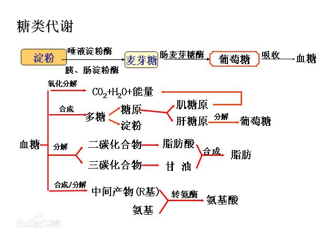
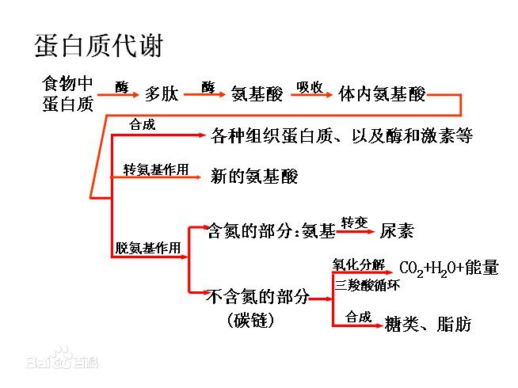
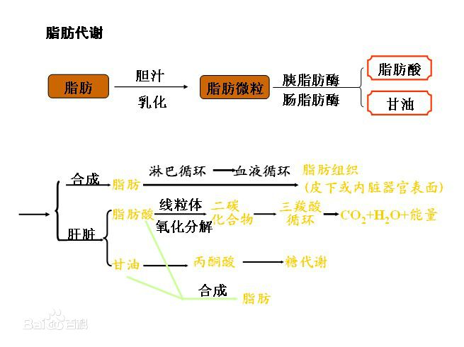

# 能量获取

## 能量来源

食物中的糖（碳水化合物）、脂肪和蛋白质→肠道→热量

| 成分（大分子） | 分解后的基本单位 | 转化效率                                                     | 作用                                                         | 说明                                                         |
| -------------- | ---------------- | ------------------------------------------------------------ | ------------------------------------------------------------ | ------------------------------------------------------------ |
| 碳水化合物     | 单 糖            | 速度最快，被优先使用，第一能量来源，储量最少，每隔约5小时储量下降  | 增加血液中葡萄糖的水平                                       | 正常饮食结构中，55%的能量由糖分提供，低于55%会缺糖，超过55%会转化为脂肪 |
| 蛋白质         | 氨基酸           | 分子结构复杂，分解时间多于碳水化合物                         | 1. 通常不用于供应热量，用于维持和更新组织及发挥功能和生长。如果没有获得足够热量的途径，蛋白质将用于供应热量。 2. 是机体的主要组成部分，大多数细胞的基本元素，例如骨肉、结缔组织和皮肤，修补人体组织。 3. 维持机体正常新陈代谢和物质的输送。 | 共20种氨基酸，其中9种不能人体合成，称为**必需氨基酸**，必须从食物中摄入。 15%（或60克）的能量由蛋白质提供。 |
| 脂肪           | 脂肪酸和甘油     | 分子结构最复杂，分解速度最慢，能量效率最高。因为有效率高，机体会把所有多余的能量都贮存为脂肪。 | 1. 正常生理活动及低强度运动中，60%能量来自糖分，40%来自脂肪。 2. 调节生理机能，保持体温 3. 保护器官，储存维生素 | 每日总热量的30%（或不超过90克）以内。                        |

## 生物的基本构成

动植物和微生物的大部分结成结构由三类基本生物分子构成：

1. **氨基酸**
2. **糖类**
3. **脂类**

| 分子类型 | 单体形式名称 | 多聚体形式名称                   |
| -------- | ------------ | -------------------------------- |
| 氨基酸   | 氨基酸       | 蛋白质（例如：纤维蛋白和球蛋白） |
| 糖类     | 单糖         | 多糖（例如：淀粉、糖原和纤维素） |
| 核酸     | 核苷酸       | 多聚核苷酸（例如DNA和RNA）       |

## 代谢

指生物体内维持生命的化学反应的集合，即生物体不断进行物质和能量交换（分解和合成）的过程。

| 分解代谢                                                     | 合成代谢                                                     |
| ------------------------------------------------------------ | ------------------------------------------------------------ |
| 对大分子进行分解以获得能量（如细胞呼吸：细胞把有机物氧化分解转化为能量的化学过程） 动物中最普遍的分解代谢分为三个主要步骤： 1. 大分子有机化合物→小分子组合 2. 小分子组合被细胞摄入→转化为更小分子，释放部分能量 3. 小分子气氧化→水和二氧化碳，释放能量  | 利用能量把小分子合成大分子 合成三个基本阶段： 1. 生成前体分子（氨基酸、单糖、核苷酸） 2. 被激活成活性形式 3. 被组装成复杂分子（蛋白质、多糖、脂类、核酸） |

