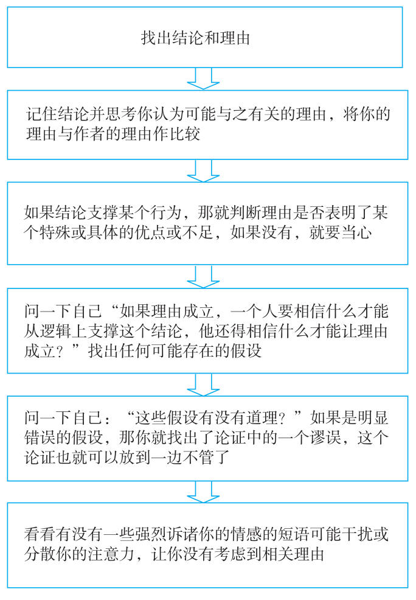

## 论证中有没有谬误

**批判性阅读和聆听的主要目标，就是判断结论可不可以接受，或者判断它的价值是大还是小。**

## 谬误

“谬误”的特征：

- 提供的论证需要明显错误的或让人不能接受的假设才能成立，因此让论证和结论之间显得毫无关系
- 把那些明明和结论无关的信息弄得好像和结论有关，以此来分散我们的注意力
- 看似为结论找证据，而想要这证据有效，就得是结论本身已经成立

## 用质疑的方法找出论证中的谬误

### 人身攻击型谬误  ad hominem fallacy

人身攻击之所以属于论证谬误，是因为进行论证的人的品格或兴趣怎么样，通常与此人所做的论证的质量毫无关系。

> 假设越是可疑，论证过程的相关性也就越低。

**有些“理由”，例如人身攻击型的论证，跟它的结论毫不相干，<u>迫使你不得不提出一些明显错误的假设，由此建立一个逻辑上的关联</u>。这样的论证就是一个谬误，你应该当机立断地予以抛弃。**

### 滑坡谬误  slippery slope fallacy

设想采取提议的步骤会引发一连串不可控的不利事件，而实际上却有现成的程序可用来防止此类连锁事件的发生。

### 追求完美解决方案谬误 searching for perfect solutions fallacy

错误地认为因为尝试某种解决方案后还有遗留问题未解决，那么这种解决方案根本就不该采用。

### 诉诸公众谬误 appeal to popularity fallacy

通过引述大部分人都持有这一观点的说法，试图证明某个断言有道理；错误的以为大部分人喜欢的事就是可取的。

### 诉诸可疑权威谬误 appeal to questionable authority fallacy

引用某一权威的话来证明结论，而该权威对这一论题并没有特别的专门知识。

### 诉诸感情谬误 appeal to emotion fallacy

使用带强烈感情色彩的语言来分散读者或听众的注意力，让他们忽视相关的理由和证据。常被用来加以利用的情感有：恐惧、希望、爱国主义、怜悯和同情。

### 稻草人谬误 straw-person fallacy

歪曲对方的观点，使它容易受到攻击；因此我们攻击的观点事实上根本就不存在。

稻草人不是真人，而且很容易被击倒；如同一个人犯了稻草人谬误，他的立场就很容易被攻击一样。要检查一个立场到底被展现得有多公平，最好的办法就是找出反映所有立场的事实来。

### 虚假的两难选择谬误 either-or false dilemma fallacy

当现实中存在两种以上的选择时，却假想只有两种选择方案。

**当别人要我们解释为什么某个特定的行为会发生，我们常常忍不住想要隐藏自己对很多复杂因果关系的无知，干脆给那种行为或贴个标签或起个名字。然后，我们错误地以为，因为我们知道那个标签或名字，我们就知道事情的起因。**

<u>我们这样做，是因为乱扣帽子欺骗了我们，让我们相信自己找到了那个人的什么特点或发现那人是个什么样，因此也就明白了他为什么有相应的行为。</u>

### 乱扣帽子谬误 explaining by naming fallacy

错误的以为因为你给某个特定事件或行为起了个名字，你就合理解释了这一事件。

### 计划谬误 the planning fallacy

人们或者机构倾向于低估他们完成一项工作所需的时间，尽管有无数过去的经验显示他们曾一直低估完成某件事所需要的时间。