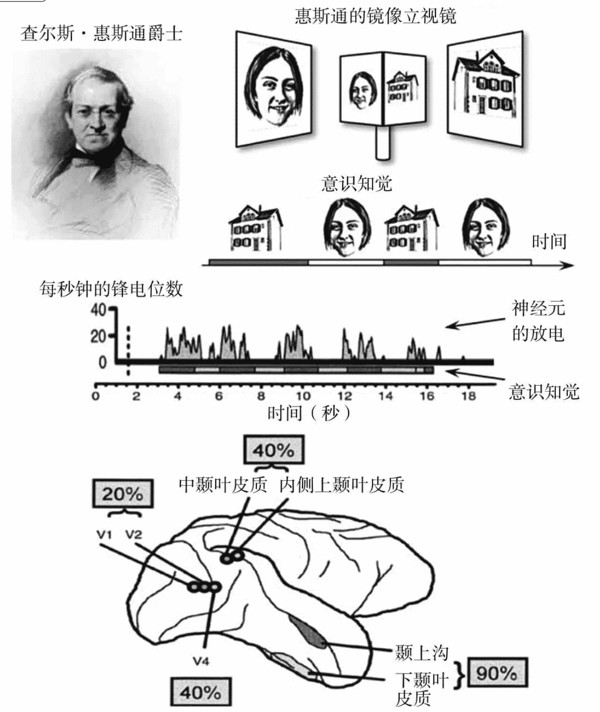

# 如何以科学方法研究意识

寻找主观状态的客观机制，也就是大脑活动由无意识变成有意识的系统“标志”。

## 意识通达

### 注意

为了避免信息过载，大脑的许多系统使用了一种选择性过滤机制，在无数种潜在的思维中，进入大脑的是最佳选择，经过这个复杂的筛选，所得到的结果就是我们所说的“注意”。大脑剔除无关的信息，最终根据其重要性或与我们当前目标的相关程度分离出一个意识的客体，然后，将这个刺激放大，这样就可以指导我们的行为了。

注意的筛选过程常常是无意识的。

<u>我们的视网膜是不完美的，血管遍布在光感受器前方。所以，视觉系统将一个物体的完全静止状态视为一种线索，提示这里需要用旁边的纹理来填充。这种“填充”也告诉我们，为什么视网膜看不见视觉盲点。这个点是视觉神经连接视网膜的地方，所以没有光感受器。当我们移动眼睛，即使只移动一点点，这些点的位置就在视网膜上改变了。于是视觉系统就意识到这些点是来自外界世界而不是眼睛内部，所以立即让这些点重新显现在意识中。</u>

### 双目竞争

分别给两只眼睛呈现不同的图片，但任何时候我们只能看到一幅图片。

在最开始的加工过程中，在作为视觉皮质入口的初级视觉皮质中，许多细胞反映了刺激的客观状态。它们根据每只眼睛所看到的图像放电，而且在动物表明它的知觉发生变化时仍然保持不变。

在视觉加工进行到更高层次时，在所谓的高级视觉区，越来越多的神经元开始认同动物的反应。它们在动物看到偏好的图像时强烈地放电，在图像被抑制时很少放电或不放电。

这个实验表明：**给眼睛长时间呈现图片，并且让图像信息进入大脑的视觉处理中，但是最终在主观意识中，图片可能完全被掏。**

### 注意瞬脱

通过使显意识大脑暂时饱和来创造一小段看不见图像的时间，被称为“注意瞬脱（attentional blink）”。

我们从来没有真正意义上有意识地同时处理两件不相干的事物。当试图同时关注两件事时，印象中我们的意识是即时的，并与两件事保持联系，事实上，主观思维没有同时感知这两件事，当一件事进入意识，另一件事就必须等待。

当意识脑被占据的时候，其他信息必须在一个无意识的缓存中等待。这种等待是危险的，在任何时候，由于内在的杂音、干扰的想法和别的外来刺激，缓存中的信息可能从意识中被完全清除掉，即瞬脱了。

**不关注可以让任何事物从意识中消失。**

内省作为方法在心理学中站不住脚，因为**无论多少内省也不能告诉我们脑是如何工作的**。但内省作为一种建设意识科学的手段，提供了方程式关键的一半——被试对于某些体验的感受，不论他们对实际情况有多少误解，认知神经科学家“只”需要确定方程式的另一半——在一个人的主观体验背后有哪些客观的神经生理现象。

