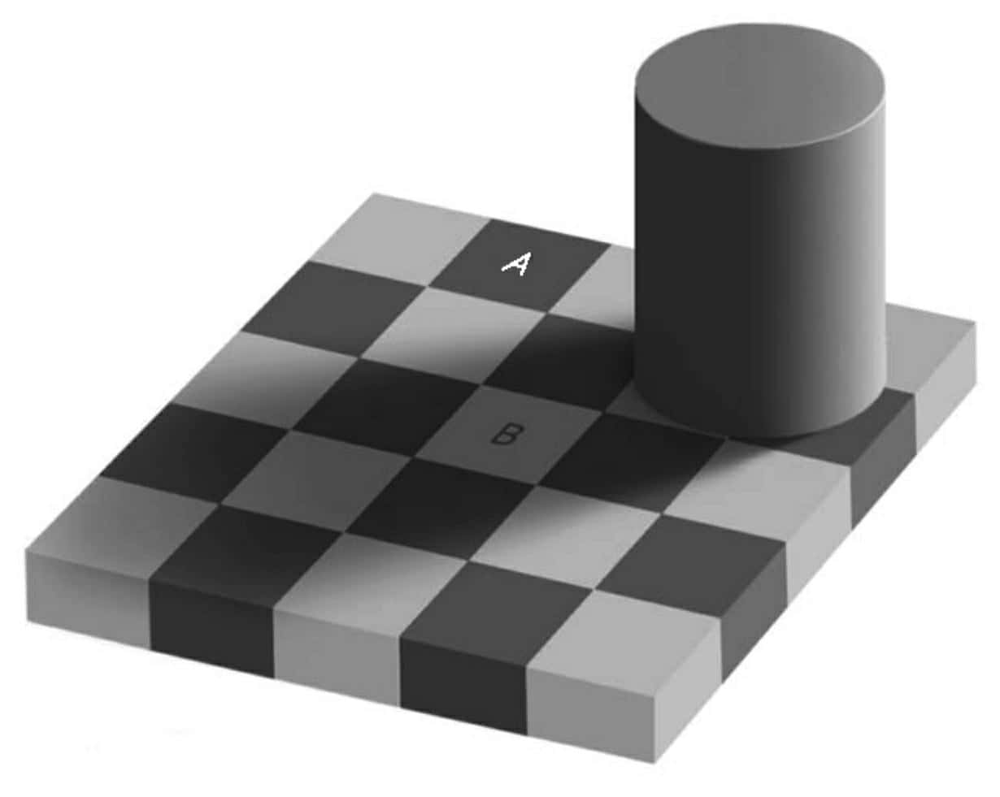

# 探索无意识

> 人们应该了解到，我们的幸福、快乐、笑声和玩笑，我们的难过、痛苦、悲伤和流泪，都是由大脑产生的，而且只能是由大脑产生。尤其是，我们通过大脑进行思考、看和听，并且分辨美丑、好坏和喜悲。——希波克拉底 《神圣病论》

  这样形容弗洛伊德个人的贡献毫不为过：他的观点中可靠的部分都不是他自己提出的，而他自己提出的部分都是不可靠的。

<!--在19世纪末20世纪初，实验心理学已经诞生了，新的实践方法不断出现，包括系统性地收集精确的反应时间以及反应错误数据的方法。但弗洛伊德似乎对自己提出的关于思维的隐喻模型很满意，即使该模型并没有经过严格的检验。-->

几乎所有的脑区都既可以参与有意识的思维过程，也可以参与无意识的思维过程。

## 阈下启动效应 subliminal priming

低于绝对阈限的刺激，虽然我们感觉不到，但却能引起一定的生理反应。

不需要意识，信息可以被编入初级视觉系统中，发生这个过程的区别为**梭状回**区域，负责阅读的初级阶段加工。

### 梭状回

- 颞叶与枕叶的一部分，位于颞下回与海马旁回之间
- **功能**：
  - 处理颜色信息
  - 人脸与身体识别
  - 文字识别
  - 分类辨识
- 与脸盲症直接相关，眼睛感知视觉信息，视皮层处理，梭状回辨析
- 梭状体异常与威廉氏症候群相关
  - 威廉氏综合征，也称为鸡尾酒会综合征，一种罕见遗传疾病，患者神经发育异常，行为举止异常兴奋，语言能力相对一般人好，且不怕陌生人，个性外向，大部分人有典型的轻度到中度智能障碍
  - 患者有着像妖精、矮人的特殊面部特征，且脸部特征随年龄增长而更加明显
  - 患者特殊面部特征常被认为是缺失了特定的基因（尤其因为7号染色体的长臂中27个基因被删除）
  - 发生概率介于1/7500到1/20000之间
- 自闭症患者在看到人脸时，梭状体很少甚至没有兴奋活动
- 梭状回面孔区增加活动程度可产生人脸幻觉，可能是真实人脸或卡通人脸（邦纳症候群：在心智正常的人身上发生的一种鲜明而复杂的幻觉，以瑞士自然博物学家查尔斯·邦纳为名，其祖父因白内障两眼近乎全盲，但可以看到男人、女人、鸟、车辆、建筑物、织锦画、图腾等幻象。）
- 有证据表明梭状回面孔区中负责人脸识别的区域的功能是进化而得，MIT有研究表明，左右梭状回在认知中具有不同的角色，随后二者会互联，左梭状回负责识别类似于人脸的视觉对象的特征，右梭状回负责确定这些被识别出来的类似人脸的视觉对象是否真是人脸

## 自动视觉加工

**视觉联结可以在不知不觉中发生。**

**我们所感受到的有意识的视觉景象是一个经过了高度加工的图像，远远不同于我们眼中所接收到的未加工的信息。**

我们看到的世界和视网膜所看到的世界从来都不是相同的。事实上，如果我们看到的世界和视网膜所看到的世界是相同的话，那将会是一个相当恐怖的景象：一系列高度扭曲的明暗像素朝着视网膜中心汇聚，被血管覆盖，并且在视网膜的中心有一个巨大的洞，即“视觉盲点”，也就是连接眼睛和大脑的神经的所在地，另外当我们的目光移动的时候，图像也会不断地模糊、变化。<u>而事实上，我们看到的却是一个三维的景象，它纠正了视网膜的缺陷，填补了视觉盲点，稳定了眼睛和头的移动，并且可以在很大程度上根据我们对类似视觉场景的原有经验来重新解释图像。</u>所有这些操作都是在不知不觉中进行的，尽管有许多过程复杂到连计算机建模都无法模拟。例如，我们的视觉系统能探测到下图中的阴影并且去除它们。只需一瞥，我们的大脑就能无意识地推断光源，并推断出物体的形状、透明度、反射比和亮度。

## 声音和图像的自动联结

多种感觉的信息都可以无意识地联结在一起，而我们意识到的只是结果。

多感官组成的意识酝酿于大脑的前额叶，我们意识知觉的内容首先从更高级的区域中被提取，然后再返回到早期的感觉皮质区域。许多复杂的感觉运算悄悄进行，以此来组成我们最终所接收到的完美景象，并且我们还确信这些景象像直接来自感觉器官一样。

### 麦格克效应 McGurk Effect

1976年，心理学家哈里·麦格克和约翰·麦克唐纳发现。当视觉看到的一种声音与耳朵听到的另一种声音不匹配时，会让人察觉到神秘的第三种声音。

## 无意识的语义启动

大脑能够同时存储和提取一个单词所有可能的含义，即使这个单词是模棱两可的，或者只有一个意思完全符合上下文 。

