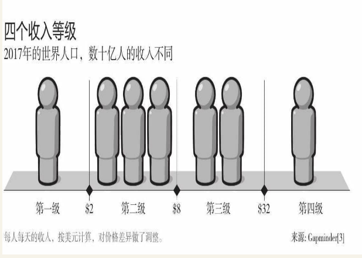

# 笔记

## 一分为二

无论人们习惯用什么样的词语来描述这个世界都是无所谓的，**但是他们用来描述这个世界的词语，一定在他们的脑海中形成了一幅图画，而这幅图画应当是基于现实的。**

究竟为什么，这种一分为二的观念，这种把世界分为富国和穷国的观念如此难以改变呢？

我认为这是因为人类有一种很强烈的、情绪化的本能。这种本能促使人们习惯于把事情一分为二：好的和坏的，英雄和恶棍，我所在的国家和其他国家。把世界一分为二是简单、直观而且情绪化的方法。因为这种一分为二的方法，暗示了矛盾冲突。所以我们总是不假思索地采用这种方法。

### 如何防范

当出现以下三种情况时，要提高警觉：

- 只比较平均数
  - 平均数的最大问题就是它用一个单独的数字取代了大量数据的分布规律
- 只比较极端情况
- 只俯视不仰视

## 负面思维

**统计学一个基本原则：当差别小于10%时，不要轻易做任何结论。**

> 文化和自由是国家发展的目标，它们很难被量化衡量，但拥有吉他的人口的比例是一个很好的参考指标。

### 负面思维的本能

我们会刻意回避不好的过去。

如果在我向你展示了这么多事实和数据之后，你仍然不相信这个世界在变得更好，我猜测这一定是因为你知道还有很多巨大的问题仍然没有得到解决。我猜测，你认为我告诉你这个世界在变得更好，其实是想告诉你，所有的事情都是很好的，你不应该去关注那些问题，或者假装这些问题不存在。这让你感到很荒谬和焦虑。

当人们错误地相信我们没有获得什么进步的时候，他们将会做出错误的结论，我们现在做的一切都不起作用，而且会因此对实际有效的措施也丧失信心。我遇到了太多这样的人，他们告诉我他们对人性彻底失去了希望；或者他们走向另外一个极端，成为激进分子，支持一些破坏生产力的极端手段，而无视现在我们采用的解决问题的方法本来就是很有效的。

> 这才是我们思考这个世界的正确方式。对坏消息有思想准备。

<u>请记住，要在一个长期持续进步的大背景下，吹毛求疵地找出一个短暂的低谷，并基于此讲述一个危机的故事，是一件很简单的事。请记住，现在我们生活在一个广泛连接并且透明的世界中，关于不幸事件的报道比以往任何时候都多得多。</u>

### 控制负面情绪的方法

- 要学会区分状态和趋势，要认识到事情可以同时是不好的，也在变得更好。
- 好消息是很少得到报道的，因此我们总是听到坏消息。
- 循序渐进的进步不是新闻。当一件事情在持续蛮好，但当中产生了一些小的低谷时，通常你只会注意到低谷，而不是整体的趋势。
- 更多的坏消息不意味着更多的坏事情。
- 警惕过分美化的历史。

## 直线思维

当我们对另外一件事物不够熟悉的时候，我们将很容易假设它是按照直线发展的，而忘了考虑这种假设很可能是愚蠢的。

