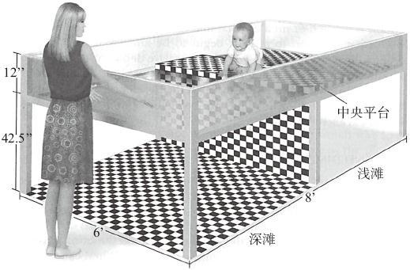

## 研究1 脑的分工（一个脑还是两个脑）

研究先驱：Roger W.Sperry，切断一只猫脑两半球的联系。

20世纪50年代后期，切断胼胝体减少甚至消除癫痫发作给心理学家一个研究脑半球的机会。

胼胝体由约2亿根神经纤维构成。

### 理论假设

- 人脑两半球是否独立行使职能
- 如果两个脑不再交流信息，人还能正常行动吗
- 感觉输入同时作用于左右两侧，切断两脑的交流对感觉的影响是什么

### 方法

设计三组不同的测试（视觉、触觉、听觉）实验来验证。

- 视觉：图片只能投射到单眼
- 触觉：只能触摸，不能看到
- 听觉：听到指令并实行动作

### 结果

左半球：更擅长言语、写作、数字运算、阅读，是主要的语言中枢

右半球：加工人像、解决空间关系问题、符号推理、艺术活动

| 感觉皮层 | 区域               |
| -------- | ------------------ |
| 体感皮层 | 顶叶               |
| 视觉皮层 | 枕叶               |
| 听觉皮层 | 颞叶               |
| 原嗅皮层 | 颞叶               |
| 味觉皮层 | 岛叶的前脑岛、额叶 |

| 大脑空间位置 | 区域                                               |
| ------------ | -------------------------------------------------- |
| 额叶         | 高级认知功能，如学习、语言、决策、抽象思维、情绪等 |
| 顶叶         | 身体感觉，空间信息处理，视觉信息和体感信息的整合   |
| 颞叶         | 听觉，嗅觉，高级视觉功能，分辨左右，长期记忆       |
| 原嗅皮层     | 视觉处理                                           |
| 边缘系统     | 奖励学习和情感处理                                 |

**大脑两半球控制着明显不同的认知功能，这一结论来自因病进行外科手术 、切断胼胝体的少数病人，我们不能没有限制地将这些结论用于大脑正常的人身上。** <u>基于大脑半球负责特定任务加工观点的教育模式将是非常危险的。</u>

### 关于优势半球

优势半球研究的两个发现：

1. 通过使用最佳利手测验测量脑半球偏侧化，推测大脑半球可能和学业成就和兴趣有关
2. 大脑半球偏侧化能够显著预测个人职业选择

## 研究2 经历和大脑体积的关系

### 理论假设

为什么选择老鼠而不是别的动物：老鼠的脑部是平滑的，对大脑的检测和测量更容易，体型小，不贵。

理论假设：大脑的体积和经历相关。

### 方法

采取12组，每组同胎三只雄鼠组成，三只雄鼠分配到三种不同的实验条件（原环境，丰富环境，贫乏环境）中。

1. 原环境：几只老鼠，足够大的空间，适量的水和食物
2. 贫乏环境：一只老鼠，小空间，适量的水和食物
3. 丰富环境：6~8只老鼠，有各种娱乐设施的空间，适量的水和食物

结果检测：解剖

### 结果

丰富环境中生活的老鼠大脑皮层（即大脑对经验作出反应的部分，负责行动、记忆、学习和所有感觉的输入，视觉、听觉、触觉、味觉、嗅觉）更重更厚，和贫乏环境的老鼠差别很显著。神经系统 中的“乙酰胆碱”酶更具活性。

丰富环境的老鼠大脑神经元更大，RNA和DNA的比率相对更高，即有更高水平的化学活动。

丰富环境的老鼠大脑中神经突触比在贫乏环境中的大50%。

### 相关研究和近期应用

现有一些证据表明，经验确实改变了人类大脑的发育。研究者发现当一个人具有更多的技术和能力时，他的大脑确实变得更复杂也更重。

> 在生活中，我想我们应该对大脑老化持一个更乐观的态度……主要因素是刺激，神经细胞因刺激而存在，所以我认为好奇心是一个关键因素。如果一个人在一生中始终充满好奇心，那这将刺激他的神经组织和大脑皮层……我发现那些经常用脑的人，大脑不易老化。事情就是这样简单。  *Marian Diamond*

怀斯和贝林格（Weiss & Bellinger，2006）的研究认为，有害环境不仅包括各种有害的化学物质，还应考虑个体生活情境中的所有因素，如遗传倾向和生活环境的丰富或贫乏。

> 将脑研究的结果作为一种‘权宜之计’，用来解决复杂系统的问题，这是不恰当的。  *Jones & Ziger*

## 研究3 人的本性是“天生的”吗

20世纪后半叶，心理学领域一直被一种叫行为主义的人性理论所统治。行为主义理论的基本主张是人的行为被环境因素所左右，其中包括引起人的行为的刺激和某种选择反应的结果。此理论对如今大众信仰产生了根深蒂固的影响，大家普遍认为，经验是人性塑造的基本因素或唯一因素。

其次，遗传和生理因素对人类行为的影响不能直接观察到，这是人们普遍用环境因素解释人类行为的又一个原因。

最后，很多人不愿接受基因在其人格塑造中起决定作用的观点，宁愿相信真正起作用的是他们在生活中所作出的各种选择。*因为前者带有宿命论的味道，而且无法体现人的“自由意志”。

### 理论假设

找到两个具有相同基因的人，从出生起把他们放到两种截然不同的环境里。

理论假设：假设个体差异是由环境引起的，在相同环境下成长起来并共同养育的同卵双胞胎和分开养育的同卵双胞胎相比，前者的个体特征更相似。

托马斯·鲍查德（Thomas Bouchard）、大卫·莱肯（David Lykken）及其助手们从1983年开始聚集了56对分开养育的同卵双胞胎，1990年完成研究报告。

### 方法

每一句被试完成近50小时的测试，内容涵盖4种人格特质量表、3种能力货币和职业兴趣问卷及两项智力测试。

收集的数据包括家用物品清单、家庭环境量表（测量他们对养父母教养方式的感受）、个人生活史、精神病学及性生活史等。

### 结果

**个体差异和环境无关。对于相当数量的人类特征而言，大多数差异似乎由遗传因素（或“基因”）引起的。**具有完全相同的遗传特质的人（同卵双胞胎），即便分开抚养，且生活条件大不相同，在成年以后，不仅外表极为相似，其基本心理和人格也惊人一致。

### 研究发现的意义

心理学界和西方文化被环境决定论的思想统治了近50年，过去，我们对教育、犯罪和刑罚、心理治疗、技能和能力、兴趣、职业目标、社会行为等许多问题持环境决定论的解释，认为是人的经验而非基因塑了人格。但“人格先天论”颠覆了之前的认知，对此，鲍查德和莱肯对此做出以下解释：

1. 智力主要是由遗传因素决定的（智力差异中70%都可以归因于遗传的影响，1999年鲍查德重新评价了本研究，总结为人格中40%的变异和智力中，50%的变异都以遗传为基础），然而，仍有30%可归因于环境，这些影响包括许多我们书籍的因素，如教育、家庭环境、毒品和社会经济地位等
2. 鲍查德和莱肯研究的基本假设是，**人的特性是由遗传和环境的综合影响决定的。**所以，当环境因素影响较小时，其差异更多来自遗传，反之亦然。即，**在孩子长大成人的过程中，家庭环境对他的影响与他所继承的基因相比，其作用是很小的。**
3. 并非环境影响人的特性，而是人的特性影响着环境，即人的遗传倾向塑造着周围环境。**导致绝大多数心理差异的直接原因可能包含着通过经验而习得的菏，然而，有效的经验在很大程度上是人们自我选择的结果，而这种选择又为遗传的恒定压力所引导。**

本研究并非得到学界的普遍认可，但激发了人们对基因-行为关系的兴趣，鼓励更多相关性研究的开展。

## 研究4 视崖

用视觉感知和解释周围世界的能力是天生的还是后天习得的？研究者为了研究深度视觉能力，设计出一种叫“视崖”的实验装置。

### 理论假设

理论假设：人类对视觉深度的感知是先天的。

### 方法

设计一个造成视觉上有深度，实际上没有深度的装置，考察36名年龄在6到14个月之间的婴儿。（图片单位：英寸，1英寸≈2.54cm，1英尺≈30.48cm)

### 结果

依赖视觉的动物（包括人和动物），在出生时就有视觉深度感知能力，各种动物中，视崖能力最差的是海龟。

所有各类的动物，如果它们要生存，就必须在能够独立行动时发展感知深度的能力，因为如果通过尝试错误而获得这种能力可能会带来过多潜在的、致命的危险。

### 批评和后续研究

对于人类什么时候开始感知深度这个问题，学术界仍在继续争论。真相可能是一种折中的情况，即先天和后天的交互作用所致。

有研究者指出，深度知觉能力可能在婴儿一出生就已经具备了，但害怕跌落和避免危险是婴儿到了能够爬行的年龄并遇到危险后，通过经验习得的。