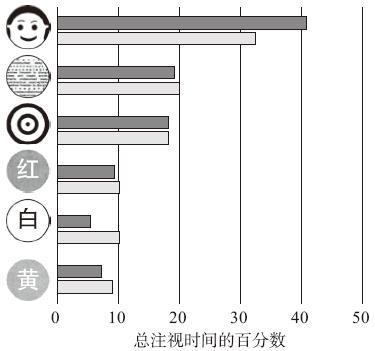
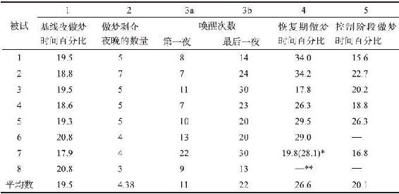

# 知觉与意识

大脑把大量来自感官的信息资料组织成具有一定形式和意义的单元，这就是心理学家所说的“知觉”。

## 注视偏好 preferential-looking

注视偏好：观察婴儿如何“分析”他们的世界（喜欢看什么，看多久）的研究。

### 理论观点

婴儿能趋光、区分基本颜色、察觉运动，但不能知觉形态。

### 方法

通过给小鸡啄取不同形状的物体，来验证小鸡是否能知觉形态，事实证明小鸡能知觉形态。

对灵长类动物，用另一种方法（可见密室，looking chamber），来检测婴儿是否会凝视物体。实验表明黑猩猩对特定的物体表现出系统性偏好。

### 结果

> 人对婴儿的重要性就像谷物对小鸡的重要性。对于从其他物体中区分并识别一个人而言，面孔形状是人类最具特点的方面……因此，婴儿对面孔图片所产生的选择性认知也是毫无意外的。—— 罗伯特·L·范茨

*注：黑条：8~12个月；灰条：年龄大于12个月。*

### 后续研究

范茨提供了偏好注视的方法，打开了一扇相当准确的通向婴儿心理的门，激起了婴儿知觉能力的研究革命。

2007年的一项研究发现4个月大的婴儿能够习得区分“可能”物体和“不可能（现实中不存在的物体，错觉物体）”物体的能力。

## 睡眠和梦

### REM睡眠（快速眼动睡眠）

睡眠四阶段（非快速眼动睡眠 NON-REM），从1循环到4：

1. 入睡 10s-10m
2. 浅睡眠 10-20m
3. 熟睡 20-30m
4. 深睡 ，循环到1时出现REM睡眠阶段（REM阶段，来自大脑的电化学信息会麻痹肌肉，使身体不能动弹）

整个睡眠过程REM和NON-REM交替出现约5到6次，随后NREM睡眠越来越短，而REM睡眠越来越长（因此，这就是人在清晨时做梦较多的原因）。每个人都会做梦。虽然有少部分人声称他们从不记得做过梦，但研究证明所有人都会做梦。

### 理论假设

梦被完全地或部分剥夺了，人是否还能继续正常地活动？

梦在心理学意义上是必需的，还是在生理学意义上是必需的，或是二者兼而有之。

### 方法

1. 确定基线和睡眠模式阶段：允许被试整夜正常睡眠，持续几天
2. 梦剥夺阶段：当被试开始做梦时，被唤醒，再入睡，3天到7天（本阶段被试在实验室外时间不可睡觉）
3. 恢复阶段：允许被试整夜正常睡眠，1到6天
4. 休息几天
5. 3/4的被试回到实验室，重复之前的实验，但被唤醒的时间改为两次眼动之间，即允许被试完整做梦

### 结果

1. 越是被唤醒，越容易做梦
2. 如果被阻止了做梦，之后做梦的时间明显增加

结论：人需要梦。

### 后续研究

上述实验从1960年至今经受住了时间的考验——所有人都做梦，如果我们某个晚上因为某种原因而无法做梦的话，下一晚会做更多的梦，这一事实在很多动物身上也能观察到。

## 物体分类的来源

物体分类的知识是从哪里获得的？20世纪70年代早期，Eleanor Rosch提出，分类不是来自于语言，而是天然存在的，与人类知觉的生物能力有关。

