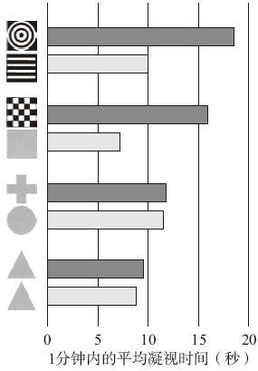

# 知觉与意识

大脑把大量来自感官的信息资料组织成具有一定形式和意义的单元，这就是心理学家所说的“知觉”。

## 注视偏好

注视偏好：观察婴儿如何“分析”他们的世界（喜欢看什么，看多久）的研究。

### 理论观点

婴儿能趋光、区分基本颜色、察觉运动，但不能知觉形态。

### 方法

通过给小鸡啄取不同形状的物体，来验证小鸡是否能知觉形态，事实证明小鸡能知觉形态。

对灵长类动物，用另一种方法（可见密室，looking chamber），来检测婴儿是否会凝视物体。实验表明黑猩猩对特定的物体表现出系统性偏好。

### 结果

> 人对婴儿的重要性就像谷物对小鸡的重要性。对于从其他物体中区分并识别一个人而言，面孔形状是人类最具特点的方面……因此，婴儿对面孔图片所产生的选择性认知也是毫无意外的。—— 罗伯特·L·范茨

