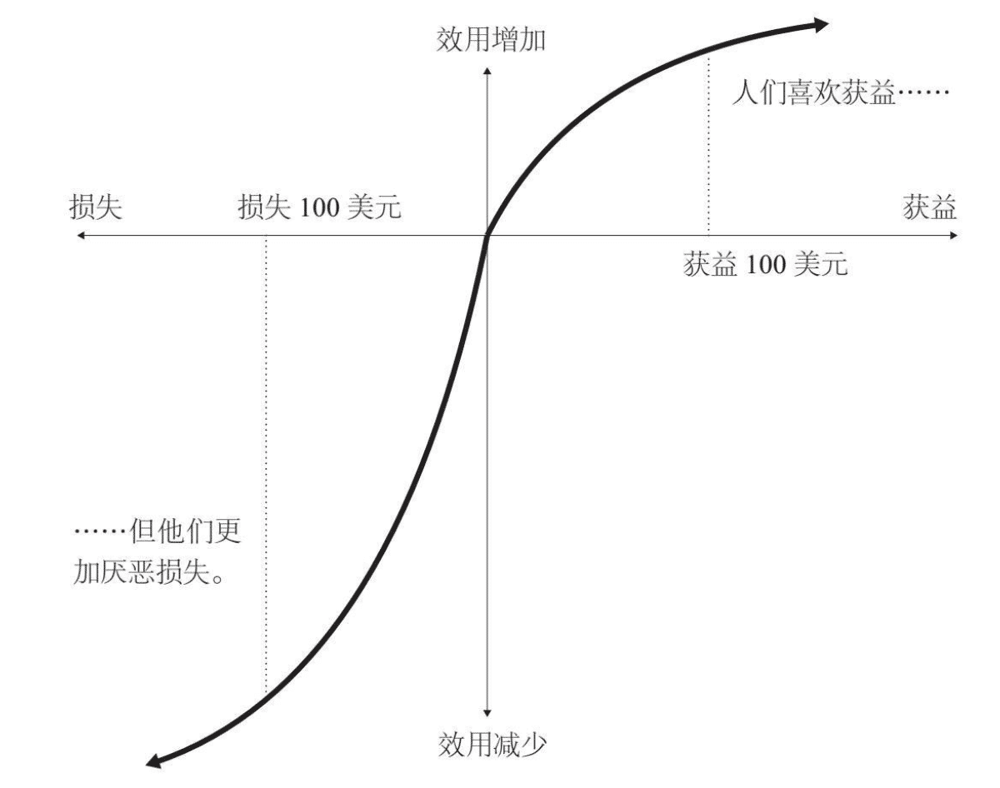

# 机会成本和禀赋效应

**机会成本（opportunity cost）**：为了这项活动而放弃的其他活动的价值。与实际支付现金相比，机会成本是模糊的、抽象的。

**禀赋效应（endownment effect）**：当人拥有某项物品，那么他对物品价值的评价要比未拥有之前大大增加。可用“损失厌恶”来解释。

**边际（marginal）**：增加值

**最小可觉差（Just-noticeable difference）**：代表人或动物，对某一特定的感官刺激所能察觉的最小改变。

$ \frac{△I}{I}=K$

I：原始刺激强度

△I：原始强度下所能感受的最小变化量（即此强度下最小可觉差）

K：一个常数

<u>我们对现状改变的敏感性会呈现出递减规律。</u>

因为学习意味着需要不断练习，所以我们可以在小事情上做得更好。

**获得效用（acquisition utility）= **物品所带来的效用-不得不放弃的机会成本

**交易效用（transaction utility）=**实际支付的价钱 - “参考价格（消费者的期望价格）”

**只要消费者认为商品的价值远高于市场价值，这次交易就会产生大量的获得效用。**

## 前景理论和价值函数

