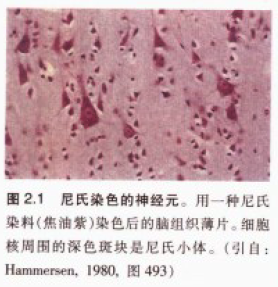
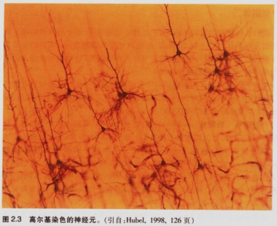
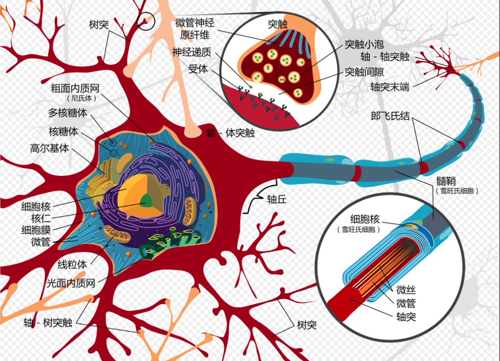
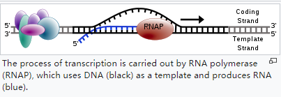

<head>
    
    
      
      
</head>

# 神经元和神经胶质细胞

**所有组织与器官都是由细胞组成，细胞的特殊功能及其相互作用s的方式决定了器官的功能。研究大脑必须先研究脑细胞如何单独工作，再研究其协作方式。**

人脑神经元数量：大约1000亿个，只占脑细胞的10%

神经元：感知环境变化，把信息传递给其他神经元，并指令机体作出反应

神经胶质细胞（词源于希腊词“胶水”）：隔离、支持及营养周围神经元的作用

## 神经元（neuron）

脑细胞大小：直径平均0.01-0.05mm，为了用显微镜观察脑组织，需要把脑组织切成薄片，最佳厚度不能超过细胞直径。

神经元又名神经原或神经细胞(nerve cell)，人脑中，神经细胞约860亿个，其中约700亿个为小脑颗粒细胞。

19世纪早期，科学家发明了将组织浸入甲醛使之变硬的方法，用切片机切脑薄片。

19世纪后期德国神经科学家 Franz Nissl 发明染色法——**尼氏染色法**，可以染所有神经元的核及核周的斑块物质——尼氏小体。尼氏染色法可以区分神经元和胶质细胞。

**高尔基染色（Golgi stain）**：可以把神经元完整染色。高尔基染色表明神经元至少有两个明显不同的部分：含细胞核的中心区（又称为细胞体/胞体/核周体）和从中心区辐射出的无数细管（又称为神经突起，包括轴突 axon 和树突 dendrite ）。

细胞体一般只有一个轴突。整个轴突的直径都是均一的，若有分支，分支一般都成直角延伸出。在体内，轴突可以延伸得很长（达1m或更长）。树突延伸距离很少超过2mm。

<u>神经元的突起不是连通的，它们通过接触而非连通传递信息。</u>

| 单位 | 缩写 | 米制单位数值 | 实际生活的对比量       |
| ---- | ---- | ------------ | ---------------------- |
| 千米 | km   | $10^3$m      | 约 2/3 英里            |
| 米   | m    | 1m           | 约3英尺（0.9米）       |
| 厘米 | cm   | $10^{-2}$m   | 小指厚度               |
| 毫米 | mm   | $10^{-3}$m   | 指甲厚度               |
| 微米 | ㎛   | $10^{-4}$m   | 接近光学显微镜的分辨率 |
| 纳米 | nm   | $10^{-9}$m   | 接近电子显微镜的分辨率 |

### 神经元的构成

- **胞体（cell body or soma）**：神经元的中心，像个毛球。典型神经元的胞体直径大约20㎛。细胞液是富含钾的盐溶液，由神经细胞膜把它与外界环境隔开。
  - 细胞核：球状，直径大约5~10㎛.细胞核外有双层膜，称为核被膜。核被膜上布有直径约为0.1㎛的核孔。
  - 染色体：在细胞核内，由遗传物质DNA组成。DNA包含身体的全部“蓝图”。每个神经元内的DNA是相同的，和肝、肾细胞的DNA一样。**神经元和肝细胞的差异在于组成细胞的DNA特异片段不同。
    - 每条染色体含有2nm宽的连续双螺旋DNA结构，总共46条人染色体。<u>如果把DNA长度比拟成字符串长度，那基因可以比成单词。</u>每个基因是DNA的一部分，长度可由0.1至几个微米不等。
    - **基因表达（gene expression）**：
- **神经突**
  - 树突(Dendrites)：多呈树状分支，可接受刺激并将冲动传向胞体，通常一个神经元有一个或多个树突
  - 轴突(Axon)：呈细索状，末端常有分支，称轴突终末，轴突将冲动从胞体传向终末。神经元只有一个轴突。神经元的胞体越大，其轴突越长。

**神经元分区**：

- 接收区：树突到胞体部分，树突接受不同来源的突触，接收的来源越多，对胞体膜电位的影响越大，反之亦然。接收的信息在胞体内整合
- 触发区：在胞体整合的电位，决定是否产生神经冲动的起始点。位于轴突和胞体交接的地方（轴丘位置）。
- 传导区：轴突部分，当产生动作电位时，传导区能遵守全有全无的定律（all or none）来传导神经冲动
- 输出区：神经冲动的目的就是要让神经末梢，突触的神经传递物质或电力释出，才能影响下一个接受的细胞（神经元、肌肉细胞或腺体细胞）

**神经元的分类(按传输方向及功能)**：

- 感觉神经元（传入神经）
- 运动神经元（传出神经）
- 联络神经元

**神经元的分类(按突起的多寡)**：

- 单极神经元（伪单极神经元）
- 双极神经元
- 多极神经元

### 基因表达 gene expression

基因表达是把基因信息生成基因产物的过程，基因产物一般是蛋白质，非蛋白质编码基因的产物（例如tRNA, snRNA)的产物是RNA。

基因表达被所有已知生命（真核生物（包括多细胞生物），原核生物（细菌和古细菌））使用，并被病毒利用，以产生构成生命的大分子结构体。

基因表达过程中的所有步骤都可被调节。基因表达的调节可控制细胞中存在的给定基因产物（蛋白质或ncRNA)的时间，位置和数量，是细胞分化、发育、形态发生和任何生物多功能性和适应性的基础。基因调控也可作为进化变化的基础。

**基因表达的机制**：

- 转录 transcription
  - 把DNA链拷贝成RNA的过程。由RNA聚合酶(RNA polymerase)完成，该酶根据核苷酸碱基的互补定律一次向增长的RNA链中添加一个核糖核苷酸。转录时，DNA中的胸腺嘧啶（T）被RNA中的尿嘧啶（U）替代。
  - 
  - 原核生物中，转录是由单一类型RNA聚合酶进行的，该酶需要在sigma因子蛋白的帮助下，结合 pribnow box的DNA序列来开始转录。
- mRNA处理 mRNA processing
- 非编码RNA熟化  no-coding RNA maturation
- RNA出口 RNA export
- 翻译 translation
- 折叠 folding
- 易位 translocation
- 蛋白质转运 protein transport

