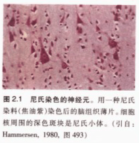

<head>
    
    
      
      
</head>

# 神经元和神经胶质细胞

**所有组织与器官都是由细胞组成，细胞的特殊功能及其相互作用s的方式决定了器官的功能。研究大脑必须先研究脑细胞如何单独工作，再研究其协作方式。**

人脑神经元数量：大约1000亿个，只占脑细胞的10%

神经元：感知环境变化，把信息传递给其他神经元，并指令机体作出反应

神经胶质细胞（词源于希腊词“胶水”）：隔离、支持及营养周围神经元的作用

## 神经元（neuron）

脑细胞大小：直径平均0.01-0.05mm，为了用显微镜观察脑组织，需要把脑组织切成薄片，最佳厚度不能超过细胞直径。

神经元又名神经原或神经细胞(nerve cell)，人脑中，神经细胞约860亿个，其中约700亿个为小脑颗粒细胞。

19世纪早期，科学家发明了将组织浸入甲醛使之变硬的方法，用切片机切脑薄片。

19世纪后期德国神经科学家 Franz Nissl 发明染色法——**尼氏染色法**，可以染所有神经元的核及核周的斑块物质——尼氏小体。尼氏染色法可以区分神经元和胶质细胞。

**高尔基染色（Golgi stain）**：可以把神经元完整染色。高尔基染色表明神经元至少有两个明显不同的部分：含细胞核的中心区（又称为细胞体/胞体/核周体）和从中心区辐射出的无数细管（又称为神经突起，包括轴突 axon 和树突 dendrite ）。

细胞体一般只有一个轴突。整个轴突的直径都是均一的，若有分支，分支一般都成直角延伸出。在体内，轴突可以延伸得很长（达1m或更长）。树突延伸距离很少超过2mm。

<u>神经元的突起不是连通的，它们通过接触而非连通传递信息。</u>

| 单位 | 缩写 | 米制单位数值 | 实际生活的对比量       |
| ---- | ---- | ------------ | ---------------------- |
| 千米 | km   | $10^3$m      | 约 2/3 英里            |
| 米   | m    | 1m           | 约3英尺（0.9米）       |
| 厘米 | cm   | $10^{-2}$m   | 小指厚度               |
| 毫米 | mm   | $10^{-3}$m   | 指甲厚度               |
| 微米 | ㎛   | $10^{-4}$m   | 接近光学显微镜的分辨率 |
| 纳米 | nm   | $10^{-9}$m   | 接近电子显微镜的分辨率 |

**粗面内质网**：简称粗面ER，是成堆的闭合膜，膜上附有密集的球状结构的核糖体，大量存在于神经元中。是神经元中蛋白质合成的主要场所。

**高尔基体**：蛋白质在翻译后进行大量化学修饰的地方，重要作用之一是把转运到神经元不同部位（如轴突和树突）的蛋白质进行分类整理

**线粒体**：是细胞呼吸的场所，当线粒体“吸气”时，丙酮酸（源于糖、蛋白质和脂肪的消化产物）和氧气就被吸进来。丙酮酸在线粒体内部产生复杂的生化反应，产物是能量（ATP），供给给细胞。

**神经元膜**：把细胞质包裹在神经元内，阻止细胞外的某些物质进入膜内。厚约5nm，上嵌有蛋白质。胞体、树突、轴突膜的蛋白质组成均不同。

**细胞骨架**：是不断进行动态调节的细胞支架

- 微管
  - 直径约20nm，沿神经突起纵向排列。看似是一个笔直、壁厚的中空管子
  - 管壁由辫状链（聚合物）组成，每个链由微管蛋白（球状，粘在一起）组成
  - 神经元的信号可以通过调节微管的聚合和解聚调控神经元的形状
  - 参与微管组装及功能调控的一类蛋白称为**微管相关蛋白MAPs**，其中一种叫tau的轴突微管相关蛋白，已知与阿尔茨海默病引起的痴呆有关
- 微丝
  - 直径5nm，和细胞膜厚度相当。遍布于神经元，在神经突起中更多。
  - 由两股细链盘绕而成，每股链都是肌纤蛋白的聚合物，肌纤蛋白是所有类型细胞中含量最丰富的蛋白质之一，已知它参与细胞形状的改变。
  - 肌纤蛋白也会不断装配和解聚，由神经元内的信号调节。
  - 除了像微管一样沿着神经突起中心延伸，微丝还跟膜紧密联系在一起，通过纤维蛋白的网状结构锚定在膜上，纤维蛋白像蜘蛛网一样衬在细胞膜内
- 神经丝
  - 直径10nm，存在于身体每个细胞中，仅仅在神经元中被称为神经丝。
  - 神经丝与骨头和韧带最相似，神经丝由类似于香肠链的许多亚单位组成，每个亚单位由三条蛋白质链互相盘绕而成。和其他两种结构不同的是，这些链由单独的蛋白分子组成，每个蛋白分子都盘绕成弹簧的结构，使神经丝有很强的机械强度。
  - 神经丝的数量决定轴突直径
  - 神经丝的异常表达与异常修饰导致某些神经系统疾病，例如肌萎缩性（脊髓）侧索石化症ALS，幼稚型脊柱肌肉萎缩症ISMA等，异常磷酸化也可能导致老年痴呆[^阿尔兹海默症]或帕金森等（神经纤维纠结导致微管瓦解，由细胞骨架构成的运送系统崩坏，细胞间的化学讯息沟通失效，神经细胞死亡）

### 神经元的构成

- **胞体（cell body or soma）**：神经元的中心，像个毛球。典型神经元的胞体直径大约20㎛。细胞液是富含钾的盐溶液，由神经细胞膜把它与外界环境隔开。
  - 细胞核：球状，直径大约5~10㎛.细胞核外有双层膜，称为核被膜。核被膜上布有直径约为0.1㎛的核孔。
  - 染色体：在细胞核内，由遗传物质DNA组成。DNA包含身体的全部“蓝图”。每个神经元内的DNA是相同的，和肝、肾细胞的DNA一样。**神经元和肝细胞的差异在于组成细胞的DNA特异片段不同。
    - 每条染色体含有2nm宽的连续双螺旋DNA结构，总共46条人染色体。<u>如果把DNA长度比拟成字符串长度，那基因可以比成单词。</u>每个基因是DNA的一部分，长度可由0.1至几个微米不等。
    - **基因表达（gene expression）**
- **神经突**
  - 树突(Dendrites)：多呈树状分支，可接受刺激并将冲动传向胞体，通常一个神经元有一个或多个树突
  - 轴突(Axon)：呈细索状，末端常有分支，称轴突终末，轴突将冲动从胞体传向终末。神经元只有一个轴突。神经元的胞体越大，其轴突越长。

**神经元分区**：

- 接收区：树突到胞体部分，树突接受不同来源的突触，接收的来源越多，对胞体膜电位的影响越大，反之亦然。接收的信息在胞体内整合
- 触发区：在胞体整合的电位，决定是否产生神经冲动的起始点。位于轴突和胞体交接的地方（轴丘位置）。
- 传导区：轴突部分，当产生动作电位时，传导区能遵守全有全无的定律（all or none）来传导神经冲动
- 输出区：神经冲动的目的就是要让神经末梢，突触的神经传递物质或电力释出，才能影响下一个接受的细胞（神经元、肌肉细胞或腺体细胞）

**神经元的分类(按传输方向及功能)**：

- 感觉神经元（传入神经）
- 运动神经元（传出神经）
- 联络神经元

**神经元的分类(按突起的多寡)**：

- 单极神经元（伪单极神经元）
- 双极神经元
- 多极神经元

### 基因表达 gene expression

基因表达是把基因信息生成基因产物的过程，基因产物一般是蛋白质，非蛋白质编码基因的产物（例如tRNA, snRNA)的产物是RNA。

基因表达被所有已知生命（真核生物（包括多细胞生物），原核生物（细菌和古细菌））使用，并被病毒利用，以产生构成生命的大分子结构体。

基因表达过程中的所有步骤都可被调节。基因表达的调节可控制细胞中存在的给定基因产物（蛋白质或ncRNA)的时间，位置和数量，是细胞分化、发育、形态发生和任何生物多功能性和适应性的基础。基因调控也可作为进化变化的基础。

**基因表达的机制**：

- 转录 transcription
  - 把DNA链拷贝成RNA的过程。由RNA聚合酶(RNA polymerase)完成，该酶根据核苷酸碱基的互补定律一次向增长的RNA链中添加一个核糖核苷酸。转录时，DNA中的胸腺嘧啶（T）被RNA中的尿嘧啶（U）替代。
  - 
  - 原核生物中，转录是由单一类型RNA聚合酶进行的，该酶需要在sigma因子蛋白的帮助下，结合 pribnow box 的DNA序列来开始转录。
  - 真核生物中，转录由三咱类型的RNA聚合酶进行，每种都需要一个特殊的DNA序列（称为启动子）和一组DNA结合蛋白（转录因子）来启动该过程。RNA聚合酶I负责核糖体RNA（rRNA）基因的转录，RNA聚合酶II（Pol II）转录所有蛋白质编码基因，也转录一些非编码RNA（如snRNA，snoRNA或长非编码RNA），RNA聚合酶III转录5S rRNA基因，转移RNA（tRNA）的基因，和一些小的非编码RNA，当聚合酶遇到*终止子*的序列时，转录结束。
    - 基因启动子区域作为RNA聚合酶的识别位点，通过控制RNA聚合酶能否结合这个位点，来控制大多数基因是否表达
    1. 解旋酶把DNA拆成2条单独的链
    2. 引物（由RNA或DNA碱基或两者组成）负责形成第一个核苷酸
    3. 聚合酶把游离核苷酸添加到DNA链的三个主要末端，一次添加一个。（不能自己形成新链），形成mRNA(信使RNA）
    4. RNA聚合酶到达基因终止点时，mRNA链转录完成
  
- mRNA处理 mRNA processing
  
  - 原核蛋白编码基因的转录产生可翻译成蛋白质的信使RNA（mRNA），真核基因的转录留下RNA的主要转录本（pre-RNA）, 非编码的内含子需要剪除，5‘端加帽，3’端加尾，该转录本必须首先进行一系列的修饰（剪接）才能成为蛋白质--mRNA，由剪接体（蛋白质和RNA组成的复合体）执行
  
- 非编码RNA熟化  no-coding RNA maturation

- RNA出口 RNA export
  - 真核生物中，大多数成熟的RNA必须从**细胞核**输出到**细胞质**。
  - RNA的输出需要与称为**出口蛋白**的特定蛋白质结合。
  
- 翻译 translation

  - 翻译的目的是为了快速准确地产生多肽(多肽链即为蛋白质），多肽需要被修饰后才能行使生理功能，在不同的细胞器中，不同的多肽链被进行不同的修饰
  - 对某些RNA（非编码RNA）来说，成熟的RNA是最终基因产物。对信使RNA（mRNA）来说，RNA是编码一种或多种蛋白质合成的信息载体。
  - 每个mRNA均由三部分组成：
    - 5'非翻译区（5'UTR）
    - 蛋白质编码区或开放阅读框（ORF），编码区携带由遗传密码编码的蛋白质合成信息，以形成三联体。每三个含氮碱基分为一组（用三个字母为代号），叫密码子，遗传密码包括64个密码子，大多数都能编码对应的氨基酸
      - 其中有四种特殊密码子， 一个编码起始（AUG），三个编码终止
    - 3'非翻译区（3'UTR）

  1. 启始密码子（AUG）和核糖体小亚基结合，每个氨基酸由特定的转运RNA（tRNA)带到核糖体上，转运氨基酸的各类由tRNA的种类决定，tRNA身上有反密码子
  2. 互补碱基配对发生在nRNA的密码子和tRNA的反密码子之间

  

  3. 在tRNA分子和起始密码子结合后，核糖体大亚基（下图那个大的麦芽糖状物体）、mRNA、tRNA一同组成翻译复合体

  4. 携带氨基酸的tRNA会先在翻译复合体的a位点上（也称受位）

  

  5. 位于A位点的氨基酸和P位点（中间那个，供位）的tRNA的氨基酸形成肽键

  6. 翻译复合体沿mRNA向左滑行一个密码子（3个碱基）

  7. P位上没有氨基酸的tRNA从E位（最左侧的位，离位）脱离，同时A位点空出来供下一个tRNA结合

  

  8. 肽链延伸一直持续到遇到终止密码子（UAG,UAA,UGA）

  9. 遇到终止密码子时，释放因子（RF因子）会结合在A位上，完成的多肽链会从P位上释放出去，复合体也从mRNA链上脱落，在下一个可以结合的启始处开始下一轮翻译

  

  

- 折叠 folding

- 易位 translocation

- 蛋白质转运 protein transport

[^阿尔兹海默症]: 特征是大脑皮质及特定皮质下区域的神经元和突触丧失。神经元丧失过多的区域可能会形成萎缩。脑皮质有明显的类淀粉斑块和神经元纤维缠结（缠结一般由tau蛋白构成）。患者的颞叶、顶叶和部分扣带回中的沟回会消失