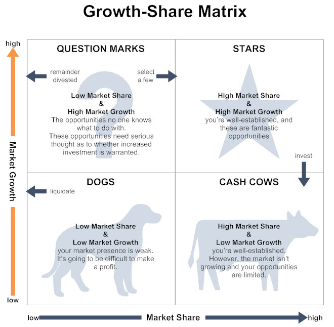

# 战略贸易论的崛起

## 战略贸易论者的主要起因

里根的竞选胜利激起了自由派的焦虑。

代表人物：莱斯特·瑟罗（麻省理工，《零和社会》），罗伯特·赖克（哈佛大学，*Minding America’s Business*  *The Nest American Frontier* ）

## 战略贸易论的内容

一个国家要实现经济繁荣，就必须在一些特定的有价值行业里取得领先地位。要让美国经济增长，最着急的是要让产业结构向这些有价值的产业转移。（抄袭波士顿咨询公司的波士顿矩阵策略，且该策略当时在商业界已走向没落）

### 波士顿矩阵

波士顿矩阵的问题：

1. 这种分析的理论基础是，一家公司会经历明显的、可预期的“学习曲线”， 在这过程中，它在当前的主导性市场份额，会逐渐转化为相对于竞争对手的价格优势。<u>但在现实中，这样的学习曲线并没有这么可靠。</u>
2. 这个分析的前提是“明星”业务总会赢利，但事实上，由于每家企业确定的“明星”业务趋同，这些业务通常会吸引很多投资，使产能超出市场需求，从而使利润变得微薄。
3. 波士顿咨询公司认为“摇钱树”业务是牢不可破的。**但事实上，在一家公司在一个低增长市场上拥有主宰地位的情况下，具有创新思想的企业仍会打入这个市场，并大大夺走该公司的利润。**
4. 波士顿公司建议的收购/合并具有增长潜力的行业的企业导致很多公司的覆灭，不同的企业文化与思维方式的冲突，导致了太多臃肿的联合企业。

### 战略贸易论的谬误

1. 战略贸易论的中心思想是，整个美国经济就像一家在市场上竞争的公司。但经济学家认为，理论上，一个经济体的国际化并不会改变其基本面貌，贸易只不过是一种普通的经济活动布局，和其他经济活动并无不同；现在美国经济对国际贸易的依赖程度并不像战略贸易论者认为的这么高，也没有达到空间的高度。（==有待考证==）
2. 战略贸易论者认为，各国像市场上的公司一样相互竞争，而美国中产阶级生活水平的长期停滞，是由美国竞争力的不足所致。贸易的本质是一种交换过程，所有国家既是卖家也是买家，在市场力量的作用下，外贸中的销售（出口）与购买（进口）在长期里总会大体保持均衡。==而国际贸易的目的与价值在于进口，而不是出口。==外贸对于一个国家的意义在于，它可以因此而进口自己所需要的东西，出口本身不是目的。
3. 战略贸易论者认为，生产率的重要性在于，它有利于我们在国际市场上与别国展开竞争。<u>而标准经济学观点是，生产率的重要性在于它能提高经济产出，有没有国际贸易对这一点毫无影响。</u>
4. 战略贸易论最重要的信条之一是，鼓励单个工人附加值较主同的产业的发展，可以提高美国的实际收入。这些高价值产业就是电脑、航空等先进高科技产业。这个观点存在一个原理性问题，<u>为什么一些产业的单个工人附加值高于其他产业？</u>事实上， 一些产业的单个工人附加值之所以较高，通常的原因是其资本、技术等生产要素的投入较高。由于美国经济的资本和技术供应是有限而稀缺的，所以鼓励这些资本与技术密集型的产业发展，只会降低而不是提高国民平均收入。（1988年统计数据表示，真正高附加值产业是高度资本密集型产业，烟草和炼油）
5. 