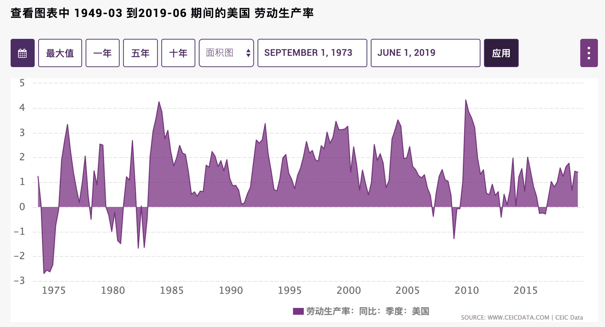
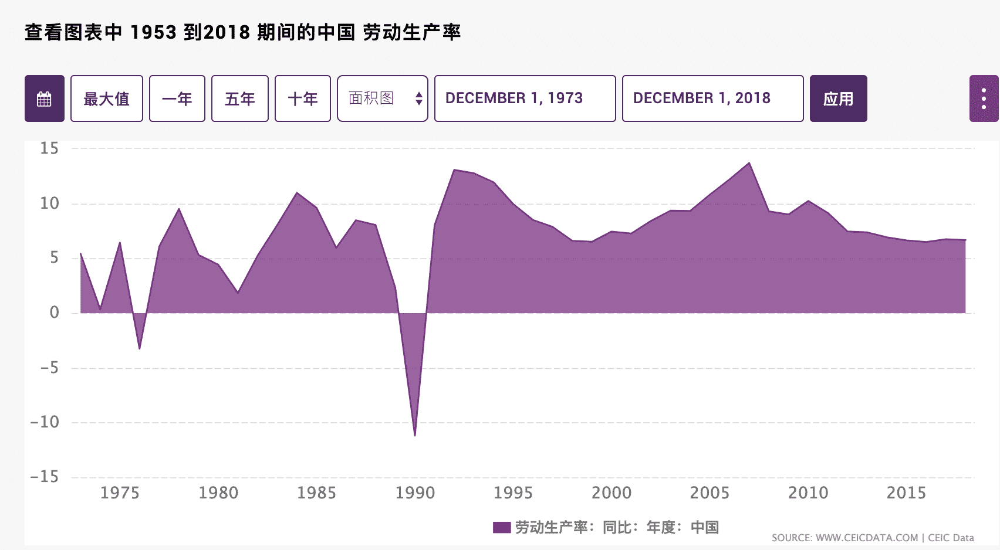

# 税收、管制与经济增长

货币主义和理性预期学说最终只对实际经济政策产生了短暂而有限的影响。

## 生产率的减速

美国生产率增长的三个时期：

1. 19世纪晚期--第二次世界大战：年均增长1.8%
2. 第二次世界大战--1973年：年均增长2.8%
3. 1973以来：年均增长不到1%

## 生产率增长为何减速

### 1. 科技原因说：科技与生产率减速问题

广义上的科技（不仅指新型器具，还包括“软件”上的创新，如存货实时管理系统）对于生产率增长至关重要。二战后，随着一系列已存在了一段时间的理论和技术逐渐完善，美国的生产率出现了高速增长，但需要一段很长的政治与经济稳定的时期，这些科技的效果才能得到彻底的发挥。也就是说，**生产率增长变慢的原因是新思想的枯竭**。

一项科技在只得到零星、孤立的应用时，是无法充分发挥其能量的，只有在得到广泛应用，并于其他科技相配套之后，其真正的潜力才能开发出来。

一项新科技不管多么神奇，都有可能连续十几年功效甚微，只有在其规模超过临界点之后，才会大放异彩。

本质上说，这是一种听天由命的观点，这种以科技来解释生产率增长减速的说法只不过是教导我们要更有耐性，并没有更多的启发作用。

### 2. 社会原因说

中产阶级子女经济动力的丧失、教育水平的下滑、底层阶级的扩大等社会问题是美国生产率增长减速的重要原因之一。

和科技说一样，都有一种听天由命的味道。

### 3. 政治原因说

**税收和管制带来的激励扭曲与激励减弱——美国的经济问题是政府的错。**

政府开支带来的真正成本高于具体支出的金额。如果政府想增加开支，就必须提高税收，从而使激励扭曲恶化，而额外的扭曲是除政府项目的直接成本之外的另一种成本。

税收体制和社会保障体制严重抑制投资（税收的上涨导致投资的收益率减少，甚至为负收益，同时，税收会使人们的工作动力降低；社会保障体制会影响人们的储蓄及私人养老金储备，继而影响美国的资本积累）

多余或拙劣的管制会比税收带来更多的无谓成本，一些经济学家认为，美国生产率增长减速的真正原因是管制的加强，而不是实际税率的提升。

