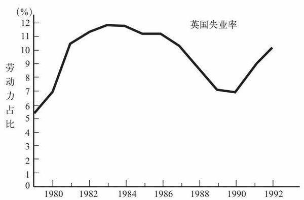
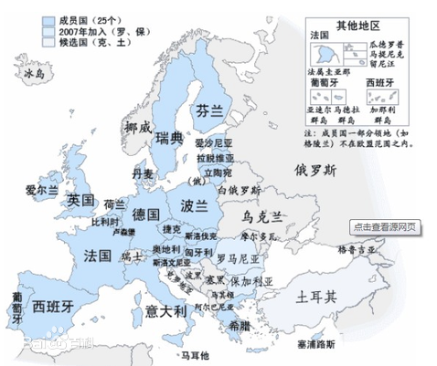

# 国外的保守派

## 撒切尔主义

英国的撒切尔主义和美国的里根主义有一些极其相似的地方：

1. 两场运动的领导人都持有强烈的意识形态观念，有一种外行人的思维模式，并向左派与温和的正统保守派发起了挑战
2. 在两场运动中，保守派的新领导人都是在一段通货膨胀高涨、经济整体不振的时期取得政权的
3. 两个新政权一开始都深陷经济困境，然后经济又都复兴，使他们得以宣称自己的新政策大获成功
4. 两个政权的后继者都遭遇了严重经济困难，使以两位领导人的名字命名的这两场运动在民众中威信尽失

### 货币、通货膨胀与失业

玛格丽特·撒切尔1979年上台，<u>是因为选民普遍对通货膨胀深感忧虑才得以当选。</u>

*1976年，英国曾被迫接受国际货币基金组织的贷款与指导，这种丢人的事向来只有“第三世界”国家才做。*

**不论在英国还是美国，应对通货膨胀的正统方法都是以一场衰退来消除人们的通货膨胀预期，而且在两个国家，这最终都是货币政策的职能。**美联储用“调控货币总量”来包装这个操作，英国也用同样的措辞来为同样的政策辩解。

英格兰银行与美联储不同，是英国财政部的分支机构，必须**听命与执政党**。当时英国决策者对货币倾向是真心诚意的，并不是一个临时的为改变政策需要的说辞，这是英美的不同。

<u>所以，英国决策者想办法在不积极调控经济的前提下制定货币政策，这一举动最终带来灾难性的后果。</u>英格兰银行一直都不宣布调控经济产出、失业率与通货膨胀的目标，只宣布要调控广义货币总量M3。

撒切尔执政期：1979年-1990年

### 1987~1989年大失败

1987年英国失业率开始迅速下降，表明市场需求上涨。但上涨的原因之一是**私人储蓄的剧降**，需求上涨之所以能转化成就业率的快速增长，原因之一就是**生产率的迅速增长突然停止**，所以，**失业率的下降很快就反映为通货膨胀的上升了。**

英格兰银行对造成通货膨胀的经济繁荣放任不管，不抑制经济过热的原因可能有以下两点：

1. 希望实施稳定的货币政策，而不必根据经济现状来权衡货币政策，在M3规则无效的情况下，仍寻找一种简单机械的准则，最终找到的办法就是**控制汇率**
2. 撒切尔强烈反对英国加入欧洲货币体系，在为货币政策寻找指针的过程中，英格兰银行最终决定，让英镑币值“暗暗追随”德国马克，而不必积极调控经济（被动调控）

### 私有化

<u>将过去的国有经济私有化</u>，是撒切尔主义的主要行动之一。

撒切尔政府把电信、供气、供电和供水企业进行了私有化，不顾垄断力量剥削消费者这个影响。

英国的保守派没有明白，**市场不是万能的，在合适的条件下，市场可以运行得很好，但如果对自然垄断企业放任不顾，任由其施展破坏力，就是一种由盲目的意识形态驱动的行为。**

### 欧洲货币

- **1979~1989年的欧洲货币体系**

  - 欧共体

    [^欧共体]: 1952 法国、德意志、意大利、荷兰、比利时、卢森堡；1973 丹麦、爱尔兰、英国；1981 希腊；1986 西班牙、葡萄牙；1995 奥地利、瑞典、芬兰、挪威
    [^欧盟]: 1993年，欧共体更名为欧盟，2004 塞浦路斯、爱沙尼亚、拉脱维亚、立陶宛、波兰、捷克、斯洛伐克、匈牙利、马耳他、斯洛文尼亚；2007 罗马尼亚 保加利亚；2013 克罗地亚

    各成员国的经济融合程度远高于其他工业化国家，因此，汇率波动对各国的影响非常明显。

    

    1979年，企业界对于汇率随意波动造成的不确定性感到不满，欧洲大陆发达国家共同制定了一套意在使汇率趋于稳定的规则体系，即**欧洲货币体系**。