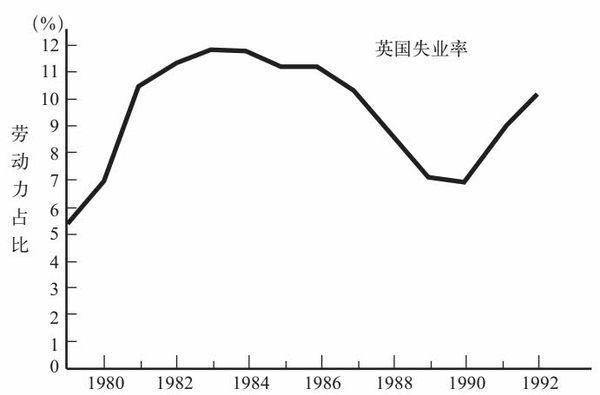
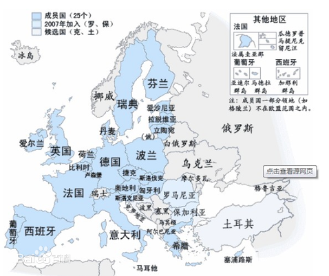

# 国外的保守派

## 撒切尔主义

英国的撒切尔主义和美国的里根主义有一些极其相似的地方：

1. 两场运动的领导人都持有强烈的意识形态观念，有一种外行人的思维模式，并向左派与温和的正统保守派发起了挑战
2. 在两场运动中，保守派的新领导人都是在一段通货膨胀高涨、经济整体不振的时期取得政权的
3. 两个新政权一开始都深陷经济困境，然后经济又都复兴，使他们得以宣称自己的新政策大获成功
4. 两个政权的后继者都遭遇了严重经济困难，使以两位领导人的名字命名的这两场运动在民众中威信尽失

### 货币、通货膨胀与失业

玛格丽特·撒切尔1979年上台，<u>是因为选民普遍对通货膨胀深感忧虑才得以当选。</u>

*1976年，英国曾被迫接受国际货币基金组织的贷款与指导，这种丢人的事向来只有“第三世界”国家才做。*

**不论在英国还是美国，应对通货膨胀的正统方法都是以一场衰退来消除人们的通货膨胀预期，而且在两个国家，这最终都是货币政策的职能。**美联储用“调控货币总量”来包装这个操作，英国也用同样的措辞来为同样的政策辩解。

英格兰银行与美联储不同，是英国财政部的分支机构，必须**听命与执政党**。当时英国决策者对货币倾向是真心诚意的，并不是一个临时的为改变政策需要的说辞，这是英美的不同。

<u>所以，英国决策者想办法在不积极调控经济的前提下制定货币政策，这一举动最终带来灾难性的后果。</u>英格兰银行一直都不宣布调控经济产出、失业率与通货膨胀的目标，只宣布要调控广义货币总量M3。

撒切尔执政期：1979年-1990年

### 1987~1989年大失败

1987年英国失业率开始迅速下降，表明市场需求上涨。但上涨的原因之一是**私人储蓄的剧降**，需求上涨之所以能转化成就业率的快速增长，原因之一就是**生产率的迅速增长突然停止**，所以，**失业率的下降很快就反映为通货膨胀的上升了。**

英格兰银行对造成通货膨胀的经济繁荣放任不管，不抑制经济过热的原因可能有以下两点：

1. 希望实施稳定的货币政策，而不必根据经济现状来权衡货币政策，在M3规则无效的情况下，仍寻找一种简单机械的准则，最终找到的办法就是**控制汇率**
2. 撒切尔强烈反对英国加入欧洲货币体系，在为货币政策寻找指针的过程中，英格兰银行最终决定，让英镑币值“暗暗追随”德国马克，而不必积极调控经济（被动调控）

### 私有化

<u>将过去的国有经济私有化</u>，是撒切尔主义的主要行动之一。

撒切尔政府把电信、供气、供电和供水企业进行了私有化，不顾垄断力量剥削消费者这个影响。

英国的保守派没有明白，**市场不是万能的，在合适的条件下，市场可以运行得很好，但如果对自然垄断企业放任不顾，任由其施展破坏力，就是一种由盲目的意识形态驱动的行为。**

## 欧洲货币

### 1979~1989年的欧洲货币体系

#### 欧共体[^1]

[^1]: 1952 法国、德意志、意大利、荷兰、比利时、卢森堡；1973 丹麦、爱尔兰、英国；1981 希腊；1986 西班牙、葡萄牙；1995 奥地利、瑞典、芬兰、挪威；**1993年，欧共体更名为欧盟**，2004 塞浦路斯、爱沙尼亚、拉脱维亚、立陶宛、波兰、捷克、斯洛伐克、匈牙利、马耳他、斯洛文尼亚；2007 罗马尼亚 保加利亚；2013 克罗地亚。

各成员国的经济融合程度远高于其他工业化国家，因此，汇率波动对各国的影响非常明显。

1979年，企业界对于汇率随意波动造成的不确定性感到不满，欧洲大陆发达国家共同制定了一套意在使汇率趋于稳定的规则体系，即**欧洲货币体系**。

根据该体系，任何两个成员国间都有一个议定的基本汇率，两国货币的汇率只能在基本汇率一个狭窄“区间”内波动。如果超出，双方自觉把本国货币升值/贬值，以保证汇率稳定。

欧洲货币体系之所以能令人意外地稳定下来，是因为欧洲各国政府以它为借口，实行通货紧缩，对高失业率袖手旁观。

这个体系需要有一个国家，不必用国际金融问题做理由，可以直接实施强有力的反通货膨胀政策，它的货币就可以成为其他国家的基准——德国。

#### 德国的盟主地位

德国通货膨胀一向较低，因而使所有欧洲大陆国家将其货币与德国马克挂钩，德意志联邦银行事实上承担起了负责全欧货币政策的重任。

欧洲货币体系之所以在十年内保持成功，因为：

1. 欧洲的发达国家领导人决心要控制通货膨胀，而不大关心失业率
2. 欧洲最大的经济体恰好也拥有全欧最不容忍通货膨胀的央行

#### 欧洲货币体系神话与欧洲货币联盟大挫折

==要抑制通货膨胀，就必须使经济陷入一场旷日持久、极其痛苦的衰退。==

<u>欧洲货币体系的实质是，它为各国政府提供了一种有用的借口，使它们可以选择一些不受欢迎的政策，并遮掩这些政策带来的残酷后果。</u>

因为欧洲货币体系的成功，欧洲各国逐渐相信一个神话：<u>欧洲货币体系是有利无害的，不附带任何损失。</u>只要遵守相关货币规则，各国就能压低通货膨胀，而不附带任何失业率上升的成本。

#### **《马斯特里赫特条约》**

该条约的核心内容是确定了一系列所谓的“趋同标准”，各成员国必须首先实现这些标准，才有权废除本国货币，采用新的统一货币，即欧洲货币单位。

该条约是在高度乐观的气氛中商定的，因为当时，欧洲货币体系已经取得了惊人的成功，人们觉得该体系的成功，可进一步引入共同货币。

1. 标准1，一车必须维持两年的稳定汇率，才有权加入单一货币区——必须证明自己很能控制自己的货币汇率，才有权废除本国货币
2. 标准2，一国的长期利率必须与欧共体经济表现最佳的国家接近——如果市场觉得一个国家将加入欧洲货币联盟，该国就会达到加入联盟的标准（自我实现）
3. 标准3，一国的通货膨胀率必须与欧共体经济表现最佳的国家接近——与1矛盾，如果必须维持稳定的汇率，就不能通过调整汇率来抑制通货膨胀
4. 标准4，一国必须使预算赤字和政府债务的规模低于一定水平——与货币联盟没什么关系

#### 欧洲货币体系的崩溃

欧洲货币体系的崩溃发生在**柏林墙的倒塌**后。柏林墙倒塌后，人们发现民主德国（东德）的经济乱成一团，生产率很低，为了筹集重建东部的费用，联邦德国（西德）财政必定会出现巨额赤字。为了中和通货膨胀的风险，德意志联邦银行开始提高利率，**造成欧洲其他国家的衰退。**

如果重新划定欧洲货币体系的利率，使马克相对于别国货币升值，可以缓冲马克升值对欧洲其他国家的影响。但当时欧洲的决策者相信，固定汇率永远是有利的，一定要维持严格的欧洲货币体系，于是各国决策者都袖手旁观，任由本国经济日益滑入衰退，只是等待经济形势能自行逆转。

最终，欧洲货币体系崩溃了。英国的衰退不断加剧，为了挽救本国经济，英国退出了欧洲货币体系。

