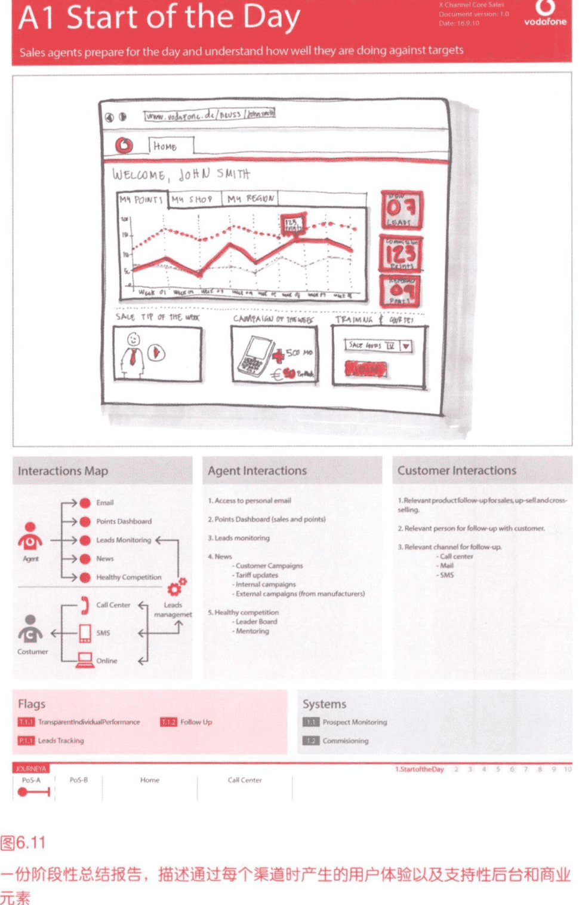

# 构建服务主张

## 以洞见为基础确立服务主张

从商业和顾客或用户角度看，服务主张其实就是商业主张。

**无论这项服务是免费服务还是公共服务，其背后的商业模式都很重要。因为如果没有商业模式作为支撑，服务就会缺乏可持续性和应变空间。**

> 谁来提供资金？
>
> 价位和细分市场如何？
>
> 实现服务需要什么？
>
> 成本如何？

> 人们是否理解新的服务及其用途？
>
> 人们是否能够看到它在生活中的价值？
>
> 人们是否知道它的用法？

### 人们是否理解新的服务及其用途？

服务不像产品一样一看就知道用途。服务是抽象的，甚至是无形的。新的服务往往能够开辟新的领域。

### 人们是否能够看到它在生活中的价值？

要建构一个服务主张，<u>需要考虑它如何为人们的生活增加价值。</u>这显然要以需求为根据。需求是通过洞见研究来发现的。

### 人们知道如何使用它吗？

用简洁易懂的方法向用户介绍服务是什么

## 从蓝图中抽取片段

服务必须与用户进行互动，这意味着我们需要考虑跨触点的细节。

服务一定要赢利，但**收费一定要清晰透明，因为人们反感的正是不公平的收费。**触点中的任何一个细节都会影响到整个业务，如果用户有任何不理解的地方，就会产生不信任，从而影响业务。

<u>要想随时从全局到局部，从细节到宏观进行思考，就需要服务蓝图针对不同情境的需求提供空间。</u>蓝图应当表现出服务生态系统中的要件，以便通过一系列假设的情景追踪不同的用户历程。项目所涉及的所有相关利益人：设计师、用户、员工和管理人员都可以使用现有的“如果……那么……”形式得出结论，用它来界定服务主张和体验。

### 选择资源侧重点

每个项目的资源 是有限的。必须有选择地把精力投入到某些触点上，不管是创造新服务还是升级现有服务，**选择一些能够体现服务核心的关键触点，都是踏出第一步最有效的方法。**

为了防止闭门造车，我们必须精确判断如何着眼于全局对每个元素进行协调。要做到这一点，就要重新扩大视野，俯瞰整个蓝图，建构服务主张。*这意味着最开始的时候可能要推迟细节方面的工作。*

尽管你可以经常性地在整体和局部之间转换思维，但还是需要把不同层级的细节打印出来钉在墙上，与一起做项目的同事讨论细节。

### 4种从蓝图中提取细节片段的有效方法：

1. **用户历程总结**

   如果洞见调研已经积累了人群，就可以开始设想每一类用户是怎样使用服务的。一般说来，大多数用户都会体验各种渠道，根据他们所处的情境（上班、在家、旅游等）在这些渠道之间切换，因此，**实现渠道之间的一致性非常重要**。

   服务设计师需要保持后台员工的见解与用户需求的协调性。界定用户历程中的体验崩溃点或者重大机遇，还要界定渠道和技术在哪里配合可以创造价值，在哪里互相对立。将用户历程置于蓝图中进行思考，这是解决这些问题的方法之一。

   一旦标画出某个特定用户在服务体验各阶段中的历程及其选择触点集中的历程，就能得出一个用户历程总结。<u>这实际上是某个情境历程（或步骤，如果进一步深入细节的话）中各个阶段的情节故事板，用来介绍发生了什么以及用户应当获得什么体验。</u>

   .png)

   历程总结介绍的是用户体验服务主要阶段的特定历程、步骤或更多细节。图文并茂，介绍了具体情况以及选定触点的体验和交互。

2. **阶段和步骤总结**

   蓝图的网格结构使人们可以在服务的整个生态系统内找出若干条路线，可以对行和列进行查询。每个服务阶段或服务的每一步都可以视为顾客/用户服务体验的组成部分，贯穿所有触点渠道的竖列，一直延伸到与之相关的后台相关人员和活动。

   由此可以做出更详细的阶段或步骤总结报告，描述该历程阶段通过所有渠道时所形成的用户体验。

   **对于其他任何一个交互或产品设计，将多个交互分割成更小的元素并标识出所有渠道中的全部交互，这样做很重要。**

   在阶段和历程总结笔记中，可以引用洞见调研中的材料，可能是当前用户对现有服务的意见或从调研中挖掘到的新需求，可以基于此需求建构新的服务主张。*反复进行概念发展和洞见调研，设计过程就能保持落地状态。

   

3. **渠道总结**

   如果从服务蓝图中单拿出一行渠道来进行横向观察，就能够看出这一渠道在整个服务生命周期中的作用。

   通过这样的观察，我们还可以写出一个描述该渠道体验的全面详述或者总结报告。

   **将每时每刻与该渠道的交互都记录成员，用户历程的阶段和步骤就是这样规定的。**以保证在设计过程中时刻牢记与其他渠道的交互，使其不孤立且能够长期、有效地进行。

4. **明确独立的触点**

   独立的触点指用户历程中的一个阶段或步骤与渠道的时间交汇点。在服务蓝图中，指一个独立的单元，用以描述什么是触点，它们怎样发挥作用以及何时发生。

   “用户在线注册”可能算一个触点，但不能算作设计总结。应当描述出所有触点的细化分解，以便进行设计或改善。