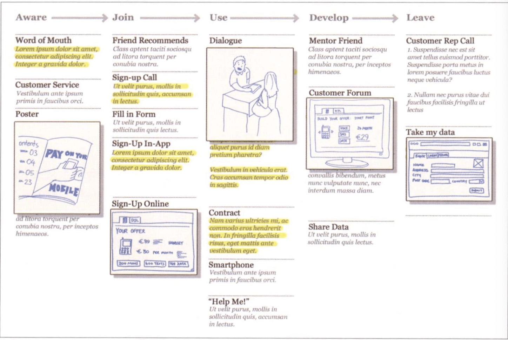

# 服务体验的原型化

## 体验的定义

体验的重要在于，通过讲述使用服务或是受服务影响的人的故事，就有可能为创新和进步发现机会，也可能使未来体验成为一种设计交流方法。

服务设计不局限于软件要素，还有为服务表现贡献硬件要素的能力，例如积极的经济成果、成功的流程或是有益的服务条款输出。

## 体验的类型

1. **使用体验：技术交互体验**
2. **消费体验：零售品牌体验**
3. **服务体验：对服务的体验**
4. **感性体验：影响生活质量和福祉的服务（如医保）的情感体验**

### 使用体验

个体在服务中完成任务的能力对于服务的成功与否至关重要。任务设计的方式对服务的整体效果影响重大，服务内的任务经常需要重新设计以提高服务的表现和收益。

*在很多情况下，模糊的用词、规划或者有歧义的用户界面设计都会导致用户放弃使用，转向尝试其他的联系方式，或者干脆重新更换服务。*

### 消费体验

**消费体验就是使用服务时任务体验的总和**。但消费体验不只限于在愉快到不愉快这两点之间变动。

**当其他很多企业都会拼价格时，服务质量就是一个至关重要的因素。**服务质量一般由公司文化决定，而<u>*公司文化一旦确立，就很难改变*</u>。

消费体验比用户体验更具有长期性，但一般来说也是有限制的。但是，消费体验囊括一系列基于任务的微小互动。消费体验就是顾客与服务互动体验的总和。

### 服务体验

服务体验是由顾客及其与触点形成的交互共同形成的。服务设计区别于使用体验设计或消费体验设计的原因之一在于服务设计并不只限于关注一个方向。

> 如何看待人在服务中的角色呢？一个行之有效的方法是把每一个“台下”的出口都看作是其他地方的入口，尤其是当提供服务的工作人员既是服务提供者也是服务使用者的情况下。

### 感性体验

当服务设计师开始将他们的技术运用到个人、公共和社交项目中时，必须考虑服务对人及其自我认知所产生的影响。**一旦体验层面出现事故，结果就不只是失败或简单的经济牵连(损害品牌形象或影响销售)，还会波及人们的生活。

## 期望与实际体验

<u>在进行服务设计时，最基本的概念是顾客所感知到的质量取决于期望和实际体验之间的落差</u>。

作为服务设计师，**首要任务是确保每次服务交互体验都能为下一次交互树立准确的预期**，即，不管时间多久，触点数量有多少，质量的高低和体验的性质都必须始终保持不变。

当某个触点的体验超出预期时，如果下次交互不能保持这种水平，就会为此埋下失望的伏笔。<u>有时可能还需要考虑降低某一触点的质量来增强服务的整体体验质量。</u>*当每次交互的期望都一致并在下次交互时符合期望，人们就会从中感受到服务的核心品质。

当所有的触点谐调一致之后，当人们日复一日地达成期望后，良好的服务体验就水到渠成了。**这就是底线。**即使想要达到设计和实现服务“勉强可以”的底线层次，也是很有挑战性的。

**不同触点之间最细微的期望-体验不匹配都可能导致所有致力于提升体验的努力前功尽弃。**

## 以时间作为设计对象

想要设计更好的体验，需要从两种角度看待时间：

1. 关联时间：体现在顾客历程中，指人们在整个服务中不同阶段的关联时间
2. 交互频率：因服务而异，因触点而异。设计合适的频率离不开敏锐的处理、试验和长期观察。

**顾客历程和服务蓝图是服务中集成长期体验的两种重要工具。**

## 服务设计原型

### 原型可验证的问题

1. 人们是否能够理解服务？新的服务到底是什么？或者能做什么？
2. 人们能够意识到这项服务在生活中的价值吗？
3. 人们会使用它吗？
4. 提供服务时最主要的触点有哪些？
5. 此服务的可见因素都正常吗？
6. 语言和术语可行吗？
7. 体验原型的测试人员提出了哪些改进想法？

### 体验原型的四个层次

.png)

- **讨论原型**
  - 带上一连串触点模型，按计划好的用户历程进行介绍就1个小时的访谈。接受采访的人只需要自然地与触点发生交互，并给出反馈意见。
  - 这种讨论可消除服务主张中最明显的问题，即<u>规避陷阱</u>。典型的讨论原型涉及5~10个用户。
  - 观察人们对不同提案的真实反映。
- **参与原型**
  - 在实际地点给用户提供真实的服务，由服务商的员工来提供，观察他们的反应。
  - 参与原型的目的是在制衡中加入经过长期实地考验的各项服务元素后增强不同触点之间的协同能力。你可以借此了解哪些交互对服务才是最重要的，以及人们的真实做法，而不是他们说自己要怎么做。
  - 典型的原型包含2~6个用户，可以依此界定详细深入的观察并改善设计
- **模拟**
  - 模拟原型是以上两种原型的结合，但细节更丰富。
  - 这需要更充分的准备，而且依赖于服务，可能还需要在可调控的环境中试验这种原型。
  - 这意味着你可以实地准备有确实需求的触点。
  - 在模拟原型中，需要用更长的时间来调和。可以在用户身上花几天或几周的功夫，观察其在进行一系列的交互时体验的变化过程。还可以观察从一个触点到另一个触点逐步熟悉服务之后的服务体验的形成过程。
  - 模拟原型旨在提高不同触点的功能和长期作用。
  - 典型的模拟原型包含2~6个用户。
- **试点原型**
  - 如果服务有可用的基础设施和人力资源，就可以启动试点原型。
  - 这种原型不是模拟体验，而是**直接为终端服务对象提供服务**。持续提供即将完成的服务，可以从中了解到哪些服务能够满足服务对象的需求，哪些不能。
  - 试点原型作为测试版服务，必须始终支持反复改进，才能够尝试出用于解决问题的新方法。
  - 试点原型旨在发现服务中能够长期对大规模用户有效的东西，发现需要为服务分配哪些资源。
  - 试点原型可以生成新服务系统证据，证明解决方案中的确存在好的商业案例，使服务对象从服务中获得的价值可以持续，并有望得到提升。

### 为体验原型做好准备

在任何层级中，都必须有3个关键步骤：

1. **第一步：用户历程**

   1. 开发一个或几个用户历程(The Customer Journey)，用以描述希望与顾客交互的情境。要使其发挥价值，需要考虑到从“了解”到“离开”的所有步骤。

      

   2. 用户历程可以视为原型手稿，用以描述不同的角色和必要的实体。

2. **第二步：人**

   1. **参与者**：为某一服务原型招募参与者时，首先要考虑你是否需要客户委托方(即服务商)的帮助。你是需要掌握特定技术的员工，还是熟悉公司、产品和服务相关知识的员工？拉下来，需要筛选潜在的用户。要召集有相关特征的人或在服务历程中处于不同阶段的人，使他们在用户历程的不同阶段发挥作用。
   2. **角色**：要明确规定他们的角色。他们可以表现出真实的自己，但要为他们提供角色的背景知识。
   3. **目标**：要告诉参与者他们目标或者服务交互的目标——给一个剧本。你应该确保给参与者设定的目标能够揭示出服务中潜在的问题。

3. **第三步：道具**

   1. 为想要呈现的核心交互创建“道具”，并规定理想中的质量水平和真实程度。
   2. 在现实环境中的实验原型之前，在项目团队内部需要设计实体并把它们作为用户历程的一部分进行测试。
   3. 将原型的目的牢记于心。原型测试对设计你已知肯定有效的东西毫无意义。
   4. **应该关注那些对服务体验至关重要的原型要素，或者哪些不尝试很难进行体验的原型元素**。这些元素比在原型设计中服务的其他部分要求更高的保真度。

### 体验原型的可行性

体验原型可行性的方法

- **设计脚本，并为之准备素材。**在用户端和客服商各安排一个研究员，观察两方的对话过程，能够帮助你发现用户真正想要的东西，同时也能让员工知道怎样服务才能让用户满意。
- **建立网站原型**
- **搭建真实布景**

在整个过程中，每隔一段时间就要与用户进行交流，以鼓励他们参与，鼓励他们提供必要的支持。