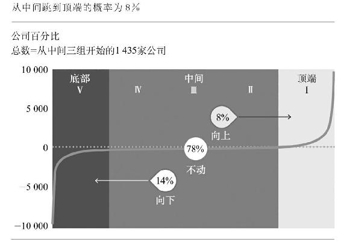
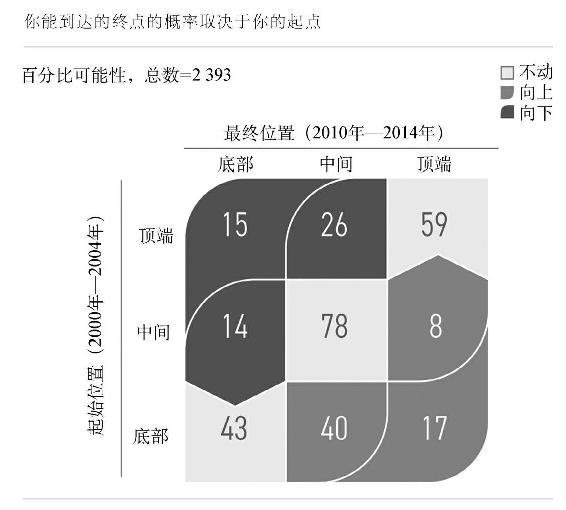
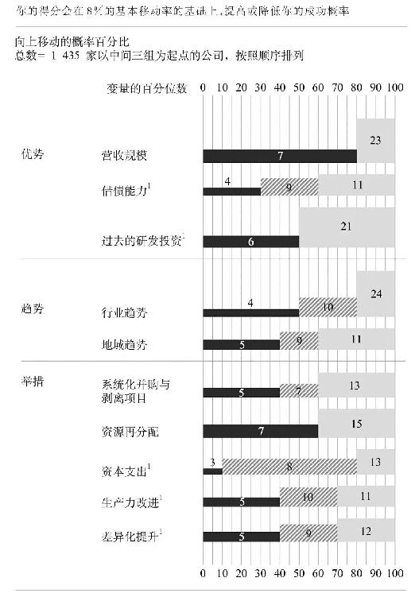
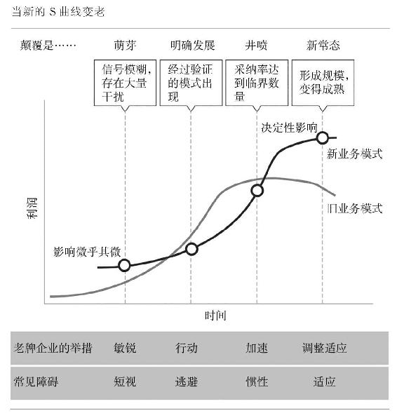

# note

10年间，从曲线的中间移动到前20%的概率是8%。

你能达到的终点的概率取决于你的起点。

# 10个重要变量

## 1. 优势-起始营收（规模）

企业越大，越有可能提高自己在经济利润曲线中的位置。

要在这个变量上获得重大优势，公司的总营收需要进入行业的前1/5。

## 2. 优势-债务水平（杠杆）

负债越少，越有机会向上移动。

## 3. 过去的研发投资（创新）

按研发费用与营收的比例计算，需要处在行业的前二分之一，才能大幅提升在经济曲线中向上移动的概率。

## 4. 趋势-行业趋势

10大变量中最重要的一个，如果要适应行业的发展，需要在10年内至少在行业经济利润曲线中向上移动一个五分位。

## 5. 趋势-在增长地域的曝光率

关键是要处于那些名义GDP增长排名前40%的市场之中。

对于涉足一个以上地域的企业来说，应该根据你从每个地域获得的营收比例来计算公司整体的GDP增长率。

## 6. 举措-务实的并购

每笔交易的成本都不超过公司市值的30%，但10年时间可以为你增加至少30%的市值。

## 7. 举措-动态配置资源

为能够实现爆发式增长且在经济利润曲线中实现大幅上升的部门提供资源，同时对起色不大的部门减少资源供给，企业更有可能成功。

基准线是在10年内把至少50%的资本支出重新分配给相关业务。

## 8. 举措-加强资本支出

如果公司的资本支出占营收的比例处于所在行业的前20%，就达到了这个杠杆的标准。

## 9. 举措-生产力改进

提升生产力的速度至少要达到所在行业的前30%

## 10. 差异化改进

想要利用商业模式创新和定价优势来提供在经济利润曲线中向上移动的概率，总利润需要跻身所在行业的前30%。

这项指标可判断一家公司能否因产品差异化和创新而实现可持续的成本优势或收取溢价。

每种变量所占百分数对公司向上移动的概率的影响。例如，营收规模在行业中处于前20%时，向上移动（成功/保持成功）的概率是23%。

## 了解概率

在所有决定性因素中，自身优势约占30%，趋势约占25%，采取的措施约占45%。

**概率不是简单的加总，需要认真考虑我们在研究分析中发现的各种杠杆的综合影响力。针对10项杠杆采取的举措一般都比你想象的力度大得多，而关键在于，它们能否超过特定阈值，但这要与竞争对手进行比较。这一点很重要。重大举措之所以重大，并非因为难以完成，或者是令团队感到精疲力竭，而是相对于竞争规模来说的。**

现在我们暂且可以这样理解：**无论人才基础如何，只要战略没有超过这10个杠杆的阈值，那么人才就很难弥补优势、趋势和举措上的不足。**

<u>**作为投资者或管理者，顺势而为才是更明智的做法。**</u>

你也一样需要让自己尽可能占据最大的趋势有利条件。如前所述，行业和区域这两个最重要的因素决定了公司在经济利润曲线上下移动25%的概率。趋势好比脚下的大地，甚至在你做出任何其他战略举动之前，它们已在推动你上移（或下移）。<u>走在趋势前面无疑是你必须做出的最重要的战略选择。</u>

<u>由于大多数业务竞争激烈，许多企业往往会着眼于当前的竞争，而不思考竞争态势变化的更深层次原因。</u>

### 改变从事的行业或者改变行业本身

1. 行业转型
   1. 改变行业规则
   2. 调整业务定位
   3. 改变地域
2. 选择新的行业领域（转行）

> **我们实现增长的一个重要原因是始终努力专注于增长领域。**现在，如果将业务放在亚洲和太平洋地区，增速会比放在西欧更快。我们努力发现行业中的增长趋势，我们的持续增长也将倚赖于此。当然，<u>找到最佳的收购对象也很重要，但首先还是要找那些敞开的大门。不管你有多聪明，但如果大门是关上的，推开它将十分费力。</u>

由于行业定位和行业趋势如此重要，善于顺势而为的企业会将这些观点融入与管理层考核业绩相关的日常工具中。与通常基于内部会计数据和标准市场报告的零星深度分析不同，使用全面的分析组件，几天内即可完成几年前耗时数月都无法完成的任务。你可以比较和分析行业业绩、投资组合基准、增长MRI等，为投资者进行分析。

## 颠覆性趋势的四个阶段

### 挑战一：在颠覆性趋势初期识别趋势

识别新的S曲线可能十分困难，因为它最初的坡度很小，常常不具备令人惊艳的盈利能力，也不吸引眼球。率先识别潜在增长曲线的早期阶段十分困难，我们生活中的大部分过程都以不易觉察的流线型发展。<u>虽然大部分企业的所作所为表明，它们非常善于应对明显的新兴事物，能快速整合资源并坚决采取行动，但在处理那些悄然发生发展、没有明显迹象的不确定威胁时，就有些力不从心了。</u>

### 挑战二：正确选择推动趋势的因素

将一家企业推上S曲线顶端的因素也可能令其在新S曲线底部徘徊不前。这需要企业采取不同的运营模式，但有时选对道路十分困难，即使你认为自己已经知道什么事情是对的。新的S曲线往往还对能力结构提出了不同的要求，达成这些要求才能成功。经验的价值下降了。

### 第一阶段：发出信号，但有噪音

老牌企业的核心业务几乎没有受到任何影响，基本上不存在需要率先行动的紧迫性，这可能因为利益相关者之间的需求相互冲突，再者，确定需要忽略哪些趋势、追随哪些趋势也是非常困难的。 

要获得更敏锐的洞见，克服在第一阶段的短视，老牌企业需要挑战自己的“故事”，颠覆行业赚钱的长期（有时是固有）信念。

> 这些主导的信念反映了一系列关于客户偏好、技术的作用、监管、成本驱动因素以及竞争和差异化基础的共同观念。它们常常被认为是不可违背的——直到有人违反为止。

> 每个人都喜欢改变，除了改变本身。——Alan Kay

战略的人性面会一如既往地让重塑工作复杂化。人们已经习惯了原有的思维方式，要改变它十分困难。许多公司的业务已经利用旧的S曲线赚了很多钱，而在竞争资源的战争中，他们可能（至少是悄悄地）阻碍转向新曲线的尝试。在初期阶段，转型的吸引力尚未显现，守旧者的观点特别有说服力。

### 第二阶段：让变革站稳脚跟

此时至关重要的是，老牌公司要着力推进新方案，以确保在新领域站稳脚跟。**更重要的是，他们需要确保新的试点项目独立于核心业务，即使是两者的目标相互冲突。**

由于颠覆的影响尚未大到阻碍盈利势头，相关的变革行动往往仍然缺乏动力。

*2011年，网飞公司采取颠覆措施，将业务重点从DVD转向流媒体，股价下跌了80%。*

很少有董事会和投资者可以在近期需求争议极大时直面这种阵痛。模糊不清的长期威胁看起来似乎并没有眼下的困境那么危险。

毕竟，老牌企业需要保护现有的收入，而创业者只有上升的机会可以抓住。另外，管理层更善于为他们熟知的业务制定战略，天生不愿意进入他们不熟悉规则的游戏。换言之，战略的人性面又作祟了。

最终的结果是：大部分老牌企业都会试水，进行一些不会让当前S曲线趋平并能免于自相残杀的小投资。**这些企业通常对协同效应（始终在寻求效率）过于关注，而不会进行激进的试验。**

**这种通过试探就可以进入圈子的幻想太过诱人了，缺乏可信度。**高管必须保证能够通过多种方案，培育可能摊薄盈利的小规模下一代业务。

*摊薄：因成本增加（增发新股）导致利润减少。*

**管理这样的业务组合需要能够高度容忍形势的晦暗不明，需要高管能够适应不断变化的公司内外部条件，同时始终保有为股东实现可观业绩的愿望。**<u>问题在于，人们往往会出于短期经济效益的考虑以及不愿转向外围业务的情感因素，而更倾向于保护核心业务。</u>

### 第三阶段：转型不可避免

本阶段，新的模式已被证明是优于原有模式的，而且行业也在展开行动。**老牌企业在本阶段的挑战在于要将资源向新业务倾斜，培育第二阶段的竞争力。**

将变革看作对新业务的风险投资，只有快速扩大规模才能带来收益，而原有业务将采取私募股权的方式退出市场。

<u>做出这种艰难的转变需要克服惰性，哪所企业看上去形势大好。</u>战略的人性面会使资源以“抹花生酱”的方法进行分配，企业很难实现明显的转向。

**本阶段是最艰难的阶段**

- 随着企业业绩开始受损，预算收紧，这些企业自然而然地停止在外围业务上的进一步运作，转而专注核心业务。
- **主要决策者通常都来自最大的业务中心，不愿意为了前景不明的创新业务让仍可盈利（但增长更为疲软）的业务缺乏资源。**
- *结果，领导层往往在新方案上投资不足，但却提出了很高的业绩要求。传统业务继续享受最多的资源。*此时， 主要的施压方使得企业更加不愿意，也更加没有能力解决这些问题。
- **在战略人性面的影响下，企业谢谢在最需要积极调配资源和大力投资之时，无法发挥资源的作用。**
- 董事会通常不愿意（或没有能力）改变对基准业绩的观点，面对业绩下滑，董事往往会给管理层施加更大的压力，以便采用当前模式实现雄心勃勃的目标，而无视进行深入变革的需求。**这只会让问题在未来进一步恶化。**
- 由于开始问题行业内实力较弱的企业受到的冲击最大，本阶段以前占据强势地位的老牌企业可能会因此盲目自信，“这不会发生在我们身上”。**关键是要密切关注相关的驱动因素，基于财务结果的后知之明并没有用。**

为了获得这一阶段所需的加速度，老牌企业必须大胆而坚决地重新配置资源，从旧模式转向新模式，并显示出采取与旧业务不同（且常常独立于旧业务）的方式经营新业务的意愿。

**如果老牌企业内部没有能力开展新业务，则必须考虑收购。<u>这方面的挑战是，要在业务模式得到检验与估值变得过高之间找准收购时机，确保其成为所收购业务理所当然的“最佳所有者”。</u>**

### 第四阶段：适应新常态

本阶段，企业别无选择，只能接受现实。

老牌企业的成本基础与新的（可能更窄）利润池不适应，盈利不断萎缩，企业发现自身处境非常糟糕，难以获得有利的市场地位。

企业面临的挑战是要适应利润池的新现实并从结构上调整成本基础，接受可能利润比“金河”微薄得多的“新常态”。

# 采取正确举措

最佳策略是从小处着手，有意识地逐步采取一系列小的举措。

*渐进式增长不会让公司获得长远发展，会增加低绩效的风险。*

**首先要立足于优势，看看公司的规模、债务水平和研发投资，目前拥有哪些资源和优势。此外，还要顺应趋势，虽然基本不受人为控制，但可以通过调整资源配置来把握机会，从而形成影响力。**

重要举措得以实施的前提：

- 认识到举措的重要性，和其他任何其他因素比，它们更能预测成功
- 需要足够努力才能切实改变企业攀登经济利润曲线的概率
- 多管齐下最为有效——优势或趋势越差，所需的举措力度越大

**如果仅仅是因为觉得举措很大，很难做到或者需要大量资源，这不一定就是“重大”举措。<u>你需要有一个外部的参照点：重大与否必须是相对于其他企业的所作所为而言的。你必须放眼世界，而不是坐井观天。</u>**

<u>认识到重大举措历来都很艰难，这不过是万里长征的第一步。</u>我们必须继续向前，向重大举措可能成真、哪怕只是得到鼓励的地方迈进。

## 系统化并购与剥离

**并购确实是促进增长的一大抓手。但成功与否很大程度上取决于企业选择的并购方案类型。**

*75%的并购终将失败的偏见早已被打破。它仅仅是基于与“见光死效应”有关的统计数据，并未反映企业价值创造的实际情况（而且还有许多规模较小的交易并未公布，而其累积影响却是不可忽视的）。*

最成功的并购方式是持续多次采购，平均每年至少进行一次，10年累计金额达到市值的30%以上，但任何一项交易的金额不会超过市值的30%。

**并购需要通过不断的交易锻炼相关能力，需要通过实践没逐步积累一系列能力。**通过多年（常常持续数十年）务实的并购，企业将真正成为识别收购对象、精通谈判和整合艺术的行家里手。

<u>实践太少的企业即使面对仅有的几项交易也很难做好。俗话说熟能生巧，我们的研究也发现，数量较少而规模较大的交易往往会损害企业的价值创造。</u>

**持续不断的并购有利于避免“反思诅咒”。此外它也可以增强你的业务能力。并购以及合并后整合项目的能力不是与生俱来的，而是通过不断的实践才能掌握的。**

## 积极的资源重组

“抹花生酱”方法无法确保将资源（资本、营业费用和人才）配置到公司最重要的增长机会上。平均分配资源会让那些无意或无法取得重大突破的部门获得过多的资源，而让那些本可以把握重大机会的少数部门缺乏可用的资源。

**打破惯性，将资源从低绩效部门释放出来，然后转移到高绩效部门，将会在企业各个层级创造价值，不论你如何定义这些部门。** <u>当然，问题在于，在一个资源有限的世界里，向某个部门重新配置资源意味着要减少另一个部门的资源，这也是摩擦和惯性的根源所在。</u>

**在10年内跨业务部门转移50%以上资本支出的企业，与资源调配力度低于这一水平的企业相比，同期创造的价值要高出50%。**

## 强健的资本方案

比行业扩张得更快。当你的**资本支出/销售额比率**在至少10年内都超过行业中间值的1.7倍时，则应在重大举措中增加资本支出工具。

成功的资本方案会进行项目进展管理：不要只投资你知道“合算”的方案；一定要投资一些风险略高的中期方案，以及一些风险甚至更高的长期方案；一定要确保投资项目储备充分。

**如果项目不能创造至少与资金成本相当的回报，那么实际上就是在破坏股东价值。同样，这也是我们在观察经济利润曲线时，利用经济利润来衡量财务表现的原因。经济利润是指扣除资本费用后的利润。**

## 生产力提升

**生产力改进方案在你设置了明确的标准时才真正具有意义。<u>你必须在10年内实现比行业中间值高25%的生产力改进。如果行业生产力每年提升2%，那你必须每年稳定地提高大约2.5%。</u>**

比方法更重要的是生产力改进方案本身。**能够促使整个组织长期稳定地提高生产力，并掌握对最终效益的影响，才是真正的差异所在。**

## 差异化改进

