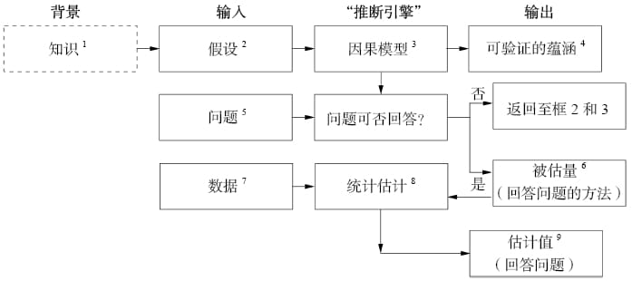

# 前言

> 禁止言论就意味着禁止了思想，同时也扼杀了与此相关的原则、方法和工具。

因果革命最重要的成果之一就是解释了如何在不实际实施干预的情况下预测干预的效果。

反事实反映了现实世界运行模式的特有结构，共享同一因果模型的两个人也将共享所有的反事实判断。

1. “知识”指的是推理主体过去的经验，包括过去的观察、以往的行为、接受过的教育和文化习俗等所有被认为与目标问题有关的内容。
2. 假设是研究者在现有知识的基础上认为有必要明确表述出来的陈述，只有假设才能被嵌入模型。
3. 因果关系的定义：如果变量Y“听从于”变量X，并根据X的变化决定自己的值，则X就是Y的一个因。
4. 可验证的蕴涵（testable implications）：可验证的结论，即X和Y是否有联系。如果推断结果和实际数据相抵触，需要修改模型。
5. 希望获得解答的科学问题，这一问题必须用因果词汇来表述。
6. 被估量：需要估计的东西，是我们从数据中估算出来的统计量。一旦这个量被估算出来，我们可以用它来合理地表示问题的答案。但是，在当前因果模型下，无论我们收集到多少数据，有些问题可能仍然无法得到解答（**例如，如果我们没有任何方法可以测量某个变量，那收集数据完全是浪费时间**），解决方法是完善模型，输入新的科学知识，使我们可以估计之前不可测量的变量，或者简化假设，从模型从去除这个不可测量的变量（此处有犯错的风险）
7. 数据可被视作填充被估量的原料。**数据本身不具备表述因果关系的能力，数据告诉我们只是数量信息，基于模型假设，该表达式在逻辑上等价于我们所要回答的因果问题。**

