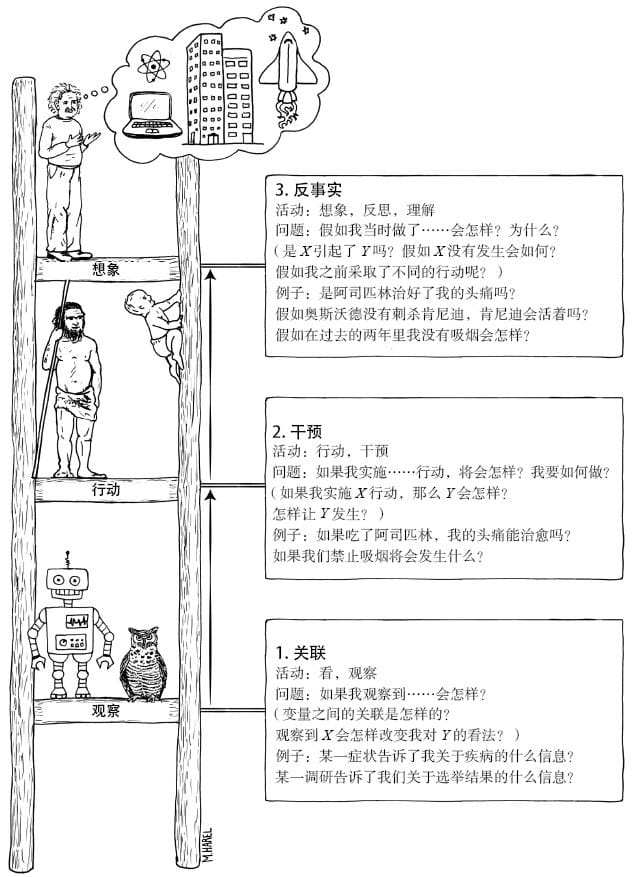

# 因果关系之梯

大约5万年前，人类以神奇的速度获得了改变环境和提升自身能力的能力。

学者提出的理论中，有一种理论和因果关系密切相关——想象力。<u>除非你能想象出事情的结果，否则寻问事情的原因就是徒劳的。</u>

## 因果关系的三个层级

> 人工智能领域“喷涌出大量的微发现”，但很遗憾，机器仍于类人认知相去甚远。——  盖里·马库斯（神经系统科学家） 纽约大学

*深度学习只是让机器具备了高超的能力，而非智能。这种差异是巨大的，原因在于后者缺少现实模型。*

因果关系学习者必须熟练掌握至少三种不同层级的认知能力：

- **观察能力（seeing）**：发现环境中的规律的能力，**对应观察到的世界**。
  - 基于被动观察做出预测：观察并发现两个事件的关联性
  - 处于因果关系之梯最底层的任何运作系统都不可避免地缺乏对未知事物的推理性和适应性
- **行动能力（doing）**：预测对环境进行刻意改变后的结果，并根据预测结果选择行为方案以催生出自己期待的结果（例如使用工具的能力）对应**可被观察的美好新世界**。
  - 干预比关联更高级，因为它不仅涉及被动观察，还涉及主动改变现状。**无论数据集有多大或者神经网络有多深，只要使用的是被动收集的数据，我们就无法回答有关干预的问题，因为我们无法知晓结果是如何形成的。**
  - 预测干预结果的一种非常直接的方法是在严格控制的条件下进行实验。<u>另一种方法是研发一个行为模型，利用充分的关键替代数据进行预测。</u>
  - 数据无法告诉我们在反事实或虚构的世界里会发生什么，但因果模型可以。
- **想象能力（imaging）**：理解工具为什么有效，工具可利用的范围及扩展性，对应**无法被观察的世界**。
  - 从想象的反事实中，我们获得的独特优势是灵活性、反省能力和改善过去行为的能力，更重要的一点是对过去和现在的行为承担责任的意愿。<u>古往今来，我们一直受益于反事实推理。</u>
  - 为了弥合行动和想象的差距，我们需要构建一个基础性的解释因果过程的模型，这种模型有时被称为“理论”，甚至（在构建者极其自信的情况下）可以被称为“自然法则”。简言之，我们需要掌握一种理解力，建立一种理论，据此我们就可以预测在尚未经历甚至未曾设想过的情况下会发生什么——这显然是所有科学分支的圣杯。**但因果推断的意义还要更为深远：在掌握了各种法则之后，我们就可以有选择地违背它们，以创造出与现实世界相对立的世界。**

大多数动物和当前的学习机器都处在第一层级。早期人类处于第二层级。反事实学习者牌阶梯的顶级，他们可以想象并不存在的世界，并推测观察到的现象的原因为何。

## 迷你图灵测试

图灵测试：一个普通人和一台计算机交流，如果人类无法判断谈话对象是人还是计算机，那么这台计算机就可以被视作一台思维机器。

迷你图灵测试：选择一个简单的故事，用某种方式将其编码并输入机器，测试机器能否正确回答人类能够回答的与之相关的因果问题。该测试仅限于考察机器的因果推理能力，不涉及人类认知能力的其他方面（例如视觉和自然语言）。

在图灵测试中，作弊是根本不可能的，因为一个变量发生变化，可能的结果就会指数增长。

**鉴于人们能轻而易举地用点和箭头构成的图来交流知识，我相信我们的大脑一定使用类似的表示方法。**

> 在创造出具备孩童智能水平的机器人之前，我们可能的确无法成功创造出类人智能，而创造出前者的关键要素就是**掌握因果关系**。

<u>如果我们希望计算机能理解因果关系，我们就必须教会它如何打破规则，让它懂得“观察到某事件”和“使某事件发生”之间的区别。</u>我们需要告诉计算机：“无论何时，如果你想使某事发生，那就删除指向该事的所有箭头，之后继续根据逻辑规则进行分析，就好像那些箭头从未出现过一样。”**使某事发生就意味着将它从所有其他影响因子中解放出来，并使它受限于唯一的影响因子——能强制其发生的那个因子。**

**构建因果模型不仅仅是画箭头，箭头背后还隐藏着概率。**不过，因果革命最有趣的特点之一就是，在许多情况下，<u>我们可以对这些完全不确定的数学细节（概率）置之不理。</u>

> 针对这类问题几十年的研究经验使我确信，无论是在认知意义上还是在哲学意义上，因果观都比概率观更重要。

概率位于因果关系之梯的第一层级，它不能（靠自己）回答第二层级或第三层级的问题。**任何试图用看似简单的第一层级的概念去“定义”因果关系的做法都必定会失败。** 这就是我不去定义因果关系的原因：定义追求简约，而简约迫使我们不得不降至较低的层级。与此相反，我追求的是一个更具建设性的最终方案，其能够解释如何回答因果问题，以及们究竟需要获取哪些信息来回答这些问题。

**概率能将我们对静态世界的信念进行编码，而因果论则告诉我们，当世界被改变时，无论改变是通过干预还是通过想象实现的，概率是否会发生改变以及如何改变。**