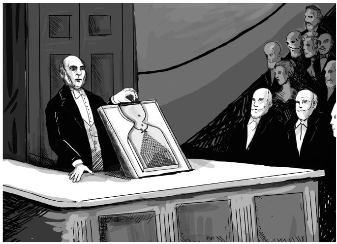
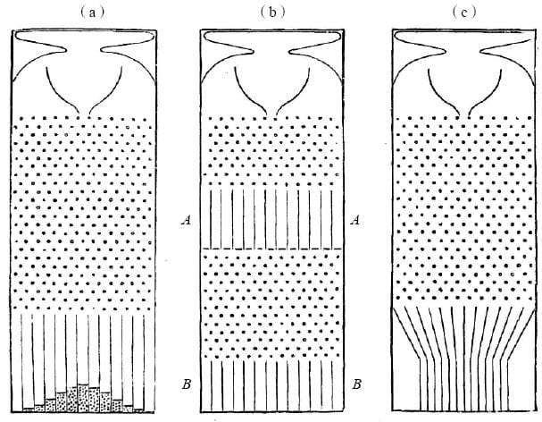
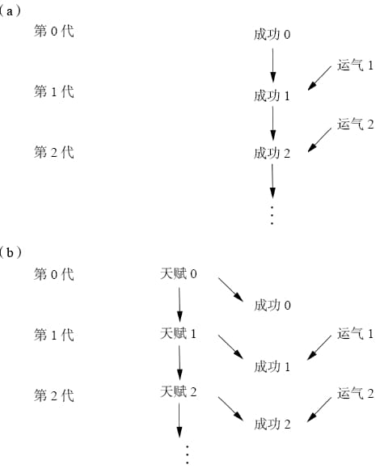
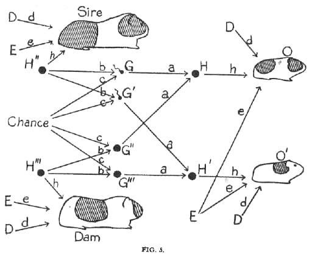

# 因果推断的起源

## 梅花机 quincunx（高尔顿板 Galton board)

1810年，埃尔-西蒙·拉普拉斯证明了中心极限定理，在适当的条件下，大量相互独立随机变量的均值经适当标准化后依分布收敛于正态分布，这种概率分布被称为正态分布（或钟形曲线）。高尔顿板是中心极限定理的一个直观演示。

弗朗西斯·高尔顿（达尔文的大表弟）在1877年2月9日利用梅花机试图说明身高遗传模型是个因果模型。然而这个模型没办法解释人类身高的极限，即钟形曲线无法解释基因遗传的稳定性。

高尔顿以寻找因果关系为起点，找到了和因果完全无关的关系——**向均值回归（regression toward mediocrity）**。

*在身高问题上，既存在儿子比父亲高的情况，也存在父亲比儿子高的情况。所以身高和遗传不存在因果关系。*

### 卡尼曼方程和高尔顿《世袭的天才》

> 成功=天赋+运气
>
> 巨大的成功=更多的天赋+更多的运气
>
> ——《思考快与慢》

a：高尔顿板模型

b：遗传模型

从现实来看，b模型更符合现实，即运气不可遗传，天赋可遗传，可遗传的天赋+不可遗传的运气=成功

### 皮尔逊：努力把因果关系从统计学中抹去

皮尔逊：高尔顿的学生，试图把因果关系从科学中完全清除。他也仍然无法解释例如“巧克力消费量和该国诺贝尔得主的人数之间存在强相关”这样的现象。对他而言，因果关系只是“对于现代科学中一些深奥难解的事物的一种迷信”，相关性才应该是科学理解的目标。

## 休厄尔·赖特和路径图

1912年，赖特到哈佛大学学习遗传学，1915年毕业以后，到美国农业部负责饲养豚鼠。赖特所饲养的豚鼠是他整个职业生涯的跳板，也是他提出其进化理论的基石。赖特认为：**进化不是如达尔文假想的那样渐进地发生，而是一种相对突然的爆发（基因突变）。**

赖特发现不同毛色基因会表现在豚鼠身体的不同部位，毛色的图案不仅取决于豚鼠继承的基因，而且取决于这些基因的遗传表现出现在豚鼠的什么身体部位，以及它们以何种组合得以表达或抑制。

> 在寻求某个未知量的值时，你可以先赋予该量一个符号，然后用数学方程的形式描述你对该量和其他相关量的认识，最后，如果你有足够多的耐心和足够多的方程，你就可以解出方程式，并算出目标量的值。

*其中西雷（Sire）和达姆（Dam）分别是豚鼠父母的名字，左侧“Chance”一词在此表示随机因子。该路径图说明了决定豚鼠毛色的因子。D=发育因子（存在于豚鼠母亲怀孕以后，子鼠出生之前），E=环境因子（存在于子鼠出生以后），G=来自豚鼠父亲或母亲个体的遗传因子，H=来自豚鼠父母双方的混合遗传因子，O、O'=豚鼠后代。该分析的目的是估计D、E、H的影响强度（图中记作d、e、h）*

路径图不只是一张漂亮的图画，它更是一个强大的计算工具，因为计算相关关系的规则（从第二层级到第一层级的桥梁）就是追踪连接两个变量的所有路径，并将沿途所有的路径系统相乘。更重要的是，**箭头缺失所蕴含的假设实际上比箭头存在所蕴含的假设更重要。两个变量间箭头缺失这一事实将二者的因果效应限制为零，而箭头存在这一事实并不能告诉我们因果效应的大小具体为何。**

<b>没有因果假设，就不可能得出因果结论。</b>

*我对赖特这段真知灼见的钦佩仅次于我对他的勇气和决心的钦佩。请大家想象一下1921年的情况：一个自学成才的数学家独自面对统计学界的霸权。他们告诉他：“你的方法是基于对科学意义上因果关系本质的全然误解。”而他反驳说：“并非如此！我的方法创造出了重要的事物，其价值超越任何你们可以创造的东西。”他们说：“我们的专家在20年前就对这些问题进行了研究，并得出结论——你的分析方法完全是无稽之谈。你所做的只不过是把一些相关关系结合起来推导出另一个相关关系而已。等你‘长大’了，你就会明白了。”而他继续说：“我不是看不起你们的专家，但事实就是事实。我的路径系数不是相关关系，而是一种完全不同的事物：因果效应。”*

**路径分析需要建立在科学思考的基础上，因果推断的每一次实践也都需要建立在科学思考的基础上。而统计学则一如既往地打压这种做法，鼓励采用“固定程序”解决问题。统计学家总是喜欢针对数据进行常规性的计算，而不喜欢接受那些挑战了他们已有知识体系的方法。**

<b>因果分析绝不只是针对数据的分析；在因果分析中，我们必须将我们对数据生成过程的理解体现出来 ，并据此得出初始数据不包含的内容。</b>

20世纪60年代，社会学家重新发现了路径分析，将其视作预测社会政策和教育政策实施效果的有效方法。

路径分析在经济学和社会学中有着不同的命运轨迹，但两者最终都走向了对赖特思想的背叛。*社会学家将路径分析改名为结构方程建模（structural equation modeling,简称SEM），他们接纳了其中的图形表示法，并将其广泛应用于各类研究——直到1970年，一个叫作“LISREL”（线性结构关系模型）的计算机程序包被开发出来，用于自动计算（某些情境下的）路径系数。*

<u>赖特很可能预测到了接下来发生的事：路径分析变成了一种生搬硬套的方法，研究者则变成了软件使用者，对后台发生的事情全无兴趣。</u>

- 20世纪80年代末，统计学家大卫·弗里德曼对解释结构方程模型背后的假设提出了公开挑战，而无人能够做出有效回应，一些顶尖的结构方程模型专家甚至拒绝承认结构方程模型与因果论存在任何联系。
- 在经济学领域，路径分析的代数部分演变为联立方程模型（simultaneous equation models，没有简称）。经济学家几乎完全舍弃了路径图，且时至今日依然如此，他们更多地借鉴了数值方程和矩阵代数方面的内容。这样做的一个可怕后果就是，由于代数方程是没有方向性的（x=y与y=x相同），经济学家也就无法利用符号表示法来区分因果关系和回归方程，因此即使在解出方程之后，他们仍然无法回答与估计策略效果有关的问题。**直到1995年，大多数经济学家依然没能明确地赋予方程以因果意义或反事实意义。即使是那些利用结构方程来进行决策的人，也对图形表达法秉持着无可救药的怀疑态度，而不顾事实上图形表达法能够为他们节省一页纸又一页纸的计算量。受此传统观念的影响，一些经济学家直到今天仍然声称：“一切尽在数据之中。”**

出于所有这些原因，直到20世纪90年代，路径图的科学使命才得到了部分实现。1983年，赖特本人又一次被召回学术圈为路径图辩护，这一次是在《美国人类遗传学杂志》（American Journal of Human Genetics ）上。写这篇文章的时候，赖特已经年过90。这篇文章的题目与他在1923年写的那篇文章的题目完全一样，因此阅读这篇文章让人悲喜参半。在科学史上，有幸在提出某理论的第一篇论文发表后的60年再次聆听这位理论开创者的讲述的机会能有几次？这就像1925年查尔斯·达尔文从坟墓里爬出来为斯科普斯猴子审判案做证一样。<u>但这也是一种不幸，因为在这60年中，他的理论本该得到发展和壮大，而事实则是，自20世纪20年代以来，该理论几乎没有任何进展。</u>

赖特撰写这篇论文的初衷是回应一篇对路径分析的批判文章。这一批判文章发表在同一本杂志上，是由塞缪尔·卡林（斯坦福大学数学家、1989年美国国家科学奖章获得者，为经济学和种群遗传学做出了非常重要的贡献）和两个共同作者撰写的，其中最值得我们关注的是卡林的两个论点。

1. 首先，卡林反对路径分析，其给出的原因是尼尔斯没有提到的：路径分析假设路径图中任意两个变量之间的所有关系都是线性的。这个假设允许赖特用一个数字，即路径系数来描述因果关系。如果方程不是线性的，那么X中一个单位的变化对Y的影响就取决于X的当前值，而不能用一个固定的系数来表示。卡林和赖特都没有意识到，这一观点包含着一般非线性理论的萌芽。（在这场争论的三年后，我的实验室中的一位优秀的研究者，托马斯·维尔玛，创建了这一理论。）

2. 而卡林最值得关注的批评，也是他自己认为最重要的一条：“……最终，综合各方面的因素考虑，我们认为最有效的做法是采用一种无模型的方法，借助一系列的展示、指标和对比来交互地理解数据。该方法强调了在解释结果时‘稳健性’这一概念的重要性。”**卡林的这句话清楚地显示了自皮尔逊时代以来统计学界的观念变化是多么微乎其微，以及皮尔逊思想的影响之巨直到1983年仍不减其威。卡林表达的是，数据本身就已经包含了所有的科学智慧，只需要（通过“展示、指标和对比”）对其进行稍加打磨，数据便会吐出那些智慧的珍珠。我们的分析不需要考虑数据生成的过程。使用“无模型方法”，我们也能做得一样好，甚至更好。如果皮尔逊今天依然健在，生活在我们现在这个大数据的时代，他一定会说：答案都在数据之中。**

   <u>显然，卡林的说法违背了我们在第一章学到的所有内容。在谈论因果关系时，我们必须有一个关于真实世界的心理模型。“无模型方法”也许能把我们带到因果关系之梯的第一层级，但肯定不会让我们走得更远。</u>

## 从客观性到主观性——贝叶斯连接

赖特认为，路径分析的应用应该以研究者对因果过程的个人理解为基础，这种理解就反映在其所绘制的因果图或路径图中。它不能被简化为一个机械性的程序，就像统计手册里列出的那些操作方法一样。

**与相关性分析和大多数主流统计学不同，因果分析要求研究者做出主观判断。为了确保客观性，他反而必须放弃传统的客观性教条。**

<u>在过去的50多年里，作为统计学分支之一的贝叶斯统计越来越受人青睐。它曾被认为是一种异端邪说，如今则完全变身为主流思想。</u>

**贝叶斯分析的原型是这样的：先验判断+新的证据→经过修正的判断。**而频率派无法忍受的正是贝叶斯学派允许观念以主观概率的形式“入侵”“纯洁”的统计学王国的做法。在贝叶斯分析被证明是一种优秀的工具，且适用于各种应用场景，包括天气预报和追踪敌方潜艇之后，主流的统计学家也只能勉强地承认对手的成功。

遗憾的是，主流统计学界对贝叶斯学派的主观性的接受并没能促进其对因果主观性的接受，他们仍然排斥在分析问题之前先依据已有的因果知识绘制路径图的方法。

