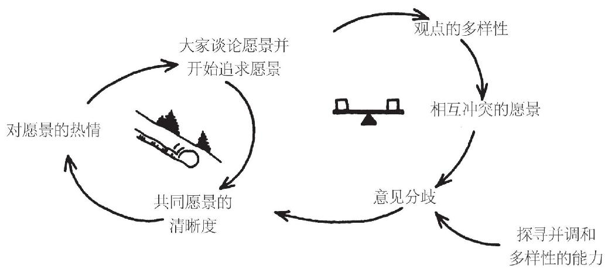

# 共同愿景

共同愿景不是理念，甚至不是重要的理念。相反，它是人们内心的愿力，一种由深刻难忘的影响力所产生的愿力。它的起始，的确可能受到理念的激发，但是，一旦它得到进一步发展，比如形成足够的吸引力，征得两人以上的支持，那它就不再是抽象的东西了。这时它成了明确而可触知的东西。大家开始看到它似乎真的存在了。**人间几乎再没有什么比共同愿景更有力量的了。**

在最简单的层面，共同愿景是对下面问题的回答——**“我们想要创造什么？”**个人愿景是人们在自己头脑里的图景和画面，<u>而共同愿景则是整个组织中的人们内心的图景。这样的图景让组织有一种共同性，它贯穿整个组织，从而在其各式各样的活动中保持一种连贯性和一致性。</u>

当我和你心中有一幅相似的图景，并且各自都承诺一起将之保持，而不只是个人自己持有，这个图景就成为真正共同的愿景了。当大家拥有真正的共同愿景时，彼此之间就相互沟通了，并且被一种共同的热望和抱负凝聚在一起。个人愿景的力量来自自身对愿景的深度关切，共同愿景的力量则来自一种共同的关切。实际上，我们认为，**人们想寻找共同愿景的原因之一，就是期望在重要的事业上找到沟通和共鸣。**

对学习型组织而言，共同愿景是至关重要的，因为它是学习实践的焦点，也是其动力来源。适应性学习没有愿景也可以进行，但，**生成性学习则只有在大家为真正关切的事业而努力时，才能发生。**

在大家对真正想成就的愿景唤起兴奋和激情之前，生成性学习以及有关扩展创造性能力的所有说辞，就只是个抽象的概念而已，没有什么实际价值。

## 共同愿景的重要性

许多共同愿景都是外在的，即关注于相对于外部，比如竞争对手，而实现成功的业绩。然而，<u>目标局限在击败对手，总会是暂时的。一旦愿景目标实现了，就会很容易滑向防卫心态。</u>只依赖外在愿景，以击败对手为唯一目的，会妨碍组织的长期发展。

**试图用理性的方法去说服人类采取长远观点，也许根本就行不通。人类要采取长远观点一定是出于其志愿，即<u>人们想这样做，而不是被要求必须这样做</u>。**

<u>在人类活动中，每一个有长远观点指导实践的例子，背后都有一个长期愿景在起作用。</u>

> 战略规划工作花了钱，原本是要找到更加有未来导向的方法。然而，如果追问起来，大多数经理人会承认，他们的战略规划更多的是关于今天的问题，而不是明天的机遇。

**典型的战略规划只注重对市场机会、公司资源状况、竞争对手的优缺点等做出详尽分析，而忽略了一个关键问题，<u>即如何形式更长期的行动计划——建立“一个值得投入和奉献的目标”</u>**

## 建立共同愿景的修炼

### 激励个人愿景

共同愿景是从个人愿景中结晶浮现出来的。

**要建立共同愿景的组织，就应该不断激励组织成员去开发个人愿景。**如果大家没有自己的个人愿景，就只能“报名加入”别人的愿景，结果只有顺从，而不会有奉献和行愿。

因此，**自我超越修炼就是共同愿景开发的基础。这不仅包括个人愿景，<u>还包括对真相的承诺，以及创造性张力等这些自我超越修炼的特征内容。</u>共同愿景会增加创造性张力，可能大大超出个人舒适习惯的水平。**

**能够“支撑住”这种张力的人，会对实现崇高愿景有较大的贡献：保持清晰的愿景，同时不断探寻现实。由于亲身经历着这种力量，这些人便能深信自己创造未来的能力。**

### 从个人愿景到共同愿景

一组人分享对组织的愿景时也类似，每个人都看到自己心中对组织的最佳图像。每个人分担着对整体的责任，而不只对自己的那部分负责。每个人都从自己的角度，用自己的方法，看更大的共同愿景。

**建设共同愿景修炼的第一步就是放弃传统观念，即认为愿景总是从“高层”宣示的，或者从组织的正规计划工作中来的。**

- 自上而下的愿景是一次性愿景，是公司战略的一锤子买卖：一次性提出具有指导性的总方向和总体意图
- 自上而下的愿景没有植根于大家的个人愿景，各级员工没机会参与探寻和测试，大家没能理解，也不能“认领”和拥有这种愿景，把它变成自己的东西。
- 自上而下的愿景不是解决问题的方案。假如把它看成是解决问题的方案，那么，“问题”解决以后，愿景的能量也就消失了。<u>愿景建设必须成为领导者日常工作的核心内容，不断进行，永无止境。</u>

处于领导地位的人必须记住，自己的愿景仅仅只是个人愿景，**不会自动成为“组织的愿景”**。

**愿景发起于组织的中层，较之发起于上层，其分享和聆听的过程情况基本相同，<u>但可能要花更长的时间</u>，特别是如果愿景蕴涵着与整个组织的关联和影响作用。**

> 一名有想象力的远见卓识的领导者，就是在保持心中愿景的同时，**解决日常的问题。**——Charlie Kiefer

### 聆听

真正被分享的愿景，需要不断的沟通，大家不仅要自由表达梦想，还要学会如何聆听对方的梦想。从这种聆听中，新的洞见、新的可能性，才能逐渐浮现出来。

聆听常常比说话表达更难，对意志力超强、凡事都有明确想法的经理人而言，尤其如此。<u>**聆听要求有非同寻常的开放心胸，愿意理解各种各样的想法。**</u>我们必须允许多种愿景共存，聆听所有个人愿景，以找到超越和整合各种愿景的最佳行动路线。

## 愿景的推广：加入、顺从和投入

**根据经验，90%以上被认为是奉献投入的，其实只是顺从。**

我们常常听经理人说，要让员工“相信”愿景，多数情况下这就是一个兜售：我卖，你买。“被兜售”常常不是自主的选择。

当代大多数组织中，很少有报名加入愿景的——承诺投入就更少了。大多数人处在“顺从”的状态。“顺从”，追随，跟着愿景走，让做什么就去做什么。在一定程度上，他们支持愿景。<u>但不会真正报名加入，或承诺投入。</u>

### 对愿景的几种态度

- **承诺投入**：想要、志愿实现愿景；创建任何必要的“法则”（构架）。
- **报名加入**：想要、志愿在“法则的内在精神”范围内做力所能及的事。
- **真心顺从**：看清了愿景的好处，会做任何分派做的事，而且会多做；遵守“法则的严格字义”，是“好兵”。
- **形式顺从**：大体看清了愿景的好处，会做分派做的事，但不会多做；是“还不错的兵”。
- **勉强顺从**：看不清愿景的好处，不过还不想为它丢掉饭碗；分配做的事，不得不做，做得差不多就行了；并且还明确表示：他并不是真心合作。
- **不顺从**：看不清愿景的好处，不愿做分派的事；“我不做这个，你不能强迫我做”。
- **冷漠**：既不反对，也不赞成愿景；没兴趣，没干劲儿；“到下班时间了吧？”

**在大多数组织里，大多数人对组织目标和基本规章，都处在形式顺从或真心顺从的状态。**处在不顺从或勉强顺从状态的人，通常很明显。他们反对组织目标或规章，其明确的表态方式，要么是通过无所作为，要么（如果是勉强顺从）是通过“恶意服从”：我会做的，但只为证明这行不通。

从工作表现上看，真心顺从的人和报名加入或承诺投入的人，常常是难区分的。简言之，真心顺从的人会尽一切可能，照规则办事，包括正式规章和潜在规则。

但**顺从和承诺投入还是有巨大差别的。**承诺投入的人会带来激情、能量和兴奋，而只有顺从，甚至是真心顺从的态度，做不到这些。（简言之，创造力和承诺投入相关，和顺从无关，顺从不会带来创造力）。

**承诺投入的人，不会循规蹈矩，而会对规矩本身负责。如果规矩妨碍愿景的实现，他会设法改变规矩。**一群对共同愿景有真正承诺和投入的人，会产生一股令人敬畏的力量。

### 真心顺从与报名加入、承诺投入之间的区别

真正加入或投入的人，真心想要一个愿景。而真心顺从的人，只接受一个愿景；也许他们想要，但却是为了别的什么目的——比如保住工作，或者让领导开心，或者得到晋级。<u>他们不是真想要那个愿景本身，那不是他们自己的愿景。</u>

## 加入和投入指南

### 自己先加入

你自己还没有加入，就没必要招募别人加入，不然就变成“兜售”，而不是招募报名。那样的结果可能最好的情况也就是一种肤浅的协议，以及顺从，更坏的后果是种下日后仇恨的种子。

### 直截了当

不要夸大利益，或者隐藏问题。愿景描述要尽量简明扼要、直截了当。

### 当对方选择

不必“说服”对方，说愿景有多大利益。你试图说服对方的努力，实际上让人看到操控，反而阻碍对方加入。越是愿意让对方自由选择，对方越感到自由。

## 愿景植根于指导性理念中

### 三个关键问题

- 是什么：我们追求创造的未来图景
- 为什么：志向目标（或使命），我们存在是为什么
- 怎么做：核心价值，怎么做才能符合我们的使命，并从现实一路实现我们的愿景

## 正面愿景和负面愿景

**负面愿景**：许多组织只有在遇到生存危机时，才能真正凝聚起来。它们把几乎全部精力都放在避免不想要的东西——被吞并、破产、失业、丢掉市场份额、收入下滑，或者“让竞争对手抢先推出下一个新产品”。

### 负面愿景的局限性

- 创新的能量被分散转移，却“防范”我们不想要的东西
- 负面愿景带来一种微妙但又明确的无能为力的信息：我们大家其实并不真正关心
- 负面愿景不可避免是短期的：组织激励只有在危机持续时才有效，一旦危机解除，组织的愿景和精力也就消失了

**激励组织的根本能量来源有两个：**

- 恐惧：驱使负面愿景，可以在短期内实现非凡的变革
- 愿望：驱动正面愿景，可以持续不断成为学习和成长的源动力

释放创新过程能量的关键，不在个人愿景本身，关键在“创造性张力”，即**愿景与现实两者之间的张力**。<u>最有战斗力的人，能够在“保持”其愿景的同时，持续投入对现实的清醒观察。</u>

## 共同愿景与第五项修炼

### 愿景为何夭亡

人们对愿景的热情不断提高的正反馈过程，遇到了不断增加的多样化、分歧和限制愿景传播的负反馈过程，形成两者相互作用，这是增长极限模式的经典结构。

<u>观点的多样性会不断发展，直到它超出组织机构的容量能力，无法“调和”这种多样性了。</u>**要避开这个极限，最重要的是反思和探寻技能。**形成愿景的过程实际上是一种特殊的探寻过程，它探寻的是**大家**真正想创造的未来。如果开发愿景的过程变成彻头彻尾的鼓吹宣扬，那它最多也只能带来顺从，而非承诺投入。

**在增长极限模式的各种结构中，要发现杠杆作用点，往往要通过理解限制因素、理解引发负反馈作用的隐性目标或规则。**

- **自我超越是发展共同愿景的基石——组织如果不鼓励自我超越，就很难培育对高远愿景的持续承诺投入。**

- 如果人们无法驾驭现实需求，失去对愿景的关注，也会使正在形成的愿景夭亡。在此情况下，**限制因素是人们用于关注愿景的时间和精力。**杠杆作用点必然在于减少用于应付危机和掌控现状的时间和精力，或者将探寻新愿景的人与应对现状的人分开。（但这样做往往容易形成两个阵营，而且它们最终会两极分化，无法相互支持。）
- 当人们忘掉彼此间的连通性时，愿景也会夭亡。<u>一旦人们不再询问“我们究竟想创造什么”，一旦大家开始宣扬官方的愿景宣言，组织中正在进行的交流以及从中培养的人际关系都会受到侵蚀。连通性十分脆弱，我们一旦不尊重他人，不尊重彼此的观点，就会对它造成损害。于是，我们分化成了内部的人和外部的人，也就是愿景的“真信者”（或“忠实的信徙”）和“非真信者”。如果发生这种情况，为开发愿景而进行的交流，就再也不能激发对愿景的真挚热情了。</u>

**导致人们鼓吹劝诱而失去彼此间的连通感的，可能是<u>时间或技能</u>这两个限制因素。**

### 遗漏的协同效益：共同愿景与系统思考

如果没有系统思考，建设共同愿景的修炼就会缺乏一个关键基础。愿景画出我们想要创造的未来图景，系统思考则揭示<u>我们如何创造了我们的现状</u>。

**只有在大家深信自己能够塑造未来时，愿景才能成为一种生机勃勃的力量。**大多数经理人没有亲身经历帮助创造现实的过程，因而他们无法看清自己如何能够帮助改变现实。<u>他们认为，问题是由“外部的”或者“系统的”因素制造出来的。</u>

在大多数组织内部，认为“我们不能创造未来”是很危险的看法，所以从未被承认过。但是这种“能做”的乐观信念，其实是一种**反应式根本观念的外表虚饰**。因为主导大多数组织是线性思考，不是系统思考。事件主导的心态告诉人们，游戏的规则是**对变化做出反应，而不是发生变革。**<u>事件主导的倾向会逐渐消灭真正的愿景，留下的只是空洞的“愿景宣言”，即那些不能深入人心的美好概念。</u>