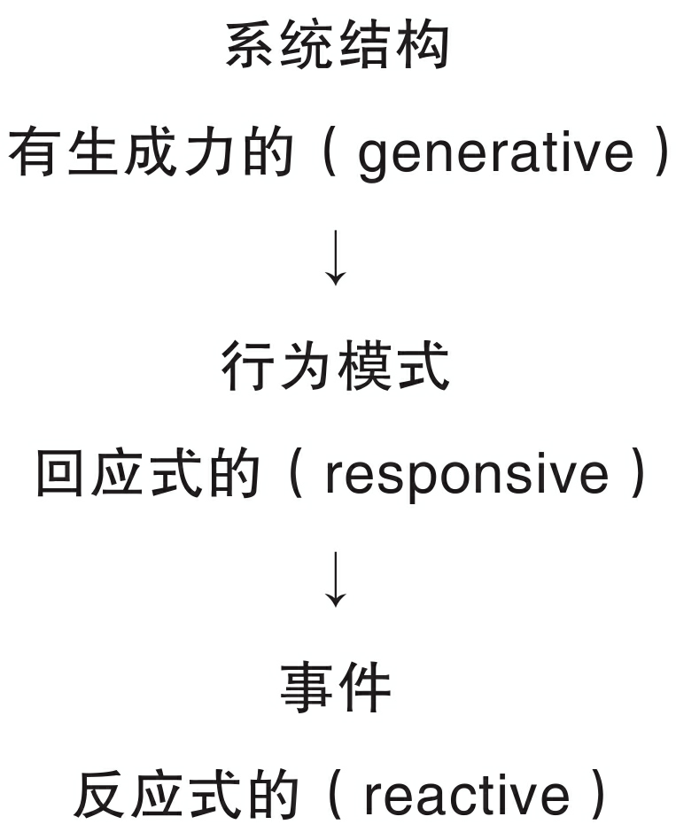

# 是系统的囚徒，还是我们自己思想的囚徒？

## 系统结构影响行为模式

**当置身于同一个系统中时，人们无论有多大差别，都倾向于产生相似的行为结果。**

> 真正深刻且不同寻常的洞察力，来自观察系统如何塑造自己的行为方式。——Donella Meadows

> **在历史规律的研究中，我们必须彻底变换一下观察对象：要把那些国王、大臣和将军们忘掉，转而研究引导群众的那些看似特征相同的、微不足道的因素。没人可以确定，沿这条新路走下去，人类对历史规律的了解能达到怎样的深度。但是很显然，只有沿着这个新方向走，才有发现历史规律的可能性。**——托尔斯泰

### 何谓系统结构

系统结构指**随着时间的推移而影响行为表现的重要的相互关系。这种相互关系指关键变量之间的关系。**

在人类系统中，结构就包括人们如何做决策——即我们依据观点、目标、规则和习惯来指导行动的“操作性政策”。然而，我们往往察觉不到自己有这种能力，事实上，通常我们根本看不到结构模式的作用，<u>我们反而觉得自己被迫以某种方式行事。</u>

当问题发生时，我们内心深处都觉得需要去责怪什么人或者什么事。<u>一旦当参与者发现他们不应当再相互责备，也不能责备顾客时，他们就只剩下最后一个可以责备的目标——**系统**。</u>

<u>典型的“管理自己的职位”这一做法的缺陷在于，你看不到自己与他人的订单之间相互作用而产生的影响，这些影响往往被你当作是“外部的”。</u>参与者其实是更大系统中的一部分，而身处其中的多数人都对系统感到迷茫。

**作为一个参与者，你的影响远远超出你的职责范围。你并不是简单地向真空中下个订单，然后通过变幻法术，就让商品送上门来。你的行为影响到供货商的行为，然后他的行为也许又要影响到另一个供货商。反过来，你的成功并不仅仅是由于你的订单，整个系统内每一个人的表现都对你有影响。**

## 解决和改进问题取决于我们的思考方式

**从系统角度看，对于任何复杂的情况，都有多层面的解释，在某种意义上，所有解释都是“正确的”，但这些解释的用途却各不相同。对事件的解释，比如“谁对谁做了什么”，注定会将持有这种观点的人局限在反应式的心态上。**

现代文化中最经常发生的，就是对事件的解释，这也正是“反应式管理（reactive management）”流行的原因。

**结构性的理解之所以如此重要，是因为只有这种理解才能涉及行为背后的原因：也只有在这个水平上，行为模式才可以改变。**

结构模式可以产生行为，潜在的结构变化可以产生不同的行为模式。从这个意义上来说，**结构性的理解是有内在生成力的。**

对大多数游戏者来说，最深层的洞察力通常来自他们意识到，问题的产生以及改进的希望，这两者都**取决于他们的思考方式**。

<u>以就事论事为主导模式的组织，是不能持续进行生成性学习的。</u>我们需要“结构性”或者系统性思考的概念框架，也就是发现影响行为的结构性原因的能力。

