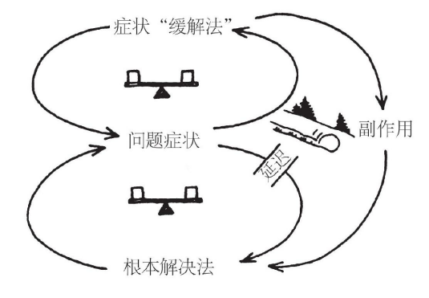

# 把系统观点带入实践，掌握系统基本模式

**某些结构模式是反复发生的。**这些“系统基本模式”或“通用结构”，是学习观察我们个人和组织生活中的结构的钥匙。

系统基本模式就是不断反复出现的基本语句，或简单的故事段落。

到目前为止，研究人员已经发现约12种系统基本模式。

## 1. 增长极限

### 定义

一个正反馈（放大）过程开始启动，产生一个期望的结果。它创造一个成功增长螺旋，但也在无意中产生副作用（在负反馈过程中显现的），从而使增长逐渐放缓。

### 管理原则

不要强行推动增长，要消除限制增长的因素。

### 结构

<u>每个增长极限的案例中都有一个正反馈（放大）过程，在一段时间里它自己就会产生增长或改进作用。然后它会碰到一个负反馈（稳定）环路，后者开始发挥限制增长的作用，改进速度会因此放缓，甚至完全停止。</u>

### 理解和利用

增长极限的模式在各个层次的组织结构中都发挥着作用。

每个结构模式中，限制作用都**逐渐变得越来越强大**，增长率可能逐渐下降到很低的水平，甚至其正反馈环路可能掉头逆转，变成负增长。

<u>变革越是成功，就越可能对人些人产生威胁，于是他们就会开始拆台，去阻止变革的实施。</u>

**负反馈作用的结果之一，就是让希望发生的变革措施的实施在一段时间里很顺利，但随后就进展缓慢，并且往往最终衰落、败北。而变革推动者对结果的失望和反应，又往往让事情变得更糟。**

*实施“准时化”（just-in-time）存货管理和其他“精益”或“柔性”生产系统时，也会遇到类似的互动作用，因为这些系统都依赖供货商和制造商之间的信任关系。最初的生产过程的柔性和成本绩效后来无法持续改善了。这些生产系统的供应商，后来往往会要求成为独家货源，以降低突击供货带来的风险。这对于制造商来说就是个威胁，因为他们习惯于向不同的供货商多头订货，或者通过竞标战让供货商之间相互杀价。这时，制造商对新供货系统的承诺和信心，也会随之动摇。供货商也一样。于是，他们都更有可能通过继续使用过去的多头订货和多家供货的方法，来避免风险，也因此而破坏了准时化系统所要求的相互信任的关系。*

**大多数人遇到增长极限情况时，往往试图使劲儿推动增长，越是努力，负反馈作用阻力就越大，努力就越徒劳无功。**有时，有人干脆放弃原目标，但实际上不再继续追求变革计划的成功，就更不可能把成功变革的潜力挖掘出来。

每个增长极限情况的杠杆作用都在负反馈环路上，而不在正反馈环路。要改变系统的现状，就**必须辨别并改变负反馈限制因素的影响。**<u>这可能要求你采取自己未曾想到的措施，做出自己未曾考虑过的选择，并完成对奖励和行为规范系统的困难的变革。</u>

增长极限模式还有另一个启示：**限制作用总会存在的。一种限制因素被排除或削弱了，增长就回来了，但新的限制因素还会出现。**试图排除限制因素以延长增长，实际上可能会适得其反。

### 识别生活中的增长极限

> **了解某个系统基本模式的最好方法就是结合你自己的情况把它画出来。越是主动分析并思索这些基本模式，就越容易认清它们，并找到杠杆作用点。**

要识别生活中的增长极限模式结构，最简单的方法就是考察行为模式。事情会不会在一开始越变越好，但之后就神秘地停滞不前？如果遇到这种情况，你可以尝试去分辨构成其正负反馈回路的因素。

1. 辨认出正反馈——**什么变得更好了，又是什么行动环节带来了改进？**
2. 认清限制性因素和它所带来的负反馈——**是哪种“减缓行动”或阻力开始介入，使情况不再继续改善？**
3. 寻找杠杆作用点
4. 实验小规模事件杠杆作用的想法

## 2. 转移负担

### 定义

由深层问题产生的症状急需关注，但问题还模糊不清，也许因为处理起来代价会太高，所以，把问题“转移负担”到其他解决方法上，看上去能消除症状，但深层问题可能会变得越来越严重，整个系统丧失本来可能有的处理深层问题的能力。

### 结构

转移负担的模式结构由两个负反馈（稳定作用）环路组成。两个环路都在调整或修正同一个问题的症状。

上面的环路代表症状缓解措施，即应急反应措施。它可以迅速缓解症状，但只是暂时的缓解。下面的环路有一个延迟，它代表对问题的更根本的解决方法，其功效需要更长的时间才能显现出来，但远比应急措施有效，而且可能是唯一长期有效的解决方法。

转移负担的模式经常（但不总是）还有一个附加的正反馈（放大作用）过程，来源于症状缓解方法的“副作用”。<u>这个副作用会让根本解决方法更难发挥作用。</u>

### 理解和利用结构模式

“症状缓解法”很有诱惑力：改善会很明显，能缓解处理困难问题的内外压力。但是，**问题症状的缓解会削弱大家心目中对寻找更根本的解决方法的需求，没有得到解决的深层问题可能还要严重，而且，症状缓解方法的副作用会使根本解决方法的应用变得更难。**人们逐渐越来越多地依赖症状缓解方法，没有人做出明确的决策，但大家已经“转移了负担”，越来越依赖症状缓解措施。

转移负担的模式往往伴随着间歇性的危机，即压力症状出现时的危机。而危机往往通过更多的症状缓解措施来得到消除，其症状会暂时消退，但不那么显而易风，往往是一种缓慢、长期的健康状况受到损害的过程。

要有效应对转移负担的模式，我们必须把强化根本解决方法与弱化症状缓解措施结合起来。组织机构的特点，常常通过其应对转移负担模式的能力（或无能）表现出来。强化根本解决方法要求一种长远观点和共同愿景。如果没有通过新产品创新来实现成功业绩的愿景，压力就会被转移到使用短期的解决方法上，这是无法抗拒的。