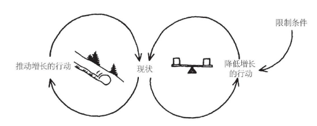

# 把系统观点带入实践，掌握系统基本模式

**某些结构模式是反复发生的。**这些“系统基本模式”或“通用结构”，是学习观察我们个人和组织生活中的结构的钥匙。

系统基本模式就是不断反复出现的基本语句，或简单的故事段落。

到目前为止，研究人员已经发现约12种系统基本模式。

## 1. 增长极限

### 定义

一个正反馈（放大）过程开始启动，产生一个期望的结果。它创造一个成功增长螺旋，但也在无意中产生副作用（在负反馈过程中显现的），从而使增长逐渐放缓。

### 管理原则

不要强行推动增长，要消除限制增长的因素。

### 结构

<u>每个增长极限的案例中都有一个正反馈（放大）过程，在一段时间里它自己就会产生增长或改进作用。然后它会碰到一个负反馈（稳定）环路，后者开始发挥限制增长的作用，改进速度会因此放缓，甚至完全停止。</u>

### 理解和利用

增长极限的模式在各个层次的组织结构中都发挥着作用。

每个结构模式中，限制作用都**逐渐变得越来越强大**，增长率可能逐渐下降到很低的水平，甚至其正反馈环路可能掉头逆转，变成负增长。

<u>变革越是成功，就越可能对人些人产生威胁，于是他们就会开始拆台，去阻止变革的实施。</u>

**负反馈作用的结果之一，就是让希望发生的变革措施的实施在一段时间里很顺利，但随后就进展缓慢，并且往往最终衰落、败北。而变革推动者对结果的失望和反应，又往往让事情变得更糟。**

*实施“准时化”（just-in-time）存货管理和其他“精益”或“柔性”生产系统时，也会遇到类似的互动作用，因为这些系统都依赖供货商和制造商之间的信任关系。最初的生产过程的柔性和成本绩效后来无法持续改善了。这些生产系统的供应商，后来往往会要求成为独家货源，以降低突击供货带来的风险。这对于制造商来说就是个威胁，因为他们习惯于向不同的供货商多头订货，或者通过竞标战让供货商之间相互杀价。这时，制造商对新供货系统的承诺和信心，也会随之动摇。供货商也一样。于是，他们都更有可能通过继续使用过去的多头订货和多家供货的方法，来避免风险，也因此而破坏了准时化系统所要求的相互信任的关系。*

**大多数人遇到增长极限情况时，往往试图使劲儿推动增长，越是努力，负反馈作用阻力就越大，努力就越徒劳无功。**有时，有人干脆放弃原目标，但实际上不再继续追求变革计划的成功，就更不可能把成功变革的潜力挖掘出来。