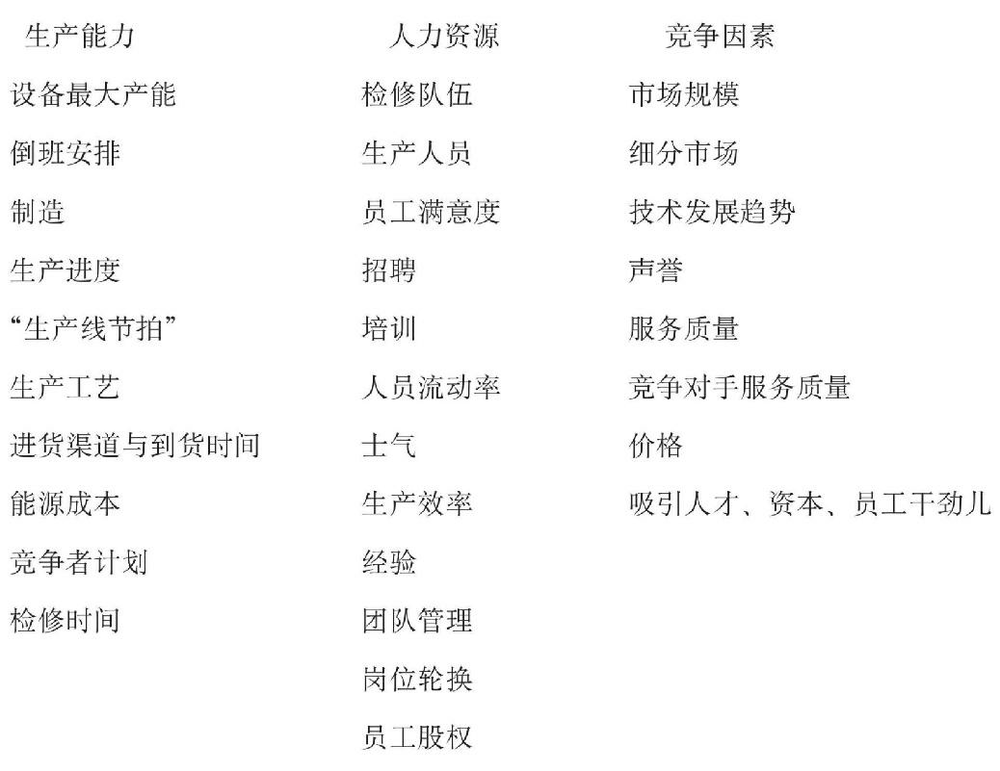

# 是自我局限，还是自我持续地增长

对于大多数处于系统中的人来说，**实际的系统杠杆作用都不是清晰可见的。**因此，我们习惯的非系统思考方式，总是让我们注重低杠杆效益的变革。<u>由于我们看不见自己行为背后的结构模式，于是就把注意力放到问题最紧迫和集中的地方，企图去修补或减轻症状。</u>但这类方法最多只能带来短期改善，长期来看，情况往往更糟。

> 我们都知道那个不能“只见树木，不见森林”的寓言。不幸的是，我们大多数人往往“后退一步站”的时候，仍然只看到许多个别的树木。而且，**我们会挑出一两棵我们认为最看好的树，然后就全神贯注在它们身上，为它们而倾注全部的变革努力。**

系统思考的艺术在于看清细节复杂性背后的、能发生变化和产生变革的结构模式。系统思考不是忽视细节复杂性，而是将复杂的细节组织起来，使它变成一种连贯的经历和故事，使它提示问题的起因和持久解决问题的方法。**把握实际情况就要从理解以下细节入手**：

当今世界不断增加的复杂性让许多经理人感到，他们缺乏自己需要的信息来进行有效的工作。实际上，**经理人面对的根本“信息问题”不是信息太少，而是太多。**我们最需要的是用什么办法知道什么重要，什么不重要，要关注什么变量，不关注什么变量——而且要有办法在团队和集体中发展共识。