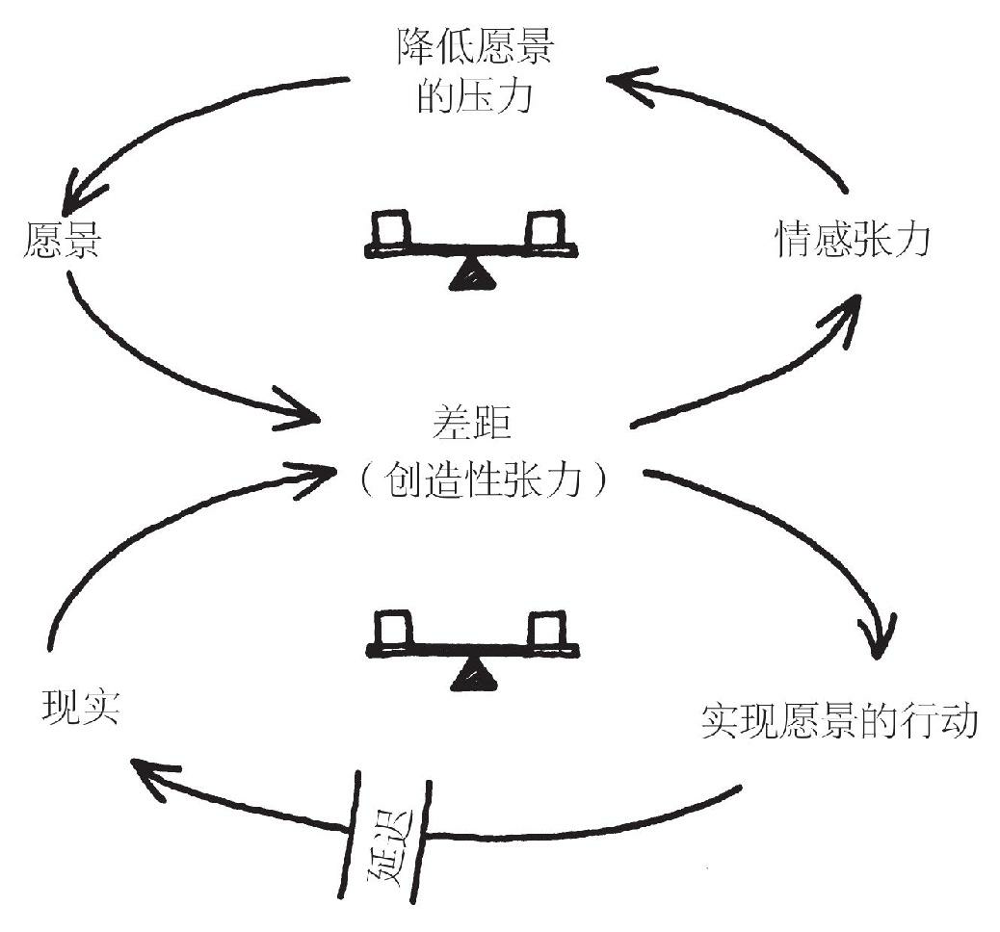
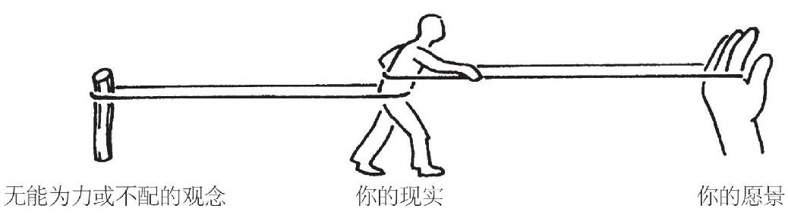

# 自我超越

> 无论研发、公司管理，或者任何其他企业活动，活力都来自“人”。而人是有自己的意志、自己的头脑和自己的思维方式的。假如员工们自己没有足够的动机去挑战增长目标和技术开发目标……就根本不会增长，不会有生产力的提升，也不会有技术进步。———稻盛和夫

> 建立更符合人性的组织模式。我们传统的等级体制的组织设计，不能服务于人的更高级需求，如自尊和自我实现。只有当组织机构开始满足所有员工的这些需求时，管理的动荡纷扰才有解决的希望。————奥布赖恩 汉诺瓦保险公司

## 超越和精通

当自我超越成为一项修炼，成为我们生活的组成部分时，它包含了两方面的行动：

1. 它不断澄清什么对我们是重要的
2. 它包括不断学习如何更清晰地观察现实

把愿景（我们想要的）和清晰的现实图像（我们现在相对于愿景所处的位置）并列在一起，就产生了我们所谓的“创造性张力”。自我超越的意义，就是学习如何在我们的生活中，不断生发和保持创造性张力。

<u>有高度自我超越修炼水平的人，都具备几个基本特征。他们的愿景和目标背后，都有一种特别的目的和使命感。对他们来说，愿景是一种召唤，而不仅仅是一个好想法。他们把“现实”看成盟友，而不是敌人；他们学会了如何观察和运用变革的力量，而不是抵制这种力量；他们有深入探究的好奇心，致力于不断改进、不断提高观察现实的准确性。他们感到自己与其他人、与生命本身，都有一种沟通。但与此同时，他们不会抹杀自己的特点。他们感到自己好像是更大的创造过程的一部分。他们可以影响这一过程，但不能单独控制它。</u>

有高度自我超越修炼水平的人，总是生活在不断学习的状态中，修炼永无止境。有时候用语言描述，比如“自我超越”这个词，容易引起误解，好像事情必有确定性，黑白分明。但是，自我超越不是你能够拥有的。它是个过程，是一项终身的修炼。自我超越水平高的人，非常了解自己的无知、无能以及需要改进的地方。同时，他们又有深深的自信。这矛盾吗？只有不能理解“行程本身就是回报”的人，才会觉得矛盾。

> 合同只是一种关系中的一小部分。一个完整的关系所需要的是信约……信约关系要基于一种共享的承诺——要实践的理念、要解决的问题、要实现的价值、要完成的目标，以及要经历的管理过程……信约关系反映的是和谐的统一、优雅的善意和泰然的自信。它表达了人际关系的神圣性。——Max de Pree 赫尔曼-米勒公司

## 抵制来源于哪里

- 无法量化
- 对现实有过过高理想和期望的理想主义者，因为失望变得愤世嫉俗
- 担心自我超越会威胁公司已有的良好管理秩序
  - 如果在思想未统一的组织里放权给员工，可能会适得其反
  - 如果大家没有共同愿景，对企业运营的现实没有共同分享的心智模式，放权只能增加组织的压力、加重组织协调和维持运营方向的管理负担
  - 如果组织领导者缺乏建设共同愿景和分享心智模式的能力，不能给下级的局部决策者提供指导，那么，**自我超越的组织承诺，就是幼稚和愚蠢的。**

## 自我超越的修炼

### 个人愿景

**大多数成年人几乎没有什么真正的愿景。**我们有目的和目标，但那不是愿景。

如果你问一个成年人想要什么，很多人实际说出的是他们不想要什么。他们想要一份更好的工作，也就是说，他们想辞掉现在这份无聊的工作。他们想住在更好的邻里社区，或者不用担心犯罪事件频发，或者不用为孩子完成学业操心。他们想让丈母娘（婆婆）搬回她自己家，或者想使自己的腰疼病好起来。这类“负面愿景”（negative vision）的冗长列举，的确是极为普遍——即使在非常成功的人士当中也是这样。它们是花一辈子时间融入主流、应付社会和解决问题的人生经历的副产品。在我们的研讨班上，有个十几岁的孩子说，**<u>“我们不应该叫他们‘成人’（grown ups），而应叫他们‘弃人’（given ups，放弃了的）”。</u>**

缩水的愿景是另一种更微妙的形式，是**“注重手段而不注重结果”**。对我们自己的忠诚，才是真正的内在意义，**其余的，都只是实现目标的手段，而手段在特定情况下可能会改变。**

关注内在愿望，而不仅仅注重次要的目标，这种能力是自我超越修炼的一块基石。

**愿景是内在固有的，不是相互比较的。**为自己的愿景而坚持自己立场的勇气，正是高水平自我超越的特征。

**愿景和志向目标（purpose）的区别：**

- 志向目标：个人对为什么活着这个问题的领悟，一个方向，抽象、梗概的
- 愿景：特定的目的地，渴望的未来图景，具体、明确的

- 愿景背后如果没有对志向目标的领悟，没有召唤，愿景就只是一个美好的想法
- 没有愿景的志向和目标，缺乏对适度规模的把握

### 创造性张力

愿景和现实之间的差距，叫做创造性张力。

创造性张力带来的感受被称为情感张力。

当我们的愿景与现实不一致时，它们之间的差距（创造性张力）可以用两种方法消除：

1. 根本解决法：努力使现实向愿景靠拢
2. 症状缓解法：降低愿景，使其靠近现实

情感张力的作用机制，在人类活动的各个层面上都广泛存在，**它是一种妥协的机制，一种带人走向平庸的机制。**

> 只有平庸的人，才总是处于自己的最佳状态。——Somerset Maugham

当我们无法承受情感张力时，我们就不再坚持目标，而是放任它受到侵蚀。

> 愿景是什么并不重要，重要的是愿景能做什么。——Robert Fritz

失败是一种不足，**它显示了愿景与现实之间的差距。**失败是一个学习良机，能够澄清人们对现实的不当理解，能够提示某些策略的有效性并不如预期，还能够提升愿景的清晰度。

> 情况必须要变得足够糟糕，否则人们不会有任何根本的改变。

**进行自我超越修炼，首先要做的是对自己的愿景做出承诺，第二个关键就是对真相的承诺，这里面不能有半点臆造。**

<u>**所有创造都是在一定的约束条件下实现的。没有约束条件就没有创造。**</u>

### “结构性冲突：你无能为力的力量”

既然有这种无能为力或不配的观念，结构性冲突就意味着，无论什么时候，只要我们在追求愿景，系统的影响力就会妨碍我们取得成功。

**应付结构性冲突影响力的三种一般性策略：**

1. 降低愿景
2. 操纵冲突：通过制造人为的冲突，来操纵我们自己追求愿景的工作，注重摆脱我们不想要的，而不关注如何创造我们想要的
3. 意志力策略：简单地用精神兴奋法，提高意志力，激发斗志（洗脑），去摧毁一切妨碍我们实现目标的障碍，这个方法缺乏经济性，没有杠杆效益，我们的确可以达到目标，但代价巨大，而且<u>**丝毫不会触动深层的结构性冲突的系统问题**</u>。

### 对真相的承诺

应对结构性冲突的首要任务是<u>承认和识别结构性冲突</u>。

**说出真相**，不是指追求铭刻于世的真理，即绝对的最终判决或终极原因，而是指：

- **心甘情愿地根除那些令我们限制和欺骗自己、不让自己看到真实情况的习惯**
- **不断质疑我们对真实情况为什么会如此的理解**
- **不断扩大我们的意识范围**
- **不断加深我们对眼下各种事件背后的结构模式的理解**

### 运用潜意识，就是说你真不必都想明白

把注意力集中在自己渴望的内在成果上，就是一种技能。对我们大多数人来说，这在开始时并不容易，而是需要时间和耐心去开发的。我们大多数人一想到某种重要的个人目标，就几乎马上想到所有使之难以实现的理由——我们要面对的各种挑战，以及我们要克服的各种障碍。想到这些，当然有助于思考实现目标的替代策略和方法，但想到这些同时也是我们缺乏定力和修炼的表现，因为我们对所渴求的成果的注意力，不断被对愿景实现过程的思虑所排挤。我们必须用心学习如何把我们认为实现目标需要做的事，与我们真正想要实现的目标本身区分开来。

有一项很有用的入门练习，可以帮我们学习如何把注意力更准确地集中在渴望获得的成果上。这就是把某个特定的目标或愿景的某个方面单独拿出来。<u>**首先，想象这个目标已经完全实现了。然后问自己一个问题：“假如我实现了这个目标，它会给我什么？”人们经常会发现，这个问题的答案会揭示出目标背后的更深层的渴望。**</u>

以上技能为什么如此重要呢？原因在于潜意识对于清晰而集中的注意力有敏锐反应。我们在阶段性目标和更本质的内在目标间迷惑不清的时候，潜意识就无法进行优先排序和集中注意力。

做出清晰的选择也是很重要的。**只有当选择完成之后，潜意识的能力才能得到充分的发挥。**实际上，做出明确选择和把注意力集中在对我们最重要的成果上，可能是我们常态意识最能发挥作用的地方，即最高杠杆效益作用点。