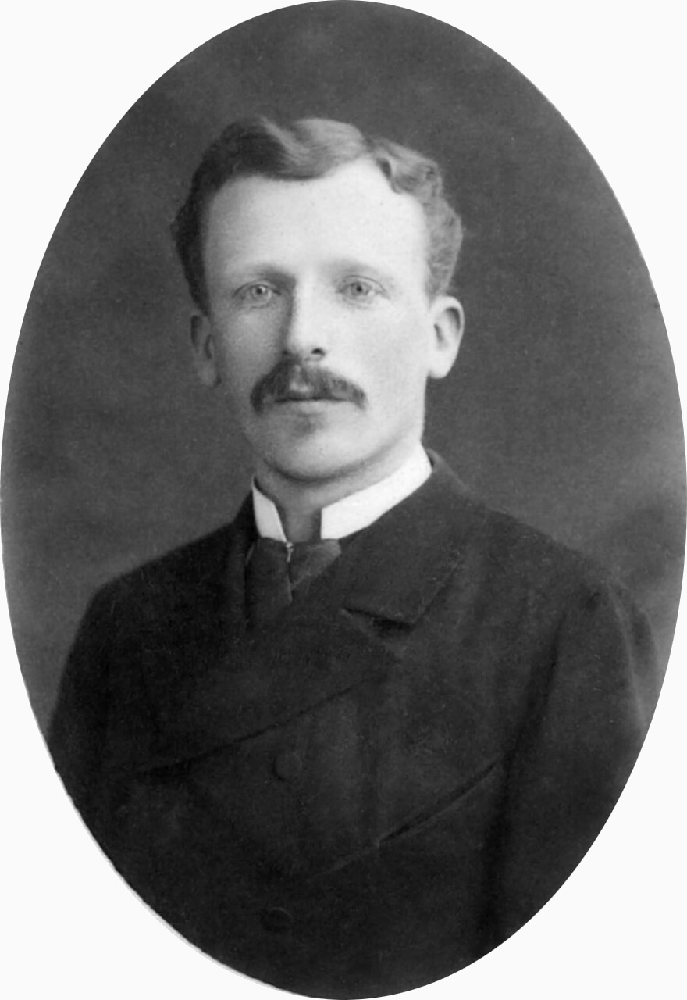

# Introduction

提奥·梵高 Theo van Gogh 1857.5.1~1891.1.25

文森特·梵高  Vincent van Gogh 1853.3.30~1890.7.29

**对完美的追求让这个人陷入无尽的痛苦。**

- 精神充沛，以自我为中心，这个问题在成长时并没有得到及时的引导
- 文森特的目标是——保持自我的谦卑，忘却自我，牺牲自我，牺牲每个人的私欲，这个理想是他在宗教上寻找到庇护后形成的，他做事从来不会半途而废。但是亦步亦趋地跟随前人的脚步，盲目地按照他人的意念行事，这不是他的性格，他要用自己的方式去帮助别人。
- “他一点也不顺从”
- “文森特给我的感觉是太过自我”

| 时间             | 事件                                                         |
| ---------------- | ------------------------------------------------------------ |
| 16世纪           | 梵高家族迁居到荷兰                                           |
| 17世纪           | 梵高家族在荷兰占据很高的社会地位                             |
| 1729~1802        | 文森特，专业雕刻家                                           |
| 1789~1874        | 文森特（梵高的祖父）牧师                                     |
| 1853.3.30        | 文森特·威廉·梵高出生                                         |
| 1869年           | 梵高进入海牙的古比尔公司工作（艺术品和版画出版）             |
| 1875年           | 被古比尔公司辞退，想去英国布道                               |
| 1877年5月~1878年 | 在阿姆斯特丹为进神学院做准备，十分痛苦 “习作练习和语法学习都不是他想要的——他想要的是通过给人们传播福音，安慰他们，鼓励他们——如果是这样的话，他远用不着学这么多！他渴望实践性的工作” |
| 1879年1月        | 得到了在瓦姆任期半年的工作机会，报酬为每月50法郎，工作内容包括布道、教孩子读书认字、拜访生病的人——文森特由衷地喜爱这份工作。 然而，他又陷入到了牺牲私欲的古老夸张的论调中——他试着将耶稣的教义付诸实践，他把所有东西都奉献了出去，他的钱，他的衣服和床，他离开了位于瓦姆的温暖舒适的丹尼斯家，租下了一间条件简陋的小棚屋。 文森特的精神状态对于福音传道协会的人来说，实在是太过狂热了，而且他们认为这样一个连自己都忽视不管的人是无法给人们树立榜样的。 |
| 1879年7月        | 被福音传道协会辞退 “他没有按照协会的意愿办事，冥顽不灵。充耳不闻所有关于他的评价” 离开瓦姆，步行到布鲁塞尔，和皮特森牧师住在一起，埋头看书 |
|                  |                                                              |

