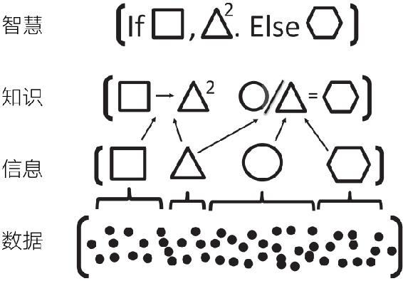

# 为什么需要模型思维

无论数据给我们留下的印象如何深刻，它都不是灵丹妙药，**我们也许可以通过数据了解到已经发生了什么和正在发生什么，但由于现代世界是高度复杂的，我们可能很难理解为什么会发生这种情况。**更何况，经验事实本身也可能 是误导性的。

我们需要模型，不然就无法理解计算机屏幕上不断滑过的数据流。因此，这个时代，**可能恰恰因为我们拥有如此多的数据，也可以被称为多模型时代。**

## 为什么需要多模型

多模型方法背后的原理基于这样一个古老的思想，那就是“管中窥豹多管齐下”。

所有模型都有三个共同特征：

1. 它们都要简化，剥离不必要的细节，抽象掉若干现实世界中的因素，或者需要从头重新创造
2. 它们都是形式化的， 要给出精确的定义
3. 所有模型都是错误的，因为它们都是简化的，省略掉了细节

通过同时考虑多个模型，我们可以实现多个可能情况的交叉，从而克服单个模型因严格而导致的狭隘性。

### 智慧层次结构

## 多模型思考者

在我们对世界的了解变得更多、更深入的同时， 这个世界也变得更加复杂了。考虑到这种复杂性，任何单个模型都更有可能遭到失败。我们应该成为多模型思考者。

构建模型是一门艺术，**只能通过不断实践才能熟练掌握。**这不是一项以观赏为目的的活动，需要刻意练习。在建模中，数学和逻辑扮演着专家教练的角色 ，它们会纠正我们的缺漏。

## 模型的7大用途

### 构建模型的3种方法

无论哪一种模型，都必须是易于处理且便于交流的。

- **具身法**  embodiment approach 
- **类比法**  analogy approach
- **另类现实法** alternative reality approach：有意不去表征、不去刻画现实。这种模型有助于我们更好地理解现实世界中各种约束条件的含义，还允许我们进行现实世界中不可能的（思想）实验

### 模型的7大用途

- 推理：识别条件并推断逻辑含义
  - 构建模型时，我们要先确定最重要的行为人（行动者）、实体以及相关特征
  - 然后，描述这些组成部分如何互动和聚合
  - 推导出一些东西，并说明原因
  - 逻辑也可以提示悖论和数学关系，真理的条件性
  - **相反的谚语经常共存，但相反的定理不会出现。两个定理，如果对何为最优行动有不同看法，必定会做出不同预测；或者，给出不同解释的定理必定有不同的假设。
- 解释：为经验现象提供（可检验的）解释
  - 模型为经验现象提供清晰的逻辑解释。
  - 基于模型的解释必须包括正式的假设和明确的因果链条，而且这些假设和因果链条都要面对数据。
- 设计：选择制度、政策和规则的特征
  - 模型还可以通过提供框架来帮助设计，因为只有在适当的框架内我们才可以考虑不同选择的含义
- 沟通：将知识与理解联系起来
  - 模型要求对相关特征及其关系给出正式的定义，这使我们能够精确地进行交流
- 行动：指导政策选择和战略行动
  - 指导行动的模型通常依赖于数据，但并不是全部模型都依赖于数据。大多数政策模型都需要使用数学公式，但也并非总是如此。
- 预测：对未来和未知现象进行数值和分类预测
  - 预测毕竟是与解释不同的，有的模型可以用来预测，但是却不一定能解释什么，例如深度学习算法可以预测产品的销售情况等，但无法提供解释。
  - 有些模型有很强的解释力，但是在预测上却没有什么价值，例如板块构造论模型可以解释地震怎么发生，但不能预测地震；动力系统模型可以解释飓风怎样形成，但无法准确预测飓风什么时候来
- 探索：分析探索可能性和假说
  - 我们可以利用模型对假说进行探索，或模拟现实世界不会出现的情况

## 多模型思维

> 没有什么比现实主义更不真实了……细节令人困惑。只有通过选择、通过消除、通过强调，我们才能获得事物的真正意义。    
>
> *乔治娅·奥·吉弗 Georgia O’ Keeffe*

**一对多的过程对创造力的要求很高。它考验思考者面对问题时能想到多少种模型来验证**

## 对人类行为者建模

我们怎样对人建模，归根到底取决于问题的背景和想要实现的目标。我们是在预测还是解释？是在评估政策行动吗？是在尝试设计一种制度吗？或者在探索？

很多人在经济学入门课程中第一次接触到描述社会现象的正式模型，这些经济学模型通常依赖一个基本的理性行为者模型——每个人都是自利的，并且有能力实现优化。基于这种经验，许多人推断，**构建正式的模型需要一种狭隘的、不切实际的”人性观“，也就是说，必须假设所有都是自私的，而且从来不会犯错，但事实并非如此。**

<u>无论做出什么假设，我们都无法摆脱假设的影响。我们被绑在逻辑一致性的“桅杆”上，不能随便制造影响。</u>

**理性行为者模型是起到“黄金标准”的作用，还是“稻草人”的作用，抑或是介于这两者之间，都取决于模型的目的。理性行为者模型在预测人类行为方面的作用，不如作为沟通、评估行动和设计政策的工具那么成功。**

