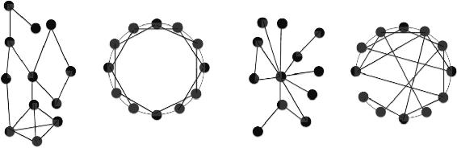

<head>
    
    
</head>

# 模型思维5-8

## 5. 与价值和权力有关的模型

> 你的价值不在于你知道了什么，而在于你能够分享什么。  *Ginni Rometty*

### 合作博弈

合作博弈由一组博弈参与者和一个价值函数组成。这个价值函数为博弈参与者的每个可能的子集（通常称为联盟）分配一个值。

合作博弈的目标是刻画集体工作和联合项目。在合作博弈模型中，<u>假设人们都会参与，没有博弈参与者组成的联盟价值等于零。</u>

### 最后上车者价值 last-on-the-bus value LOTB

一个博弈参与者的“最后上车者价值”等于他是最后一个加入团队的人时，他**所能增加的价值**。

- 价值函数表现出规模收益递减性质时，最后上车者价值的总和小于博弈的总价值
- 价值函数表现出规模收益递增的性质，最后上车者价值的总和将超过博弈的总价值

### 夏普利值 Shapley value

在夏普利值模型中，加入的顺序很关键。

一个博弈参与者的夏普利值，等于他在所有可能加入的联盟的次序下**对联盟边际贡献的平均值**。即，我们要假设每个博弈参与者**按顺序加入**，然后计算每个博弈参与者为每个序列增加的价值。

- 在任何序列中都不能增加价值的博弈参与者的夏普利值为0
- 对任何两个相同的博弈参与者，必须分配给他们相同的夏普利值
- 夏普利值的总和必定等于博弈的总价值

    <b>替代用途测试 alternative uses test</b> 
    每个人必须为一种觉的物品想出一些新用途，例如砖块，根据人们想出来的用途或用途类别来衡量一个人的创造力。 
	<ul>
        <li>3个人参加测试，分别提出6，6，7个想法，排除相同想法，团队总计9个想法。</li>
        <li>把团队拆成6种可能排序，只有某个人对团队提供了独特的想法时才能“得分",再对所有6种情况求平均值。</li>
        <li>如果两个人提出了同一个想法，每个人有1/2的机会首先加入团队。也就是说，在想到同一个想法的人之间平等地分配得分。</li>        
	</ul>
	具体计算过程： 
	<ul>
       	<li>成员A有6个想法，其中2个是独有的，1个是和B共有的，3个是和B C共有的。</li>
        <li>成员B有7个想法，其中4个和C或A共有，3个是和A C共有的。</li>
        <li>成员C有6个想法：其中3个和B共有，3个是和A B共有</li>
       	<li>成员A：创造力得分=6 夏普利值=2+1/2+3/3=3.5</li>
       	<li>成员B：创造力得分=7 夏普利值=4/2+3/3=3</li>
        <li>成员C：创造力得分=6 夏普利值=3/2+3/3=2.5</li>
	</ul>

    <b>投票博弈</b> 
    在投票博弈中，夏普利值通常被称为<b>夏普利-舒比克权力指数 Shapey-Shubik index of power</b>。 
	<b>一个博弈参与者（政党）控制席位（投票权）的百分比和其权力之间不存在直接的转换。</b> 
	<ul>
        <li>权力指数：如果某个政党加入了一个联盟并获得绝对多数(大于50%），这个政党所增加的价值等于1。这种情况下，我们称这个政党是”关键的“，否则，这个政党不会增加任何价值。</li>
        <li>假设总席位是101，4个政党掌握：A=40 B=39 C=11 D=11</li>
        <li>先入场的票数不可变化，要取得50%以上的选票，<b>必须结盟</b></li>
        <li>共有4!=24种入场顺序</li>
        <li>A在第2或第3位加入时，肯定会成为“关键”政党</li>
        <li>如A在1位加入，B在2位加入可赢；如B在3位加入，A必须在4位加入，B才能赢</li>
	</ul>

### 结论

夏普利值是衡量增加价值的一种标准，但不一定总是最好的衡量标准。**假设威胁是可信的，那在一个群体已经形成的情况下，个人的“最后上车者价值”可能是衡量权力的更好标准，因为它能够度量每个人通过威胁离开可以攫取多大利益。**

在这些情况下，联盟会希望减少“最后上车者价值”。通过扩大联盟规模，可以创建出一个具有很高的总价值、同时”最后上车者价值“又足够低的联盟。**不断加入新成员，会使现有成员变成”可以放弃的“，从而使”最后上车者价值“趋向于零。** 例如，雇主会通过雇用多余的工人来削弱工人的权力，制造业会向多个相互竞争的供应商采购中间产品等。

将视野放大到现代互联网世界，我们发现应用“最后上车者价值”和夏普利值的概念来思考权力问题非常有用。无论是个人、组织、企业，还是政府，抑或是恐怖组织的权力，都部分取决于偏离合作制度可以造成的损害的程度，也就是“最后上车者价值”。一个技术高超的计算机黑客，由于拥有摧毁大量财富的力量，因而拥有巨大的权力。即便黑客完全不能给社会创造价值，这个结论依然成立。

在政界和商界，并不是所有联盟都是合理的，更丰富的模型需要考虑世界的连通性。要计算出这种环境下的权力，我们需要网络模型。

## 6. 网络模型

**网络几乎总是很重要，我们构建的任何模型，无论是市场模型、传染病传播模型，还是信息传播模型，都可以通过将参与者嵌入网络中而变得更丰富。**

### 网络的结构

网络由节点和边组成，以一组网络统计数据为特征。

度：连接到一个节点的边的数量

路径长度：两个节点之间的最小距离

介数：经过某个节点连接两个其他节点的最短路径数量

聚类系数：节点的邻居节点对中，同时彼此也互为邻居节点对所占的比例

### 常见的网络结构

少数数据无法确定具体的网络结构，可以构建一个大量具有N个节点和E条边的随机网络，再计算度、路径长度、聚类系统和介数的分布，看其统计指标是否与某个觉的网络结构有显著差异来表征网络。

- **随机网络**
- **地理网络**：节点排列成圆形并且每个节点在每个方向上都连接到最近的节点
- **幂律网络**：少数节点有很多连接，大多数节点的连接非常少
- **小世界网络**：结合了地理网络和随机网络的特征，可以先从一个地理网络开始，然后”重新布线：，随机选择一条边，把这条边所连接的其中一个节点替换为一个随机的节点。如果“重新布线”的概率等于零，就是一个地理网络；如果“重新布线”的概率是1，就是一个随机网络；如果概率介于两者之间，就是一个小世界网络。<u>社交网络看起来类似小世界，每个人有一群朋友，以及若干随机的朋友。</u>

### 网络形成的逻辑

我们遇到的大多数网络结构都是从个体行为者做出的关于建立连接的选择中涌现出来的。

>  **友谊悖论**
>
> 如果网络中任何两个节点的度不同，那么平均而言，节点的度会低于其相邻节点。即，平均而言，人们的朋友比他们自己更受欢迎。

友谊悖论适用于任何网络，但六度分隔只适用于某些类型的网络。

### 结论

当我们尝试构建关于由人构成的网络模型时，目的通常是用它们来刻画社会影响，也就是**在社会网络中，一个人的成功、行为、信息或信念，会影响他们的朋友的成功、行为、信息或信念。**

成功主要取决于人才的信念，以及在一个组织中的位置和影响力、所能获取的信息。

恰恰是在网络中占据了最核心位置（介数最高）的人做出了最大贡献，他们填补了“结构洞”（structural holes,  Ronald Burt），这些人拥有很大的权力和影响力，<u>要想去填补结构洞，你得有相当高的才华和能力。看到一个洞跳下去并不算填补结构洞，要填补结构洞，你必须让社区里每一个人信任和理解你，你必须熟悉每个社区的知识库。</u>

运用同样的原理，我们可以将企业的价值视为内在价值，着重从资产负债的角度分析，还可以考察该企业运营的情境，与此类似，一个国家的权力取决于它的资源和联盟。**无论是对于企业还是对于国家，它们的内在性质都是与连通性相关的。那些在网络中占据很高位置的人也拥有某些举足轻重的特性。**

## 7. 广播模型、扩散模型和传染模型

这些模型用于分析信息、技术、行为、信念和传染病在人群中的传播，在通信科学、市场营销学和流行病学的研究中发挥核心作用。

**所有这三类模型都将整个人口划分为两个群组，随着时间推移，个人会在这两个群组之间移动，有人会从易感者变为感染者，或者从不了解新产品新思想的人变成知情达意者：**

1. 知道或拥有某种东西的人
2. 不知道或不拥有某种东西的人

### 广播模型

广播模型刻画了思想、谣言、信息或技术通过电视、广播、互联网等媒体进行的传播。

- 相关人群 $N_{pop}$ : 相关人群是和研究相关的人，而不是所有人
- 直接感染者/知情者 $I_t$
- 易感者 $S_t$
- 相关人群总人数 = $N_{pop} = I_t + S_t$

**广播模型** ：$I_{t+1} = I_t + P_{broad} \times S_t$

- $P_{broad}$ 表示广播概率
- 初始状态 $I_0 = 0$，且 $S_0 = N{pop}$

