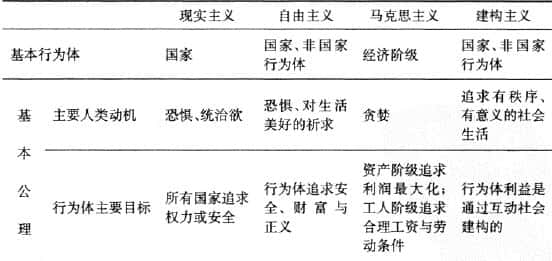
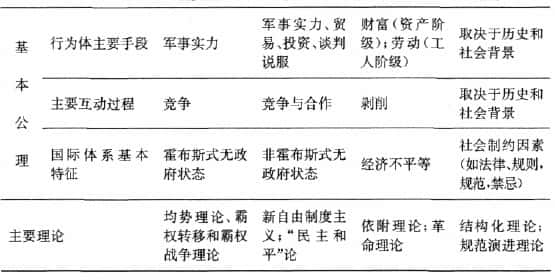

# 解释冲突与合作的工具与技巧

世界政治常常从其他学科借用词汇，或使用大众语言，不同于严谨的物理学或数学，拥有较固定的专业词汇。

在讨论国际政治之前，需要界定好基本概念。

## 基本概念

### 国家 country

特殊类型的政治单位，有两个关键特征：

1. 领土
2. 主权

州（state）、民族（nation）、政府机构（强政府 strongstate 弱政府 weakstate ） 不能代替“国家”一词。

**国家必须得到其他国家的承认，才能产生。**

### 影响国家承认决策的因素

1. 是否存在一个实际上控制某一块领土的政府
2. 其他国家是否对这块领土提出要求，如果是，这一要求有多么坚决 
3. 那些试图建立一个新国家的人是否在过去遭受压迫
4. 这些人是否认为自己的政府具有合法性
5. 承认一个新的国家具有主权是否会影响自身的主张与利益

### 行为体 actor

指某个人或团体，其决定和行为会影响国际政治。

一般认为国家是最重要的行为体，具有国际影响力的个人或团队也可以是行为体。

**权力**：实现自己目标的能力，或者说是影响他人和达到自己所期望的目的的能力。

政治领导人一般是从**国家所掌握的资源**来界定权力的。包括：

- 人口
- 领土
- 自然资源
- 经济规模
- 军队及政治稳定

**权力转换力 power coversion**：把潜在权力（用资源来衡量）变成实际权力（用别国行为的改变来衡量）的能力。

### 硬权力（hard power）和软权力（soft power）

**硬权力**：依靠奖励和威胁直接或强制性地使用权力的方法

**软权力**；因为其他国家愿意效仿自己或接受体系的规则 ，而在世界政治中实现自己预期的目标。

软权力所依赖的资源包括思想的影响力或决定政治议题、影响别人偏好的能力。

软权力并非一定比硬权力更具有效力或更符合道德，扭曲思想不一定比扭断胳膊强。

**道义判断依赖于使用权力的目的。**

<u>对于政府来说，软权力往往更不容易使用，需要更长的时间才能看到效果，并且在有些时候一点都不起作用。</u>

<u>**物质上的成就会使得一种文化和意识形态具有吸引力，而军事和经济上的落后则会导致自我怀疑和认同危机。**</u>

**软权力在信息时代后工业化国家的相互关系中变得越来越重要，民主和平思想占了上风；而硬权力则往往在世界上那些正处于工业化或者前工业化发展阶段的地区更加重要。**

**在信息经济和跨国相互依赖的时代，权力正变得越来越难以转移、不太具体和缺少强制性。**传统的分析家主要会根据哪一方军队获胜来预测冲突结果。<u>今天，在诸如反对跨国恐怖主义斗争这样的冲突中，谁讲的故事更吸引人，同样是至关重要的。使用硬权力对付死硬的恐怖主义者无疑是需要的，但使用软权力来赢得主流民众的心也同样是重要的，否则民心会被恐怖主义者夺去。</u>

随着现代经济体中服务行业的发展，今后服务业和制造业之间的界限会变得越来越模糊。信息量将变得更大，快速和灵活反应的组织能力将是重要的资源。政治凝聚力以及具有普世性和可输出的大众文化，也将依然十分重要。

**权力与权威（authority）**

- 如果权威得到其他人的尊重，那么它就可以是权力资源。
- 你可以拥有权力，而不具有权威。
- 权力是实证的概念
- 权威是道义的、规范的或法律的概念

**单极体系**：一个国家享有权力主导地位，可以有效地决定国际合作的条件，并且使别国同意或者接受。最强大的国家称为**霸权国 hegemon**

**两极体系**：两个实力相当的国家在各自势力范围内，或者对其盟国（实力较弱的国家或者仆从国）拥有主导权。最强大的国家称为**超级大国 superpowers**

**多极体系**：三个或者三个以上的国家拥有很大的权力。最强大的国家称为**大国 greatpowers**

### 国际体系和国际社会

**体系 system**：是一系列相互关联的单位

**结构 structure**：单位的权力分布

**过程 process**：单位之间的互动

体系既可以是物质性的，也可以是理念性的，或者二者兼有之。国际体系是物质因素与理念因素的混合体。

<u>从某种程度上说，把某个事物视为一个“体系”，属于一种脑力家政 mental housekeeping 练习，因为到最后所有东西都被收拾得井井有条、相互联系。</u>

我们从理论上也可以说,太阳系可以通过大气系统影响到国际政治体系。<u>但是,试图把所有事情都看作一个庞大系统的组成部分,这样做是不明智和适得其反的。</u>把国际体系视为某个独特的东西,这可能使我们更容易理解世界上所发生的事情,尽管所有事物之间都是相互联系的。（需要有边界才能分析）

虽然国际体系的排列原则是无政府状态,但是该体系并非无秩序。所有全球互动关系都是有秩序的,因为这些互动关系都呈现出有规则的、大致可预见的格局。<u>在大多数情况下,这些互动关系是受规则约束的。</u>

### 体系稳定与危机稳定

有助于体系稳定的因素中，国际社会中的社会结构特性很重要：

- 维系国家间关系的规范与制度纽带越强大，国家间的关系就越密切，防止体系解体的利害关系就更大
- 社会因素较弱的话，国家就要更加依赖于自助

### 国家利益 national interest

现实主义者：国家在国际体系中的地位决定着它如何界定自己的利益，并且预示着该国对外政策的走向。

自由主义者和建构主义者：国家利益的界定在很大程度上取决于该国国内社会的性质及其所具有的文化。

现实主义者的预言比较适用于中东，自由主义者的预言比较适用于欧洲。

**有关国家利益的界定几乎一直是有争议的。**

## 分析层次

**体系所造成的结果可能与体系行为体的愿望大相径庭。**

<u> 我们不能像物理学家或化学家在实验室里控制实验条件那样来左右世界政治，在事件发生之后，我们必须努力去理解它，而不能像做实验那样去控制它。**这几乎总是意味着，我们得出结论的时候必须小心谨慎，因为我们根本就缺少一些发现与否定错误结论的有效手段。**</u>

### 三个分析层次

**什么都能解释，就等于什么都解释不了。**

从最简明的方法进行分析（“简约原则/奥卡姆剃刀”），同时考虑理论的适用范围（可以解释多少行为）和解释力（可以解释多少不甚清楚的目的和反常的现象）。

- **个人**
  - 认知心理学 cognitive psychology：解读世界原始信息的过程
  - 动机心理学 motivational psychology：从根深蒂固的心理恐惧、欲望及需求来解释人类行为，包括自尊、社会认可及效能感。
  - 行为经济学 behavioral economics：尤其是前景理论，解释了人们做的决定取决于他们面对的是获益的前景，还是亏损的前景。（丹尼尔·卡尼曼）
  - 心理传记学 psychobiography：追溯个人幼年经历导致行为特异。局限性是不可证伪和难以证实。
- **国家**
  - 马克思主义：认为资本主义是战争的根源，这一理论不能解释一战的起源，也不能解释中国、苏联、越南的军事冲突。
  - 古典自由主义：资本主义国家具有和平的倾向 ，因为战争会对商业造成损害。同样， 一战打击了这个观点。
  - **一国介入战争与该国是否为资本主义或民主国家并无多大关系。**
  - <u>一个观点，如果所有国家都成为民主国家，那么战争就不太可能发生。</u>
  - 官僚政治学bureaucratic politics：政府职能部门和官员的相互作用，关注组织动力，特别是所有复杂性组织赖以运行的惯例和标准运作程序。**职位决定立场**。
- **国际体系**
  - 国际体系的解释最简洁，如果解释被证明是不恰当的，我们就可以把注意力转向体系内部的单位，增加分析的难度，直到得到合理的解释。

## 范式与理论

我们为了对某个事物进行系统的分析，需要采取一种方法来组合我们所使用的工具和技巧。告诉我们如何使用工具的概念工具包，通常被称为一种**范式 paradigm**。

范式可以被看作是我们构建越来越高深的（以及越来越专业的）知识结构之基础。

结构本身就是理论。理论是有关世界如何运行的假定性陈述。我们从范式中得到理论。

**我们利用假设 hypotheses 来证明理论。**

### 世界政治中的四种主范式

- 现实主义
  - 防御性现实主义：强调安全为国家最重要的目标
  - 进攻性现实主义：关注权力
- 自由主义
  - 经济自由主义
    - 特别关注贸易。他们认为，贸易之所以重要，不是因为它可以防止国家介入战争，而是由于它会使国家以特定方式界定自己的利益，从而使它们认为没有必要进行战争。
    - 避免战争的一个较好的方法是,在一个开放的、没有军事征服的贸易体系中寻求经济发展。日本在第二次世界大战结束以后,通过贸易成功地改变了自己在世界上的地位。
  - 社会自由主义
    - 认为人与人的交流会增进相互了解，从而减少冲突。这样的观点是过于简单化的。
  - 政治自由主义
    - 关注制度
      - 国际制度通过提供信息和框架而塑造了期望，国际制度使民众相信，不会再发生冲突。它们拉长了未来的阴影(shadow of future）,从而缓解了安全困境。制度减轻了无政府状态的负面影响(不确定以及不能形成相互信任）。
      - 制度从四个方面稳定人们的期望：
        - 促使人们产生一种连续观念
        - 制度创造了礼尚往来的机会
        - 制度促进了信息的流动
        - 制度可以提供解决冲突的方法
    - 关注民主
      - 民主和平论表明,假如世界上民主国家的数量增多,发生战争的可能性或许会减少,至少民主国家间发生战争的可能性或许会减少。
- 马克思主义
  - 马克思主义者很明确地但不准确地预言,帝国主义、大规模战争、社会主义革命以及共产主义的兴起,会导致资本主义的灭亡。
  - 自身弱点：
    - 试图把政治还原成经济
    - 错误认为，国家只是特定阶级的工具
    - 过于死板地理解历史进步性。
- 建构主义
  - 在建构主义者看来,结构不只是指单位的数量与布局,还包括"主体间意义"(intersubjective meanings）,即共有话语、观念、习惯、规范、规则以及适当性逻辑,这帮助构建了单位的身份,并使得单位之间以相互理解的方式进行互动。从这个意义上说,社会结构塑造了认同与利益。
  - 与此同时,人们在社会背景中进行互动的时候,也会改变社会背景本身,即便这种改变是很小的。因此,社会结构会随着时间的推移而发生变化。
  - 建构主义的洞察力的体现：
    - “行为体”和结构互动方式是循环往复和相互影响的
    - 行为体的认同和利益不是给定的，而是社会互动的产物
    - 随着时间的推移，主体间意义会由于社会互动发生变化，从而导致规则、规范、合法期望发生变化,甚至最终导致国际体系本身的性质发生变化。

**对于那些主要兴趣在于解释世界事务为什么发生以及(如果可能的话）预测世界事务未来发展的人来说,这样的分歧有一个实际效果,即它揭示一个道理:做什么事情都很难。我们不能简单地假定人们会以这样或那样的方式行为。我们需要知道他们是谁,他们要什么,以及他们是如何看世界的,这样才可以理解他们的所作所为,为此我们必须理解他们所处的社会与文化背景。我们必须"重构世界",以便解释世界,这就需要获得大量信息,也因此需要花费很多时间与精力。**

## 反事实推理与“虚拟历史”

### 反事实推理 counterfactuals

**反事实推理**：设定与事实相反的条件，建构一种可能性假设的思维活动。

衡量反事实推理思维实验是否有用的标准：

- **合理性 plausibility**：必须合理地设想两个同时存在的条件
- **相近性 proximity in time**：原因事件和结果事件在时间上越相近，答案越可能为“是”
- **理论性 relation to theory**：好的反事实推理就当借助现有的理论，理论使我们在分析众多原因时具有思想上的条理性和组织性，避免随意猜想
- **真实性 facts**：进行反事实推理需要确切的事实和详尽的历史分析。为了检验一个思维实验是否有道理，我们必须搞清楚，所谓不变的因素是否与已经发生的真实情况下吻合。**我们我必须谨防在同一个思维实验中，把一个反事实推理论点建立在另一个反事实推理论点之上。**