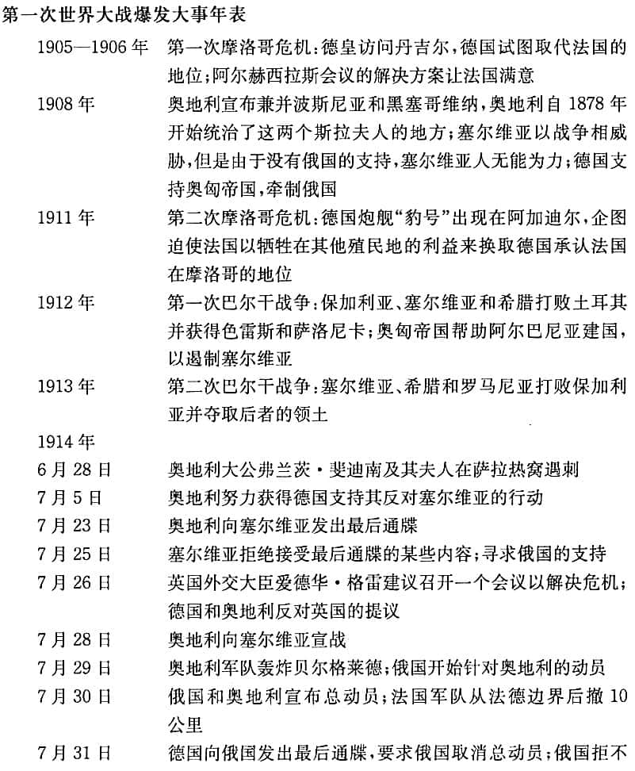

# 从威斯特伐利亚和会到第一次世界大战

**我们所熟悉的现代主权国家，它们作为国际社会中拥有特定权利与义务的单位，是欧洲的产物。**

在欧洲抛弃封建主义，进入威斯特伐利亚体系的数百年后，欧洲强国采取海外冒险行为，直接或间接地统治了全世界。

### 威斯特伐利亚和约

是一系列的条约，通过奠定欧洲领土专属权原则的法律基础，结束国家间的不平等关系，剥夺帝国皇帝和教皇的权威并把它移交给国家，授权建立一个无政府的、王朝国家体系，并增强体系成员的内部团结。

## 管理大国冲突：均势 balance of power

**国家追求均势的目的在于维护自身的独立，而不是维持和平。**均势有助于维护由独立国家所组成的无政府体系，但不能保证所有的国家都生存下来。

均势这个词一般来说有四种含义。

### 1. 作为权力分布的均势

指权力的分布。主要国家间不均等的权力分布状况的变化是我们用来解释战争和不稳定书面的一个因素，但不是唯一的因素。

### 2. 作为政策的均势

指一种精心设计的平衡政策。均势预示着，其他国家会采取行动阻止一国发展成为主导国家。

试图维持均势的一种主要手段就是**同盟 alliance **——主权国家相互间通过协议结成盟友，给维护共同的安全。

同盟的瓦解与同盟的缔结一样，有着多种原因，但一般来说，国家不再结盟，是因为认为对方与自己无关，或者把对方视为自身安全的威胁。<u>这种情况的发生，可能是因为另一个国家发生政权变更。</u>

### 3. 作为理论的均势

用于描述国际体系中权力的自动平衡。即均势理论。

均势理论预测，国家将采取行动防止任何一个国家获得权力优势地位。即它预言国家将采取均势政策，其原因在于它们不得不这么做。

在国内政治中，我们经常看到**尾随 bandwagoning**而非均势行为：政治家们常常投靠占上风的一方。然而，均势理论预测，<u>国家将会加入处于下风的一方，因为国家将采取行动防止任何一个国家获取权力优势地位。</u>

**均势是一种帮助弱者的政策，这是因为，假如你帮助了强者，强者可能会翻脸伤害你。**

### 4. 作为历史上多极体系的均势

被用来描述历史上的多极体系的例子。

## 19世纪的均势体系

19世纪的多极均势体系，使1817年到1914年之间的100年成为现代国家体系历史上最长的没有世界大战的和平时期。**但是，这个具有活力的体系并非完全是和平的。其结构与进程的变化 ，从根本上导致了两次洪水般的世界大战。**

**我们必须小心避免把一个复杂的故事变得传奇化、简单化。**

### 结构

| 时期        | 结构形态       |                                                              |
| ----------- | -------------- | ------------------------------------------------------------ |
| 1815-1871年 | 松散的两极     | 拿破仑战败后，1815年维也纳会议恢复原先的多极秩序，英国、俄国、法国、普鲁士和奥地利五大国相互制衡。 |
| 1871-1907年 | 德国的崛起     | 1871年前，“德国”包含37个国家。1871年统一后，具有重要地缘政治影响。俾斯麦的外交手腕让德国在实力在在欧洲中的地位稳步上升。 |
| 1907-1914年 | 同盟的两极分化 | 俾斯麦的继任者犯下一系列错误，导致欧洲体系彻底丧失灵活性。 两大同盟得以形成并且僵化： 三国协约：英国、法国、德国 三国同盟：德国、奥匈帝国、意大利 |

### 过程

| 时期        | 演变过程                     |                                                              |
| ----------- | ---------------------------- | ------------------------------------------------------------ |
| 1815-1822年 | 欧洲一致                     | 通过定期开会达成维持均势、制止民族主义革命浪潮的协议，来维持欧洲地区的秩序 |
| 1822-1854年 | 松散的欧洲一致               | 自由民族主义观念变得太强大，让欧洲一致不再积极有效           |
| 1854-1871年 | 民族主义和德国、意大利的统一 | 政治领袖们抛弃了过去的原则 ，开始利用民族主义来追求自己的权宜目标。 |
| 1871-1890年 | 俾斯麦让欧洲一致复兴         | 俾斯麦灵活复杂的同盟体系，确保均势体系的稳定。               |
| 1890-1914年 | 丧失灵活性                   | 俾斯麦的继任者做了一系列错误的决定，未同俄国续订条约，未阻止奥地利和俄国在巴尔干地区的对抗行为，试图挑战英国的海上霸权，**加深了周边国家对正在崛起的德国的恐惧，从而保全体系发生两极分化。** |

**其中最重要的发展趋势，是自由主义和民族主义的兴起。其结果是，国家与统治者逐渐变成不是一回事。**

**新的意识形态改变国家的目标，并使得19世纪 的国际政治局势不那么和缓，同时，工业技术的发展让原本均势的方法不这么有效。**

## 第一次世界大战起源

时间：1914年7月28日至1918年11月11日

战争过程主要是同盟车和协约车之间的战斗。

同盟国：德国、奥匈帝国、奥斯曼帝国、保加利亚

协约国：英国、法国、日本、俄罗斯、意大利、美国、塞尔维亚、中国

导火线：奥匈帝国皇储斐迪南被刺杀

影响：

- 英镑霸权遭美元削弱
- 俄国、德意志帝国、奥匈帝国、土耳其奥斯曼帝国覆灭，民族国家随之而起
- 英国作为世界金融中心及世界霸主，在战后对领土的控制力因战争大大削减，也削弱了法、意、德，美国成为世界第一经济强国，世界金融中心从伦敦转向纽约，日本由债务国变成债权国
- 德国被实行条件极为严厉的经济与军事制裁，失去13%的国土和12%的人口，解除武装，陆军被控制在10万人以下，不允许拥有空军。德国经济遭到打击后，使德国国民对强加给他们的条约有极强的抵触和反感情绪，引发德国民众强烈的民族复仇主义情绪。
- 《凡尔赛条约》将德国在山东的权益转让给日本，引发五四运动
- 大战期间男性直接参与前线战争，国内劳动力大部分由女性接替，使妇女的重要性提高，1920年日本妇女运动，美国给予妇女选举权，1928年英国给妇女选举权显示妇女的地位得以重视，女权运动兴起

### 三个分析层次

- **体系层次**

  - 德国的崛起和同盟体系的僵化

  - 德国的重工业在19世纪90年代超过英国，德国把它的工业力量的一部分转变成军事力量
  - **民族主义的兴起**：民族主义在团结工人阶级方面比社会主义更有力量，在团结银行家方面比资本主义更强大
  - **人们对和平产生了自满情绪**
  - **社会达尔文主义被越来越多的人接受**
  - **德皇政策的错误**：追求更多的权力。过于重视硬权力，忽视软权力
- **国内社会层次**

  - 奥匈帝国和奥斯曼帝国的虚弱和腐败，在民族主义的压力下解体
  - 德国国内的社会问题
- **个人层次**
  - 国家领袖的平庸

### 战争是不可避免的吗

- **深层原因**
  - 均势结构的变迁，国内政治体系的变化
  - 德国力量的崛起，两极力量体系的出现
  - 民族主义的兴起，衰落帝国的死亡，德国政治倾向
- **中层原因**
  - 德国的政策
  - 和平自满情绪的增长
  - 领导人的个性
- **突发原因**
  - 弗兰茨·斐迪南被刺杀

### 战争的教训

- 不仅要关注均势体系的结构或权力分布，也要关注均势体系的过程
  - 体系是否和缓取决于过程，**单靠权力分布是不能确保体系稳定的**
- 必须防止产生对和平的自满情绪
- 保持一支在危机中可以起稳定作用的军队很重要

