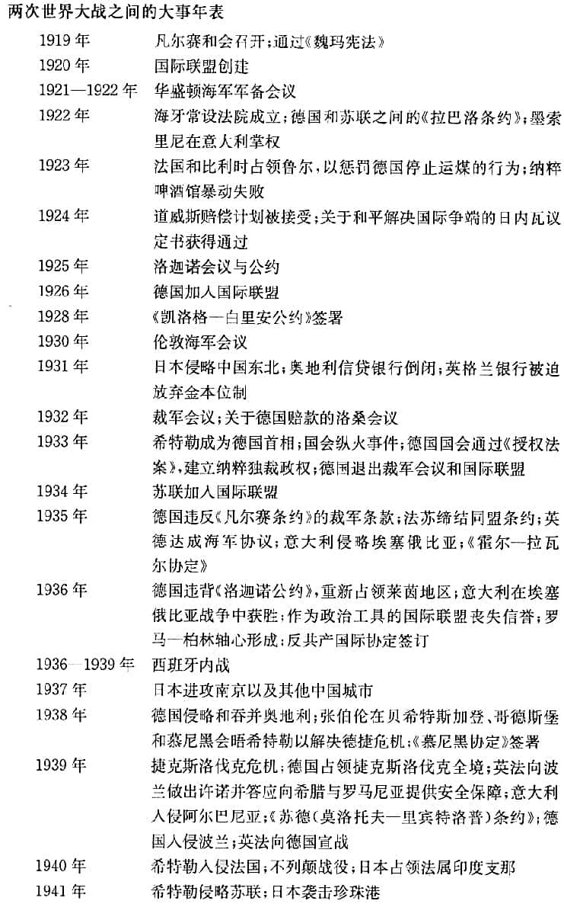

# 集体安全制度的失败和第二次世界大战

## 集体安全制度

美国总统伍德罗·威尔逊提出，国际政治和国内政治一样 ，可以用法律和制度来限制武力的使用。**为了大小国家都能相互保证政治独立和领土完整，必须成立一个基于特别盟约基础上的普遍的民族（国家）联盟。**

- 宣布侵略和进攻性战争为非法行为
- 爱好和平的国家必须结成同盟，对侵略行为起威慑作用，如果大家都许诺支持世界上任何一个受害者，那么爱好和平的力量就将占上风
- 假如威慑失败和出现侵略行为，所有国家都要同意惩罚发动侵略的国家

### 集体安全思想的体现——国际联盟盟约

国际联盟必须经过所有成员国同意,才能实施集体安全措施。这样一来,每个国家都具有否决权。国家在签署盟约的时候许诺遵守第16条,但是实际上各国自己可以决定采取何种制裁措施以及如何实施制裁,它们不受一个更高权威的制约。因此,国际联盟不是建立世界政府的一个步骤,只有存在着世界政府才能使得在国家之上具有一个更高的、对国家有约束力的权威。所以,**国际联盟的建立并不意味着无政府国家体系的终结,它只是国家集体惩罚体系中不守规矩的行为体的一种举措。**

国际法的地位优先于国内法及特定情势中的主权。国际法的一个中心思想是，国家在违背国际法的情势中不享有主权，而且应当受到惩罚。

然而，国际法被国家遵守的程度远不及国内法。许多国家拒绝接受国际法的约束，认为遵守国际法应该是自愿行为，而非强制行为。

国家不愿意放弃某些主权以换取集体安全,其原因在于国际联盟的一个重大缺陷，**即美国不参加自己创建的这个国际组织。**

### 国际联盟在中国东北的失败

第一次世界大战中，日本加入了协约国一方，战争结束后，日本希望国际社会承认其为世界上的主要大国之一，遭到欧洲国家和美国的反对。20世纪20年代，美国通过种族歧视法案，排挤日本移民。

20世纪20年代末开始的全球经济危机，使日本极其脆弱，日本的军事集团在权力斗争中占了上风。

国际联盟并未根据《国际联盟盟约》对日本侵略中国实施制裁，日本退出国际联盟。

### 埃塞俄比亚纷争

意大利很早就想兼并埃塞俄比亚，并在1935年10月入侵埃塞俄比亚。国际联盟并没有对意大利实行完全的制裁，没有对钢、煤和石油实施禁运，没有断绝与意大利的外交关系，没有关闭苏伊士运河，意大利仍可通过运河向厄立特里亚运送物资。

英国和法国不想疏远意大利,因为德国的实力正在增强,这两个国家认为有必要把意大利纳入遏制德国权力的同盟之中。

1936年3月,希特勒违反《洛迦诺公约》,派德国军队进驻莱茵非军事地区。英国和法国顿时把埃塞俄比亚问题搁置一边,并同意大利协商如何恢复欧洲的均势。显然,欧洲均势的重要性超过了在非洲贯彻集体安全原则。1936年5月,意大利在埃塞俄比亚取得了军事上的胜利,同年7月国际联盟取消了针对意大利的制裁。

## 第二次世界大战的起源

第二次世界大战宣告欧洲主导均势的时代结束，美国和苏联在此后成为实力超群的国家。

### 希特勒的战略

1933年上台后，希特勒有四种政策选择：

1. 消极立场：接受德国的国际地位被削弱的现实
2. 通过发展经济来增强德国实力，工业发展来扩大德国的国际影响
3. 修改《凡尔赛条约》，收回德国在1918年丧失的部分权益
4. 扩张战略：挣脱他认为的德国所受的遏制（希特勒的选择）

**希特勒实施战略的四个阶段**

1. 利用外交行动来破坏凡尔赛体系的框架结构（1933～1936）
   1. 1933年10月，德国宣布退出国际联盟，他把原因归结于法国人不愿意裁减自己的军队
   2. 1934年1月，和波兰签署条约，破坏法国同波兰之前达成的协议
   3. 1935年3月，指责《凡尔赛条约》的军事条款，宣布把德国军队数量增加3倍及建立德国空军的计划
   4. 1936年3月，开进莱茵地区，宣称法国与苏联达成的协议破坏了《洛迦诺公约》，迫使德国出此下举
2. 向邻近小国扩张（1936～1940）
   1. 德国与意大利签署轴心国条约，和日本签订反对共产国际的协定
   2. 支援西班牙内战（1936～1939），毁灭格尔尼卡的巴斯克市
   3. 1938年，开进维也纳，侵略奥地利
   4. 1939年3月开进捷克斯洛伐克，占领其首都布拉格
   5. 1939年8月，和斯大林签订条约，瓜分波兰
   6. 1939年9月1日，进攻波兰
3. 虚假的战争时期（1940年）
   1. 向挪威出兵
   2. 对荷兰、比利时与法国发动闪电式进攻
   3. 绕过马其诺防线，把英军赶到敦刻尔克，迫使英军横渡海峡
   4. 6月10日意大利跟随德军入侵法国，12天后法国投降
   5. 1939年美国借租借法案，提供物资协助中国和西方盟国作战，并封锁对日本的石油供应
   6. 为了对付美国，1940年9月底，轴心国集团成立
4. 战线过长的阶段（1941～1945）
   1. 尝试取得英国的制空权，但未成功，也未打败英国海军
   2. 1941年6月22日，发起巴巴罗萨行动，联合其他轴心国成员及芬兰共同入侵苏联
   3. 石油禁运政策后，日本计划迅速以武力攻占欧洲位于亚洲的殖民地地区，建立一个延伸至太平洋中线的大型防卫圈，为了防止美国对日本的作法展开干预，对美国太平洋舰队展开歼灭性攻势，1941年12月8日，突袭美军夏威夷的海军基地，珍珠港。
   4. 日本的行动促使美国、英国、澳大利亚和其他同盟国正式对日本宣战。

**个人作用**

好战，自负，种族主义意识形态，反犹太主义，偏执狂个性

**体系和国内原因**

- 第一次世界大战并没有解决德国问题

- 西方民主国家由于阶级分化和意识形态分野而四分五裂,几乎无法通过协商一致来制定对外政策
- 经济大萧条，主要资本主义国家没有建立起有效的国际协调制度,以解决国际贸易和资金流动不平衡的问题
- 美国的孤立主义政策，不愿过多干涉欧洲事务，直到珍珠港事件。

### 太平洋战争

20世纪30年代，军人和极端民族主义者获得对日本政府的控制权。日本想建立一个地区霸权秩序,即他们自己所说的"大东亚共荣圈"(这是征服邻国的一种十分委婉的说法）。日本坚信,建立这样一个共荣圈将使得它可以抵制英国和美国的威胁,这两个国家是太平洋上的主要海上力量。

1940年法国被希特勒攻陷之后,日本人抓住机会,侵占了法属印度支那(现在的越南、柬埔寨和老挝）。

到1941年秋天的时候,日本扩张主义者已经不再把苏联当作要攻击的目标了。希特勒对苏联的进攻,消除了苏联对日本的威胁。与此同时,美国对日本实施石油禁运政策,努力阻止日本的南进行动。<u>但是日本人却认为,如果不发动与美国的战争,那么最终无论如何也会遭受失败。日本90%的石油依赖进口,假如石油供应被切断,日本海军将坚持不到一年。因此,他们认为,与其慢慢地被绞杀,不如发动进攻。</u>

**个人作用**：主张扩张的日本将军们企图增强日本的地区影响力

**国内原因**：经济崩溃使日本变得更具扩张性，中国的国内战争也让国力脆弱不堪，日本人对美国不愿意在《国际联盟盟约》中写种族平等心怀不满

**体系原因**：《凡尔赛条约》没能满足日本对中国的野心，20世纪30年代经济困难让日本难完全靠贸易获得原料

## 最重要的教训

**我们要小心对待过于简单的历史模式。永远要对一个模式提出质疑，看看它是否同历史事实相吻合，是否与现实相一致。**

