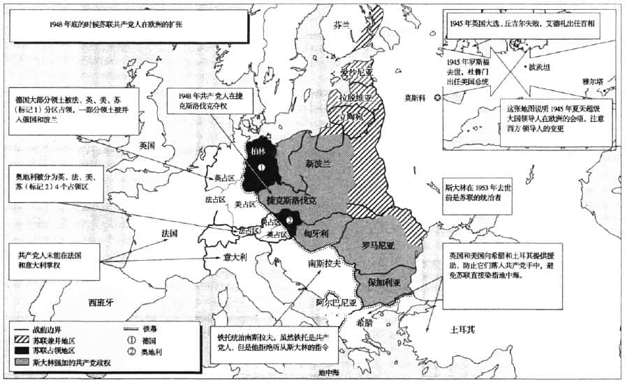
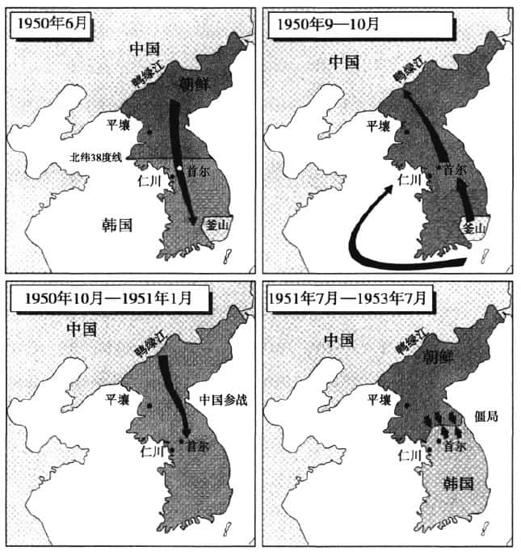

# 解释冷战

## 解释冷战的三个思想流派

- **传统派**
  - 斯大林和苏联导致了冷战的产生
- **修正派**
  - 美国的扩张主义导致冷战产生
    - 个人层次：杜鲁门停止执行战时租借援助计划；民主党从左倾和中立转向右倾；任命强硬的反共分子作为新国防部长
    - 国家层次：美国的经济性质决定着美国要采取扩张主义政策，美国的经济霸权绝不能容忍任何国家建立起一个独立的经济区。
- **后修正派**
  - 苏联更关心确保领土控制,既包括对本国的控制,也包括对缓冲区或者势力范围的控制。美国的主要兴趣在于建立一个自由的、根据规则治理的国际秩序。
  - 美国倡导全球性的联合国制度,而苏联则努力巩固其在东欧的势力范围。
  - **在一个意识形态两极化的世界中,一个强大的国家会在其势力范围内使用军事力量,按照自己的意象去重新塑造其他国家,以确保自身的安全。**

### 罗斯福的政策

罗斯福希望建立一个自由贸易体系，避免出现曾在20世纪30年代破坏世界经济以及促使战争爆发的保护主义。

罗斯福的计划并不天真,但他的某些策略确实是天真的。他对联合国寄予太大的期望,过高估计了美国孤立主义势力,而且最为重要的是,他过分低估了斯大林的敌意。

罗斯福没有充分认识到,斯大林及其追随者是极权主义者,"他以人民的名义,屠杀了无数的人；他为了防备希特勒的进攻,同希特勒签订了一项条约,和希特勒一起瓜分战利品,像希特勒一样驱赶、消灭或奴役其周边的民族；他在德国西进的时候袖手旁观,并且挖苦那些西方国家,而在希特勒东进的时候又指责西方国家没有向苏联提供足够的支持”

<u>罗斯福所犯的错误在于,他认为斯大林看世界的方式与自己一样,相信自己了解美国的国内政治,觉得可以用美国领导人那种调和分歧与增进友谊的政治技巧,与斯大林打交道。</u>

### 斯大林的政策

斯大林的战后主要目标是**加强国内的控制**。

战争期间，斯大林借助民族主义号召民众，因为共产主义意识形态的吸引力下降，不足以动员苏联人民。

战后，斯大林采取孤立主义政策，旨在消除来自欧洲和美国的外部影响。

如果国际合作有助于苏联实现其在东欧的目标和从美国获得一些经济援助,那么斯大林愿意采取某些合作的态度。作为一个杰出的共产主义者,他相信美国会向苏联提供经济援助,**因为资本主义国家必须向外输出资本,以解决国内需求不足的问题。**

斯大林是一位坚定的共产主义者,**虽然他用共产主义的认识框架看世界,但是他经常采取务实的策略。**

## 威慑和遏制

两种国家可能进行的对外政策的动力：

- **威慑 deter **：通过恐吓，让对手打消某种念头。冷战中的威慑依赖于拥有大量核武器，努力防止另一个国家取得优势。
- **遏制 contain**：指通过美国的盟友和美国的军事基地，以及在苏联势力范围之外推动形成一个自由的世界经济与政治秩序，来包围苏联。

## 解释冷战

| 时期       | 名称                     |
| ---------- | ------------------------ |
| 1945～1947 | 冷战序幕和滑向冷战的阶段 |
| 1947～1949 | 冷战开始阶段             |
| 1950～1962 | 冷战高潮阶段             |

### 促使美国调整战略的6个问题：

- **波兰和东欧问题**
  - 美国认为，斯大林违背了战后在波兰举行自由选举的诺言
  - 1945年2月的雅尔塔协定也比较含糊,斯大林极力按自己的需要来解释其含义,当苏联红军从波兰赶走德国人之后,苏联便在华沙建立了一个共产党政府。美国人感觉自己受到了欺骗,但是斯大林认为美国人会接受现实,因为是苏联军队解放了波兰。
- **1945年5月，美国突然终止租借援助计划**
  - 1946年2月，美国拒绝苏联的贷款要求，苏联人把以上美国的两个做法解释为敌视行为
- **德国问题**
  - 在雅尔塔会议上,美国和苏联同意,德国要支付200亿美元的赔款,其中一半给苏联。但是雅尔塔会议并没有确定如何以及何时支付赔款,只是决定以后再讨论这个问题。在1945年7月的波茨坦会议上,苏联要求获得100亿美元的赔款,而且它要求这些赔款应从美、英、法占领的德国西区获得。
  - 杜鲁门提出，如果苏联要获得赔款，应该从自己占领的德国东区获得。
  - <u>美国同英国、法国一起，在德国西区发行新货币，开始把德国西区融入西方的过程</u>，这也导致苏联加强对德国东区的控制。
- **东亚问题**
  - 直到战争结束的一个星期前,苏联在太平洋战争中还保持中立的态度。然后苏联就向日本宣战,并乘机从日本手中夺取中国东北、库页岛南部以及整个千岛群岛。在波茨坦会议上,苏联要求在日本获得一个占领区,就像美国拥有一个德国的占领区一样。杜鲁门的反应实际上是这样的:苏联人来迟了一步,所以不能获得一个占领区。
  - 然而,这不能不让苏联人联想起东欧的情形,美国要求在东欧举行自由选举和在东欧事务上拥有发言权,而苏联军队是最先到达这个地区的。因此,苏联人把远东情势与东欧情势相类比,而美国人则把远东发生的事视为苏联努力扩张其影响的又一个例证。
- **原子弹问题**
  - 1946年,美国提出了由联合国控制核武器的"巴鲁克计划",斯大林对此表示断然拒绝,因为他想制造自己的核武器。在斯大林看来,处于国际控制下的原子弹仍然是美国的原子弹,因为只有美国人知道如何制造原子弹,苏联拥有原子弹更有助于维护自己的安全。苏联研制的原子弹终于在1949年爆炸成功。
- **东地中海和中东国家**
  - 首先是1946年3月苏联拒绝从伊朗北部撤军。美国在联合国的有关辩论中支持伊朗。苏联最后还是撤走了军队,但是这个事件让苏联人感到很不高兴。
  - 接着苏联对南面的土耳其施加压力，而且希腊共产党看上去快要获得希腊内战的胜利。这些事件让西方更加相信,苏联人正在扩张其势力。

**一些观察家指出,在民主国家中改变公众舆论比在极权国家中改变政策要困难得多。**

欧洲冷战的早期

### 马歇尔计划

1947年6月，马歇尔提出援助欧洲的计划。斯大林认为这是美国用来破坏东欧作为苏联安全缓冲区的地位，于是加强了对东欧的控制，1948年2月，共产党完全掌握了捷克斯洛伐克的政权。

美国得知后，提出了有关德国西区货币改革计划，斯大林以封锁柏林来回击。美国继而实施空运和建立北大西洋公约组织。

1949年苏联爆炸第一颗原子弹和中国共产党解放中国让冷战进入最僵硬的阶段。

**朝鲜战争**

- 1950.6.25-1953.7.27
- 北韩: 中国,苏联
- 南韩: 联合国, 主要是美国
- 1950年10月19日, 中国军队跨过鸭绿江, 突出其来的攻击让联合国退到38度纬线以南.
- 造成的平民死亡人数大于二战, 死亡约300万
- 美国在战争中所遭受的挫折使国内发生分裂并使麦卡锡主义兴起

