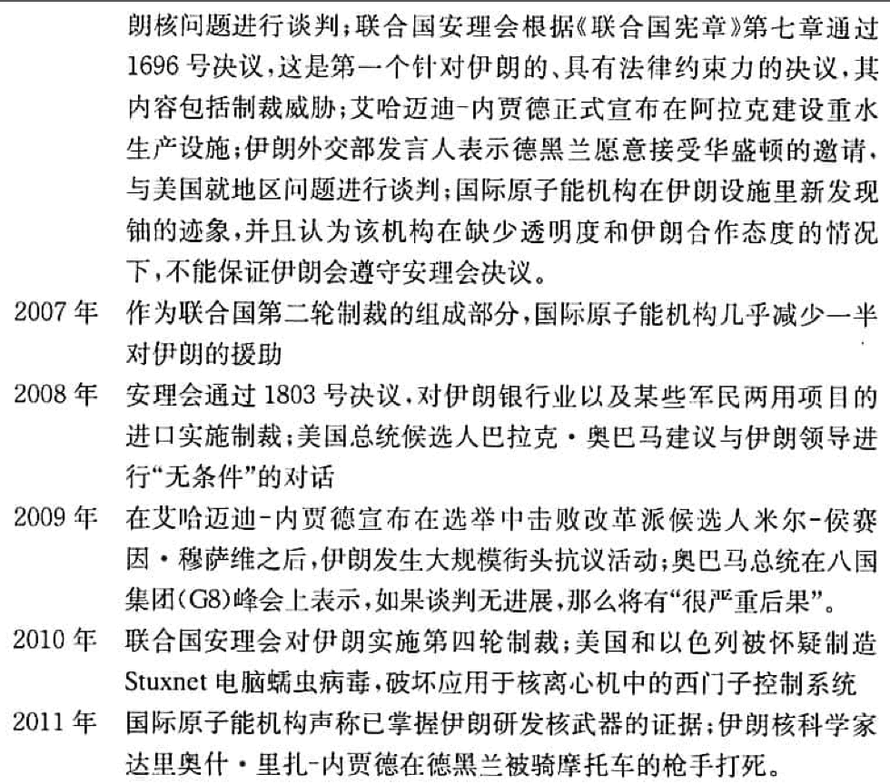
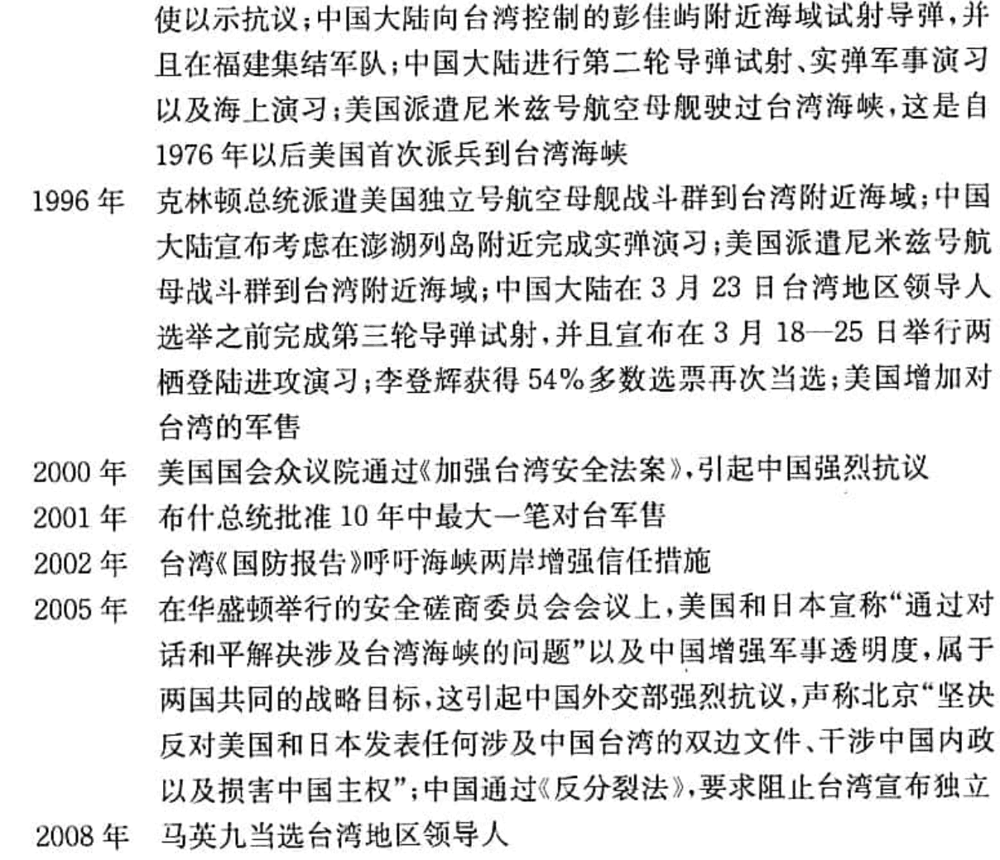

# 冷战后的合作,冲突与热点

**合作通常并非自然发生,它常常需要由某个人或某件事来安排或促成.**

**和谐是指一种大多数人偏好相同,皆大欢喜的情势.**

冲突的解决方法或冲突管理战略取决于所涉及的”物品”的性质:

- **私人物品**:具有排他性
- **公共物品**:具有非排他性和非竞争性,经典合作问题是**供给不足**
- **俱乐部物品**:具有非排他性和非竞争性,例如卫星电视信号
- **共有物品**:具有非排他性和非竞争性,例如野生鱼类或游戏

<u>只有在一个复杂的社会,法律和经济体系中,你的汽车才真正属于你,因为该体系提供了金融,执照,登记及执法等服务.</u>

**国际政治与国内政治的一个重要区别,就是在国际政治中没有高于国家的权威,这就意味着,根本不存在大量的解决国际合作问题的机制.**它虽然并不能使国际合作无法实现,但造成国际合作复杂化.

## 国际法和国际组织

国际法和国际组织,是世界政治中管理冲突与促进合作的两个主要手段.

联合国遵循的原则是一个国家拥有一个投票权,这个原则既不体现民主,也不反映世界上的权力关系,因为**民主的基础是一个人拥有一个投票权.**联合国大会这种奇特性,使国家不愿意让该组织通过有约束力的法律,因此,**联合国大会通过的只是决议,而不是法律.**

联合国秘书长是一个很弱小的行政官员,更像一个秘书,而不太像一个将军.

国际法在执行和裁决方面,和国内法区别很大:

- 制定:国内法是立法机关和惯例的产物,有时被称为”习惯法 common law”,国内法包括法律执行,由个人提出裁决请求,立法机构按程序修改法律等.
- 执行:没有一个国际行政机构来确保一个国家服从法院的决定,国际政治是一个自助的体系,国际法有时是由大国来执行的

- 由国家而不是个人提出裁决请求,除非国家自己不愿意处理某个国际争端,或者认为自己胜诉的可能性很大,否则不会把争端移交给国际法院的
- 联合国大会所通过的决议有很多模棱两可的地方,而且,**它们不具有约束力.**只有安理会根据[<联合国宪章>第7章](https://www.un.org/zh/sc/repertoire/actions.shtml)的规定所做出的决定,才是每个成员国在法律上必须接受的.
  - 确定危及和平,破坏和平或侵略行为
  - 防止局势恶化的临时措施
  - 采取不涉及使用武力的措施
  - 维持或恢复国际和平与安全的其他措施
  - 统率和部署军队
  - 会员国接受安理会有约束力的决定的义务
  - 会员国相互协助执行安理会的决定
  - 安理会对第三国采取防止或执行办法的影响
  - 单独或集体自卫的权利
- 国际政治中的共同体观念是很弱的,这就意味着国家不太愿意出于履行义务或服从权威的考虑,而遵守规则或约束自己.由于世界上缺少一个拥有合法使用武力垄断权的全球性行政机构,主权国家处于以自助,武力和生存为特征的环境之中.**当生存问题出现时,法律通常是第二位的.**

### 主权国家需要国际法和国际组织的原因

- 可预见性
  - 国际法可以避免国际交往出现的摩擦升级
- 合法性
  - 合法性是权力的一个源泉,如果一国的行为被认为缺少合法性,那该国就要为其政策付出更高的代价.
  - 国家希望借助国际法和国际组织来证明自己的政策具有合法性,合法性会增强一国的软权力
  - 国际法在重大的利益冲突中可能对国家没什么约束力,但它往往会影响国家政策的制定,**法律是权力斗争的组成部分,政府的行为可能被自己提出的法律借口所束缚.**

### 联合国 : 集体安全与维持和平行动

**安理会**: 5个常任理事国和有任期的非常任理事国组成,安理会可被看作是19世均势思想和联合国集体安全框架相结合的产物.

<u>就联合国来说,只有安理会可以认定一个行为是否为侵略行为,一切都取决于在安理会内部能否达成共识.</u>

5个常任理事国:中国,法国,俄罗斯,大不列颠及北爱尔兰王国,美利坚合众国

10个非常任理事国:

经利时 2020年

多米尼加共和国 2020年

爱沙尼亚 2021年

德国 2020年

印度尼西亚 2020年

尼日尔 2021年

圣文森特和格林纳丁斯 2021年

南非 2020年

突尼斯 2021年

越南 2021年

**维和部队(拉架部队)**: 由联合国大会或安理会至少9票造成核准部署并决定其任务授权的部队,该部队只配备简单武器用以自卫和维持秩序之用,维和部队的武装人员会戴有联合国徽章的蓝色贝雷帽或战斗盔,车辆和建筑物漆成白色,并标上”UN”字样,也被称为”蓝盔部队”

在冷战期间,联合国维和行动的一个基本原则是,维和部队总是由小国提供,避免大国直接卷入冲突之中.

1990年伊拉克入侵科威特是冷战后的第一场危机,集体安全原则在40年中第一次被付诸实施,原因是:

1. 伊拉克采取了赤裸裸的侵略行动,同希特勒的行为很相似,促使政法家们想到当年集体安全制度失败的教训
2. 政治家们认为,如果联合国集体安全制度在这么明显的侵略行动面前表现得无能为力,那它就不可能成为维持冷战后世界秩序的一个原则
3. 联合国内的小国支持这一行动,因为这些国家大多很脆弱,都有殖民主义遗留下来的具有争议的边界问题

**联合国集体安全制度的问题**:

- 当发生明显的侵略行为时,联合国集体安全制度最能发挥作用,但它难以在内战中起作用
- 集体安全制度在没有国家使用否决权的情况下可以发挥作用
- 集体安全制度只有在成员国提供资源的时候才可以发挥作用

**联合国发挥的作用**:

- 政治作用,明确反对使用武力原则,让那些想使用武力的国家负有举证的重担
- 安理会为讨论国际暴力问题提供一个重要论坛,在危机时期增强集体关注的效果和吸引国际社会的注意力
- 维和部队对冲突有缓冲作用

**对国际组织和国际法采取过于怀疑或过于天真的态度都是错误的,国家不能只按法律行事,但如果完全没有法律,那么国家就无法生存.**

## 国内冲突

> **族群冲突**:对细微差别的自我陶醉----西格蒙德·弗洛伊德

大部分国内战争是在已有的冲突调停机制失败后爆发的.<u>这样”失败国家”要么缺少一个强硬的政府,要么其政府权威受到经济状况恶化,合法性丧失或外来干涉的损害.</u>

*1991年前南斯拉夫联邦解体,导致了族群冲突.一些严重的拼杀,发生在波斯尼亚的塞尔维亚人,克罗地亚人和穆斯林之间.波斯尼亚是南斯拉夫联邦中种族成分最复杂的共和国.*

有的人会把前南斯拉夫的冲突看作是农村与城市之间的冲突.一些理论家把族群冲突的原因,归结为根深蒂固和古已有之的仇恨,或者文明之间的大冲突.

**族群冲突导致杀戮的原因:**

- 族群符号和神话导致分歧
- 经济竞争或国家权威的削弱产生对群体生存的忧虑
- 精英或领导人借助族群信条来寻求支持
  - 政客和极端主义团体利用族群符号可以煽动民众情绪的作用,来重建更大团体的偏好.
- 特殊事件引发爆点

## 干涉与主权

**干涉**: 指影响另一个主权国家内部事务的外部行为.

干涉概念的界定:

| 低强制性(较大的选择余地) |      |          |          |            |      |              | 高强制性(较小的选择余地)--> |
| ------------------------ | ---- | -------- | -------- | ---------- | ---- | ------------ | --------------------------- |
| 讲话                     | 广播 | 经济援助 | 军事顾问 | 支持反对派 | 封锁 | 有限军事行动 | 军事入侵                    |

**怀疑论者**: 道义判断没有任何意义

**现实主义者**: 国际政治中最基本的价值是秩序与和平,最重要的制度是均势, 因此, 有助于维持均势和秩序的干涉行为是正当的.

**世界主义者**: 看重正义. 个人组成的社会是最重要的国际制度. 因此, 如果干涉行为伸张了正义, 那么它就是正当的. 应该允许为了善意的目的而进行干涉. (但是”善意”的定义非常主观)

**国家道义主义者**: 国家和人民的自主权是国际政治中最基本的价值. 最重要的制度是国家组成的社会, 它拥有一定的规则和国际法. 这些行为规则中, 最重要的是不干涉别国领土主权的原则. 因此, 干涉行为基本上是不正当的, 只有捍卫国家领土主权或者抵制外来侵略的战争才是正当的. (但是”外来侵略”的性质是不明确的)

### 不干涉规则的四个例外

Michael Walzer认为, 在以下四种情势中进行战争或采取干涉行为可以是正当的:

- 先发制人的干涉行动: 如果一个国家的领土完整和政治主权面临着明显的和严重的威胁, 那么这个国家就必须马上采取行动.
- 可以用一次干涉行动来平衡上一次的干涉行为: 如果上一次发生的干涉行为使当地人民无法决定自己的命运, 那么一次反干涉行动就是正当的, 因为它恢复了人民决定自己命运的权利. 但只有针对上一次干涉行为的反干涉行动才是正当的.
- 为了拯救面临大屠杀威胁的人民而采取的干涉行为是正当的.
- 如果一个分离主义运动具有广泛的代表性, 那么支持它的干涉行动就是正当的. 即如果某个国家中的一群人明确表示要建立一个独立国家, 那么帮助他们从原来的国家中分离出去就是正当的行为, 因为这样做有助于他们把自己的权利放在一起, 享有作为一个国家的自主权利. 这样的群体必须具备拯救自己和为自己的自由而战的能力.

### 自决的问题

有一个显著的问题是: **“人民”到底指的是什么?** 外人如何知道国家内的人群是否愿意把自己的权利交给一个共同体或者国家?

**自决(self-determination)**: 指人们具有决定自己政治命运的权利, 其最常见的表达形式是希望建立一个国家. 这是一个重要的原则, 但*总是存在着由谁来做决定的问题*.

自决权是一个含糊不清的道义原则. 

**总之, 尽管简单,绝对的不干涉原则经常在实践中被违背, 但是它依然很重要. 对于不干涉原则的几种例外, 必须根据具体个案以及考察动机, 手段以及结果来加以判断. **

## 当今热点

历史表明, 战争有时会由于那些难以用传统的成本-收益计算方法来解释的原因而爆发. 国家有进介入战争, 并非完全出于工具理性方面的考虑, 而是由于对象征性东西和理想的强烈追求, 或者出于其他无形的考虑. **因此, 我们一方面要为世界已经比较好地解决国家间战争问题而感到欣慰, 另一方面又不可声称国家间战争问题已经得到彻底解决了, 特别是因为当今一些拥有强大核武库的国家与其邻国存在着严重的争端.**

### 中东

伊朗通过伊斯兰革命推翻国王的统治, 伊拉克总统萨达姆 侯赛因借此发动进攻, 伊拉克的进攻促使伊朗人团结起来. 伊朗人宣称, 只要萨达姆不下台, 伊朗就不会停战. 

- 保守阿拉伯国家(如沙特阿拉伯和约旦)支持伊拉克反对伊朗, 因为它们更害怕伊朗的革命政权. 
- 叙利亚出于均势考虑站在伊朗一边(叙利亚在伊拉克边上)
- 美国担心伊朗力量增强, 所以向伊拉克提供秘密援助
- 以色列担心伊拉克的势力, 所以暗地里把美国造的武器运往伊朗

**民族主义的利用**: 民族主义已经成为当代世界中国家合法性的重要源泉, 因此, 声称自己属于一个民族的主张, 可以成为一种强有力的武器. 如果一个群体可以让其他从承认它是一个民族, 那么它就可心要求获得民族的权力, 并以此反对自己的敌人.

<u>种族主义者是一个很不好的名称, 而民族主义者基本上是一个好的称谓.</u>

> 建构主义者指出, 人类效忠目标是多种多样的, 有的在国家层次之上, 有的在国家层次之下, 而且这些效忠目标也不是一成不变的. **当正常的生活模式被破坏之后, 人们的效忠目标就会发生变化. 民族的理念往往产生于正常生活模式受到极大破坏, 处于文化边缘地带以及认同不明确的那部分人的头脑中. 

导致民众形成新的认同的动力, 可能来自国内, 也可能来自国外. **近代民族主义的产生在很大程度上是法国革命所推动的. **

二战削弱了欧洲殖民帝国, 而且在此后30年里, 非殖民化运动成为亚洲和非洲的主导潮流. 宗主国的社会已经受到战争的削弱, 殖民地的精英们开始运用民族主义观念来反对正在摇摇欲坠的欧洲帝国.  **19世纪典型的国家是以语言和种族为基础的, 如果这种模式还运用于后殖民地世界, 那么它将导致在非洲和亚洲许多地方出现无数个微型国家. ** 然而, 后殖民时代的精英主张国家拥有缔造民族的权力, 反对与此相反的19世纪模式. <u>当地领导人声称, 他们需要利用殖民主义者所建立的国家机器, 如财政机构, 警察和公务员, 把那些较小的部落群体塑造成为一个民族. </u>

早期反对异族统治的人宣称, 由于殖民地人民都遭受外来殖民者的压迫, 所以他们应该组成泛非或者泛阿拉伯民族. 然而, 他们在获得解放或者摆脱殖民主义统治之后, 开始面临建立政权这个实际问题, 并且发现政权运转需要财政机构, 警察和公务员这些手段. 而且这些手段的存在并不依赖于”泛”的基础, 而是根据殖民主义者人为划定的边界. **所以, 随着浪漫主义情感的消退, 以国家为基础的认同开始取代以”泛”运动为基础的认同. **

### 阿拉伯--以色列冲突

- 犹太定居者希望把巴勒斯坦分一半出来做为新的国家以色列, 阿拉伯人反对. 
- 一战结束后, 奥斯曼帝国瓦解,  法国托管叙利亚和黎巴嫩, 英国把自己托管的约旦河和地中海之间那块地方称为”巴勒斯坦”.
- 随着希特勒上台和欧洲反犹太主义势力增长, 巴勒斯坦的犹太移民数量迅速增加. 到1936年,40%的巴勒斯坦居民是犹太人. 
- 英国在二战后经济的政治实力大大衰落, 把巴勒斯坦问题移交给联合国处理. 
- 1947年, 联合国建议巴勒斯坦分治. 阿拉伯人拒绝接受这个计划, 导致在当地爆发战争. 
- 1948年, 以色列宣布建国, 邻近的阿拉伯国家发动进攻(约旦, 埃及, 巴勒斯坦), 停火和联合国调停后, 以色列控制的领土面积大大超过根据1947年联合国分治计划所能得到的领土. 
- 这场战争致使大量巴勒斯坦人沦落为难民, 让阿拉伯人产生了耻辱感, 促使阿拉伯人普遍抵制有关永久和平的方案. 
- 第二次中东战争 1956年
  - 埃及从苏联获得军火, 并试图控制苏伊士运河, 引发英国和法国不满, 以色列秘密与英法两国结盟, 对埃及宣战. 
  - 美国拒绝帮助英国, 联合国通过决议以及派遣维和部队把冲突双方军队隔开, 促使双方停火. 
- 第三次阿以战争 1967年
  - 导致了现在主要领土问题, 是今日中东问题的核心
  - 叙利亚, 约旦和埃及可能有开战的意图, 以色列以埃及挑衅为由, 在6月5日对埃及展开军事攻击. 在6天之内, 以色列击败所有阿拉伯邻国军队
  - 1967年11月, 联合国安理会要求以色列从占领的领土上撤退.
  - 但巴勒斯坦人不被视为一个民族, 而被当作难民. 
- 1968-1972 消耗战争
  - 埃及得到苏联的帮助, 策划了一些骚扰行动, 引发以及色列和埃及之间的一系列空战.
- 1973 赎罪日战争
  - 埃及和叙利亚对以色列发动突袭, 美苏分别支持以阿双方. 因美国向以色列提供的军事缓助, 最终埃及和叙利亚最终被以色列击退. 
  - 为报复美国支援以色列, 阿拉伯石油输出国组织, 石油输出国组织里的阿拉伯国家, 威胁彻底禁运. 后以色列向美国请求$22亿的军火, 利比亚立即宣布对美国实行石油禁运, 导致第一次石油危机. 
  - 1977年, 在美国斡旋下, 以色列将西奈半岛还给埃及, “石油危机”得以缓解
- 1982  以色列入侵黎巴嫩. 
- 2007 以色列再次与黎巴嫩交火
- 2008 以色列进攻另一个巴勒斯坦人组织哈马斯
- 2010 以色列袭击联合国为加沙提供物资的国际援助船队

阿拉伯国家领导人不能很快提出和平倡议, 因为他们不愿意承认以色列的合法性, 这样反过来又增强了以色列那些反对同阿拉伯人媾和的强硬派在国内的地位. 

中东战争的停火压力来自外部的超级大国. 

阿以冲突之所以棘手, 很大程度上因为联合国承认以色列, 但巴勒斯坦至今还不是联合国成员.(截止2015年9月, 有70.5%的联合国会员国承认巴勒斯坦的国家地位)

**1991和2003的波斯湾地区冲突**

1990年萨达姆发动对科威特的入侵, 声称科威特是殖民主义人为制造出来的国家, 不应该是独立国家. 经济上科威特丰富的石油资源也是伊拉克没有的. 政治上萨达姆认为谁都想搞垮他的国家, 至少1981年以色列轰炸过伊拉克的核研究反应堆, 苏联衰落后, 美国和以色列日益强大.

美国对萨达姆采取绥靖政策, 把伊拉克当作在中东平衡伊朗势力一个筹码. 萨达姆因此相信自己可以侵略科威特而不会受到严厉惩罚.

萨达姆正在制造大规模杀伤性武器, 已经拥有了化学武器, 并还在研制生物武器. 假如伊拉克占有科威特并获取其石油收入...

美国在911事件后对外干涉的态度更积极. 美国的军事干预帮助北方联盟推翻塔利班原教旨主义政权(为911恐怖袭击罪魁祸首奥萨马 本 拉登及其基地恐怖组织提供庇护), 美国的行动得到北约盟国的广泛支持, 获得联合国决议的授权. 

2002年, 布什政府决定对伊拉克发动战争, 美国呼吁联合国调查萨达姆是否执行放弃核武器和生化武器的决议. 核查人员要求更多时间以完成核查工作, 布什政府认为再拖延时间会延误战机, 于2003年3月入侵伊拉克, 3个半星期后, 巴格达被占领, 萨达姆本人逃亡. 

布什政府没有计划好派遣足够的军队, 应对萨达姆政权被推翻后出现的抢劫事件或随入侵而来的起义. 由于没能获得联合国的授权, 很多国家认为入侵伊拉克的行动缺少合法性, 其结果是, 有关国家参与伊拉克重建的程度有限. 

 核查人员在战后没能找到任何一件大规模毁灭性武器, 这场战争使美国软权力受到损害. 不管最初动机是什么, 美国未能仔细寻找合适的手段, 导致了负面的结果. 

### 伊朗

- 伊朗地理位置优越, 位于波斯湾东面且控制着出入波斯湾的唯一狭窄通道_霍尔木兹海峡.
- 拥有丰富的石油资源
- 有弹道导弹项目
- 曾是美国的反共盟友, 1951年伊朗改革家穆罕默德·摩萨台当选总理, 宣布伊朗石油资源国有化, 1979年伊朗伊斯兰革命占领美国驻德黑兰大使馆后, 美国与伊朗关系急速恶化. 
- 美国支持萨达姆发动对伊朗的战争
- 利用VPN(赛风)让普通伊朗人突破官方网络审查获得有关抗议活动的外国新闻. 

### 印度与巴勒斯坦

- 克什米尔冲突, 三个主要当事方: 印度, 巴基斯坦, 中国
- 英国1947年撤退时, 把原先自己统治的这个地区划分为两个国家
  - 印度: 印度教徒占绝大多数
  - 巴基斯坦: 穆斯林占绝大多数
- 印度和巴基斯坦最有争议的地区是克什米尔
  - 克什米尔碑有半自治地位, 在1947-1948年第一次印巴战争后, 印度和巴基斯坦各占领克什米尔一部分, 中国在1962年和印度争夺阿克赛钦地区打过一次, 印度失败
  - 1965年第二次印巴战争还是争夺克什米尔
  - 1971年第三次印巴战争(13天), 始于巴基斯坦国内争端(东巴基斯坦闹独立), 最终发展成东巴基斯坦从巴基斯坦中脱离, 成为孟加拉国
  - 巴基斯坦对孟加拉国进行种族灭绝大屠杀, 特别是孟加拉国印度裔, 导致约1000万人在印度东部停车寻求庇护, 给印度增加沉重的经济负担. 印度总理 Indira Gandhi宣布全力支持东巴基斯坦人的独立斗争
- 苏联支持印度, 美国, 伊朗, 中国支持巴勒斯坦
- 巴基斯坦丧失一半以上的人口, 确立了印度在次大陆的军事和政治地位. 
- 巴基斯坦在军事,行政和经济上的损失惨重
- 印度在1974年完成核爆炸, 主要目的在于威慑与印度有领土争端的中国

### 南中国海

- 这个海域分布着很多所有权存在争议的岛屿,暗礁及环礁, 这些领土争端导致5个与南中国海相邻的国家, 对该地区的海洋空间所提出的主权要求相互重叠
- 卷入争端的国家表现出有意愿使用武力来支持自己的主张
- 对现实存在着严重的错误认知或者错误判断的很大可能性. 其中一个问题就是**美国在可能发生的任何一场严重地区冲突中所扮演的角色的不确定性. 菲越两国或其中一国可能会做出错误判断: 认为它们在同中国发生冲突时能够得到美国的支持, 因而做得太过分. 中国也可能低估华盛顿抵制中国意图成为该地区主导国家的意愿. 

### 台湾海峡

二战后, 台湾海峡发生过三次严重危机:

- 1954-1955年, 共产党军队试图把国民党军队赶出靠近大陆的一系列小岛屿, 并猛烈炮击金门和马祖, 但这两地并未失守
- 1958年再次炮击金门和马祖, 同样未成功
- 1995-1996年, 向台湾附近海域发射了几枚导弹.

美国在三次危机中, 都坚定地支持台湾. 前两次危机时, 美国已经是核国家, 中国不是;第三次时, 美国和中国都拥有核武器, 但美国的实力比中国大陆要更强大. 

现在, 北京担心让台湾正式独立, 将使得西藏或新疆的分裂主义运动具有合法性, 从而损害中国共产党作为中国唯一合法执政党的地位. 但是, <u>华盛顿和北京在防止台湾单方面宣布独立这个问题上, 拥有很大的共同利益. </u>

假如美国, 中国大陆与台湾地区领导人相互低估对方的决心在未来的对峙中做得过火的话, 那么台湾海峡依然会再次成为危险之地. 

### 朝鲜

- 二战后分裂为两个国家
- 北纬38度线实际上是世界上军事化程度最高的一条边界线
- 朝鲜政权把大量的国家资源用于军队和国家安全, 对真正的经济发展投入不足. 
- 朝鲜的政策一直是反复无常, 不可预测及富有进攻性的.
- 朝鲜拥有核武器和导弹计划
- 朝鲜的政策基本上一直是很神秘的, 它唯一清晰的行为模式似乎就是, **朝鲜在感到被忽视或者遇到严重经济困难时, 就会采取某些挑衅行为, 以及它为了从国际共同体获得有价值的资源, 会暂时提出和遵守承诺. **
- 朝鲜的特点
  - 进攻性与自信心
  - 虚弱与绝望
  - 渴望树立起自力更生形象
  - 任性
  - 幕后时行领导继承权斗争
- 2003-2009年间先后举行的六轮”六方会谈”中, 美国, 中国, 俄罗斯, 韩国以及日本试图解决朝鲜的安全关切 (have sought to address North Korea’s security concerns in return for verifiable denuclearization) , 以换取朝鲜同意可验证的去核化. **在此过程中, 朝鲜努力从其对话者那里获得各种食品援助, 能源援助以及技术援助, 同时并不信守诺言.**

