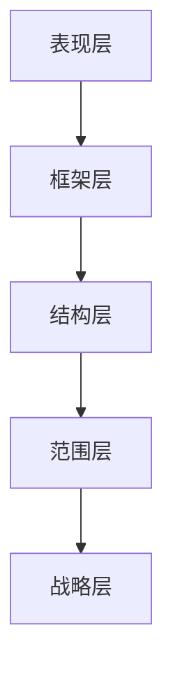
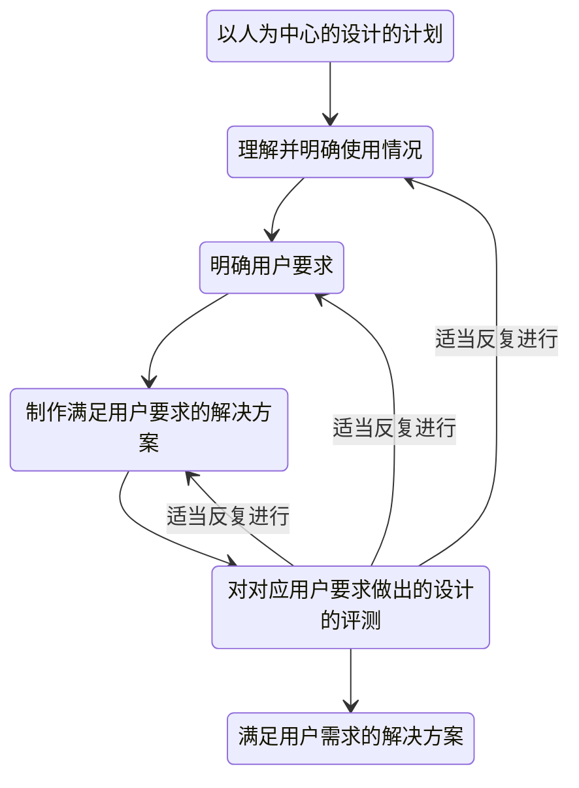

# 用户体验要素

### UCD（User Centered Design）流程 

1. **调查**
2. **分析**
3. **设计**
4. **评测**
5. **改进**
6. **反复**

## UX 国际标准

1999年提出，ISO 13407

2010年修订，ISO 9241-210

### UX的定义

国际标准：**用户体验是指，用户在使用或预计要使用某产品、系统及服务是产生的主观感受和反应。**

- 用户体验包含使用前、使用时及使用后所产生的情感、信仰、喜好、认知印象、生理学和心理学上的反应、行为及后果。
- 用户体验是指根据品牌印象、外观、功能、系统性能、交互行为和交互系统的辅助功能，以及遗忘经验所产生的用户内心及身体状态、态度、技能、个性及使用状况的综合结果
- 如果从用户个人目标的角度出发，可以吧随用户体验产生的认知印象和情感算在产品可用性的范畴内。因此，产品可用性的评测标准也可以用来评测用户体验的各个方面。

### 以人为中心的设计的适用标准

以人为中心的设计主要有以下七个优点：

1. 可以提高用户的工作效率和组织的运作效率
2. 容易理解也容易使用，可以缩减培训等费用
3. 提高设计成果的可访问性
4. 提升用户体验
5. 减少用户的不满，减轻设计团队的压力
6. 改善品牌形象，扩大竞争优势
7. 为可持续发展做出贡献

### 以人为中心的设计原则

以下列举了以人为中心的设计方法所遵循的6项原则：

1. 设计要基于对用户、工作及环境的明确理解
2. 用户需参与从设计到开发的整个过程
3. 设计需经用户反复评测，不断地改进并精益求精
4. 流程可反复进行
5. 设计需全面考虑用户体验
6. 设计团队需掌握多重技能并具备开放视角

### 以人为中心的设计活动

决定使用以人为中心的设计时，**处于图中心位置的四个活动是必须要进行的**

### 产品可用性的定义

1. **有效性**：用户能达成自己的目标
2. **效率**：以最短路径
3. **满意度**：没有不愉快的体验

## UCD 最新4原则

### 不要盲从用户意见

而用户体验却是未经分析的第一手数据,如果能对此进行谨慎细致的分析,反而能发现一些甚至连用户自己都未发觉的潜在要求。也就是说,**我们需要关注的并不是用户的意见,而是<u>用户的体验</u>**。

### 只为一人设计

然而不幸的是，如果你想满足所有用户的需求，那么最终开发出来的产品(如敞篷越野面包车)一定是**谁的需求也满足不了的**。那么，我们大胆地设想一下“不要为所有用户设计，而只为一个人设计产品”。抛弃那些没用的功能，**确保产品的简洁性**。那些具备了所有功能的产品，不是经常被人指责“常用功能只有20%，将近45%的功能基本上用不到”吗?

### 边做边想

### 早期试错

* Fast:趁早试错。
* small:重大失败会带来致命的结果。因此,要把失败的影响尽量控制到最小。
* Often:不可失败一次就气馁,要多失败几次。
* Smart:绝不可反复犯同一个错误。要彻底查明上一次失败的原因,再“聪明”地失败。

纸制软件也是可以测试的。不要把不会编写程序、没有预算、没有时间这些借口作为不去做的理由,只要是在力所能及的范围内进行尝试就可以。**在设计的最初阶段就应该反复进行试作和测试,而且要“善于”失败。**

