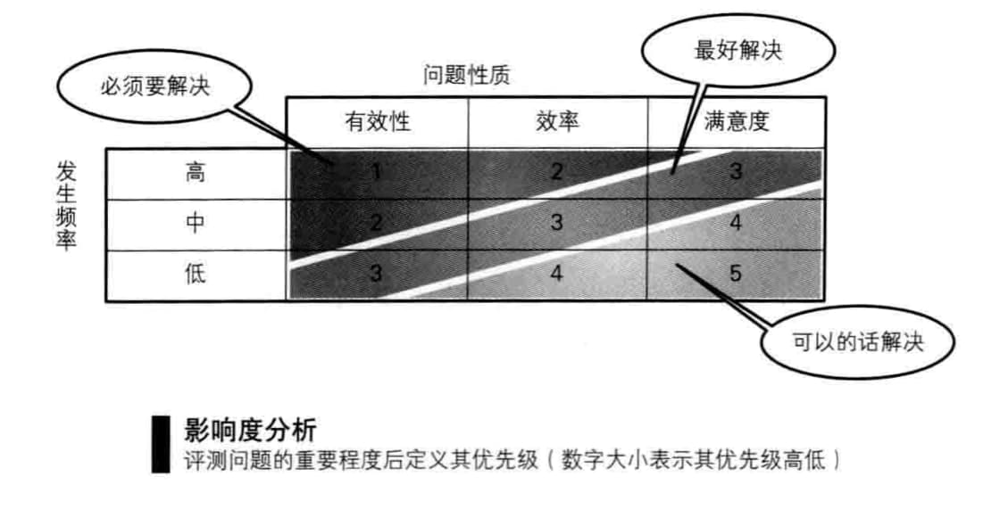

## 招募

**参与用户测试的人，最重要的条件就是他们“(被认为)有能力使用该品完成任务”。**

**抓住一切机会测试。**

## 测试设计4步骤

### 1. 设计任务

设计任务4大原则：

1. **把精力锁定在主要任务上**，如果无从下手，从产品研发目的角度出发
2. **从用户的角度出发**，<u>开发团队经常会把他们想让用户做的事情（所谓的商业目的）当成任务来研究</u>
3. **明确起点和目标**
   1. 用户测试中最重要的地方是**用户是否可以完成任务**，因此要明确**目标**是什么。一般会实现定义一个目标页面（界面），用户最终如果达到该页面，就说明完成了目标。
   2. 也要明确**任务的起点**。
4. **剧本化**：如果没有动机，用户就不会主动行动，只是等待指示。需要追加一些假设的情况（背景），把任务润色成故事。如果能像这样以剧本形式告诉用户任务，用户就可以通过自己以往的经历，带着生活实感，更主动地使用产品。

### 2. 准备实际检查工具

### 3. 制作访谈指南

访谈指南是用户测试的剧本。**访谈指南里有用户从入场到退场的流程提示提问和任务的顺序、时间分配、采访人员要说的话(台词)等。**采访人员原则上一边参考访谈指南，一边按访谈指南推动用户测试。

#### 4. 进行试点测试

无论进行了多么严密的测试设计，真正实施起来还是会发生意想不到的状况。当然，用户的行为在意料之外是可以理解的，但也有不少情况是因为访谈指南和准备存在问题。因此，需要事先进行试点测试。

试点测试不是访谈的练习或测试的事先练习。试点测试的**目的是测试用户测试本身**。试点测试要在可以调整访谈指南和实际检查工具的时间点(实际检查的2~3天前)进行。

试点测试的参与者一般是公司同事，采用的访谈指南和实际检查工具也和实际用户测试时一样。另外，访谈实施的流程和时间分配也和实际操作时相同。充当参与者的同事们也需要回答事前访谈的提问，执行所有任务。<u>我们并不关心同事的回答和任务的完成情况</u>，因为我们的目的是发现用户测试中的问题。

首先需要确认的是，访谈指南里的台词和提示卡片里的内容是否能够准确传达意思。如果同事对提问产生误解，或是不明白问题的意思向采访人员反问，那就需要讨论并修正产生问题的部分了。

另外，用户的完成时间也需要计时，以确认是否可以在规定时间内完成测试。如果同事完成任务很困难，可以想象实际操作时用户也会如此。如果同事很顺利地完成了任务，那么基本可以判断，实际操作时用户所需的时间为同事的1.5~2倍左右。

另外，还需要确认任务的指示说明和信息提示卡片里是否包含了暗示内容，**特別要注意同事非常容易就完成了任务的情况**。因为制作的信息提示卡片里的数据排列顺序和测试目标产品用户界面上的项目排列顺序完全相同，所以我的同事几乎没看计算机界面，只看我给的提示卡就完成了输入。

根据试点测试中发现的问题，通过修改访谈指南和信息提示卡片的内容或调整时间分配，来改善测试内容。

另外，**试点测试绝不可以省略**。如果省略了试点测试，就会变成前两个参与者的测试成为了试点测试，浪费了真正的测试资源。

## 分析

### 张贴

1. **所记述的内容不应该是所谓的“注意点”，二应该是观察到的“事实”。**
2. **请从“用户的角度”进行记述**

### 映射

等所有的任务完成，并把观察得到的数据大概写下来后，就可以进行以任务或者界面为单位的总结了。此时，**如果把项目中的实际界面投影到墙壁上，或者把打印出来的页面贴在墙壁上，再把观察到的数据贴在对应位置上(这即是所谓的“映射”)，就更能加深理解了**。

特别是把打印岀的页面按照页面流程图的顺序贴在墙壁上，并把观察得到的数据，逐一贴在对应页面的对应部位上的话，就可以做到全局察看测试中所观察到的多个用户的行为了。如果这些用户的纸条集中贴在某些部位上，就可以清晰看出该产品经常会被用到的部分了。

另外，卡片本身就可以激发分析者的灵感。如果某个特定的页面里贴付的卡片特别多，显然是有问题。再比如，总体来看所有页面的下半部分都集中了不少卡片，或者虽说任务不同，但相同布局的页面里集中了不少卡片，这些现象都值得注意。这些都是查明问题的根本原因时用得上的重要线索。

另外，这些映射结果的照片，也可以作为你的报告内容。正规的用户测试中，含有页面照片的、所谓“任务执行观察结果”的项目就占了报告的很大比重，在DIY用户测试中，拍摄映射结果的照片就基本能够达到相同的效果。

### 影响度分析

现在假设有5人参与了测试，平均每人发现了10-20个问题点，除去重复的部分后，大概可以总结出40个问题。然而，哪怕发现了这40个问题，开发团队却很可能会因不知从何着手而陷入混乱。**用户测试如果只是指出了问题内容，却不能标明每个问题的重要度(影响度)的话，其成果也就无法很好地得到利用**。

因此，下面我们从“**问题性质**”和“**发生频率**”两个方面来分析影响度。

我们通过“**效果问题>效率问题>满意度问题**”的顺序来评测问题性质。**效果问题**是指会导致用户很难完成任务的一类问题。效率问题是指会让用户感到困惑，或者导致用户做无用功的一类问题。而**满意度问题**则是指会导致用户表达出不满或不安情绪的一类问题。

**发生频率**主要通过发现问题的人数来决定。但是，人数的数字本身并没有什么特别的意义。我们一般通过“**1人、几个人、所有人(几乎所有人）**”三个范围来表示发生频率。比如说，如果参与者的人数是5人，就分为“1人、2-4人、5人”三类;如果参与者人数是10人，就分为“1人、2-8人、9-10人”三类。但是，这个界限划分并不严格，有时也会根据实际的问题发生频率进行调整，比如5人的例子调整为“1人、2-3人、4-5人”三个范围。

接着，把问题性质与发生频率相乘，就可以得到9个小方格。如果把处在相同对角线上的问题定义为拥有同等影响度，就可以把所有问题分类成“从所有人都发现的效果问题(优先级1:最为重要的问题)到只有1个人发现的满意度问题(优先级5:最为轻微的问题)这5个层次了。

请注意，DIY用户测试的窍门正是提炼出必须要解决的问题数。哪怕一心想解决用户测试中发现的所有问题，现实中也无法做到。因此，正像美国著名的产品可用性咨询师史蒂夫·克鲁格所提倡的“1次的测试中，最多罗列出10个要解决的问题点”一样，对发现的问题点来一次大瘦身吧。

这里，我将任务完成情况区分为如下三个阶段：
⃝ ：用户独立完成的任务，且其中基本未发生混乱或绕了弯路。
△ ：虽说用户独立完成了任务，但是期间绕了弯路，或者被观察
到在操作中有出现困惑的情况。另外，也包含用户表达了强
烈不满的情况。
×：用户被认为未能独立完成任务的情况。

## 再设计

### 交谈比文档更重要

但仍然需要做一份**最低限度**的报告。

### 解决问题

有10个问题就用10个对策方案来解决的做法，很可能会导致事态进步恶化。对所有问题进行一对一的“治疗”只会导致最终产品里到处都是“补丁”，从而导致产品的复杂程度增加，最终让用户感到更加困惑有10个问题并不意味着就一定需要10个对策。如果能够深入分析每个问题的内部构成，**就能够做到一个对策方案解决多个问题点**。而且，若是能够解决产品里导致用户体验不好的**最为深刻的根本问题**，就能够让产品的品质得到质的飞跃。

DIY用户测试的解决方案，应该在**当天晚上或明天，最迟也只能在下一个星期内必须得到实施**。

### 反复设计

反复实施小规模的用户测试和让开发团队保持与用户持续的沟通是一样的。要想得到改善，却止于单方面的沟通，是不能够排除掉那些来自开发人员“自以为是”的设计的。**而通过再次用户测试，就能够发现自己的解决方案里哪些是确实有效、哪些是不得要领的，从而能够从更深的层面上理解用户**。

另外，随着用户测试的反复进行，开发团队的能力往往也会逐步提升。哪怕一开始只有5成“命中率”的团队，再经过三次用户测试的“洗礼”后，也能够做到基本解决所有问题。如果是反复进行相同环节的测试，哪怕只观察一两个用户(当然，精确度可能会有所下降)，也能找到问题点并研究出解决方案来。

