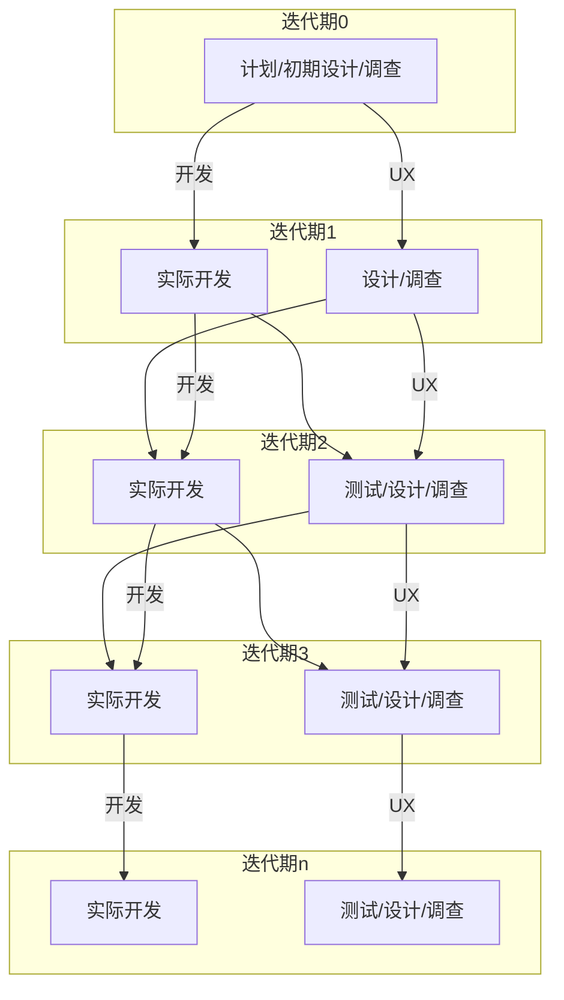

## 敏捷UX起源

令人意外的是，**敏捷UX的起源很早**。无论是敏捷开发还是UCD，都是在**20世纪90年代后半段**完成的自身理论建设。接着在21世纪初，就出现了结合敏捷开发和UCD两者进行的开发。

2002年，XP(极端编程)的首创人员且是敏捷开发宣言起草人之一的**肯特·贝克**和被称为虚拟角色之父的UX界权威**阿兰·库珀**进行了一场对话。在对话中，贝克对库珀顷克库珀提倡的“在产品开发之前就应该考虑交互设计”提出了异议，他认为“交互设计应该在开发的迭代周期里逐步完善”。然而，这只是过去的争论，在此之后，两人都继续在敏捷开发的领域做出了贡献。

2005年以后，敏捷UX得到了迅速地发展，从2008年开始，在 AgileConference(被称为敏捷开发业内最大的盛会)上设置了敏捷UX专用的讲台。敏捷UX终于在敏捷开发的社区里为自己争取到了一席之地。

## 敏捷UX的基本原则

从经验中我们可以得到最基本的原理和原则。

### 1. 由内至外

对于软件产品，一般都有“用户频繁使用的功能只占产品全部功能的20%左右”的说法。因此，敏捷开发中的一项铁规就是“不开发多余的功能”。从**对用户最有价值的核心功能**开始开发，慢慢地扩展到可选功能上。

### 平行推动

即使想让开发和UX设计同时完成，往往也不能如愿。比如，因界面设计导致了开发延误，或者因为赶时间而采用了不是很成熟的界面设计等。成功的关键是先做UX设计，这就是平行轨道法( Parallel tracks

### 轻量

传统的UCD方法大多由复杂的流程和大量文档构成。如果想原封不动使用以前的方法，你会发现敏捷开发的各个迭代周期根本无法承受这样的消耗。因此，需要在万分小心、不损害到各个方法的前提下，消减没用的部分，轻装上阵。

*出处: Desiree Sy, Adapting Usability investigations for AgileUser-centered Design, Journal of Usability Studies, Vol2. Issue3.May2007.pp.112-132*

## 敏捷UX的理论基础

UCD是 **User Centered Design(以用户为中心的设计)**的缩写。但其实还有另一个缩写为UCD的开发模式，即**以使用为中心的设计( UsageCentered Design)**。

以使用为中心的设计是**康斯坦丁( Larry Constantine)**和**洛克伍德( Lucy Lockwood)**在《面向使用的软件设计》一书中提出的概念。不同于以用户为中心的设计里对用户调查和用户测试等调查的重视，以使用为中心的设计的一大特点就是**重视用户使用案例和使用UML的建模**。因为以使用为中心的设计是从用户使用案例到用户界面的设计流程理论，其表记语言也与UML类似，所以对开发人员和架构师而言，是一个很容易上手的方法。但是，以使用为中心的设计并不是以敏捷开发作为前提的。而且，以使用为中心的设计虽然是基于用户使用案例设计的，但是在敏捷开发中比较多的情况是使用用户故事。完美解决了上述问题的是**科恩( Mike Cohn)**，他在自己的著作 User Storied Applied里用简单易懂的语言解释了如何在敏捷开发的流程中运用以使用为中心的设计。另外，在以使用为中心的设计中也有过不重视用户调查的问题。不依据数据，只靠开发团队内部的讨论确定的用户角色和用户故事，结果往往是抓不住重点，陷入大量的普通需求脱不了身，而最坏的情况则是开发出完全错误的产品。

因此，很多人把**上下文调查( Contextual Inquiry)、虚拟角色( Personas)、用户测试( User Testing)等以用户为中心的设计方法运用到以使用为中心的设计中，逐步完善设计**。如上所述，敏捷开发、以使用为中心的设计和以用户为中心的设计这三种模式慢慢地融合，最终形成今天的敏捷UX开发模式。

## 使用敏捷UX开发

1. **明确产品概念**
2. **计划**
   1. 创建虚拟角色
   2. 通过用户故事定义需求
   3. 对用户故事所做的作业规模做评估：敏捷开发的个特点是并不是以作业时间(人月)，而是**以表示相对规模的故事点( Story Point)**作为指标的。之后用**计划扑克( Planning poker)**这种游戏进行预估。但是，有一点需要注意，进行预估的<u>必须是开发团队的全体成员</u>，绝对不可以让其他人进行不负责任的预估。
   4. 决定用户故事以什么顺序实现
      1. 实现顺序不能单纯以工作流程和投入产出比为依据来决定，还必须综合考虑各功能之间的相互作用、市场的变化等与产品息息相关的众多因素。**确定实现顺序是产品经理/产品负责人最重要的工作**。
3. **开发**
   1. 迭代法中，用户界面的设计可以与开发同步进行，适用的方法之一是**草图板( Sketchboards)**。这是一种非常出色的方法，在一张巨大的纸上设计界面，必要时，还可以把这纸从墙壁上撕下来，卷成一卷，拿到访谈现场。通过测试的素描板即是一个简单的界面规范说明书。
   2. 对那些需要进行重要且复杂操作的界面制作原型，有一条不可动摇的规则就是“**尽量在设计的初期阶段消灭bug**”。通过制作纸质原型，就可以做到在以前无论如何也不可能做到的在最初期的阶段实施测试。这对开发团队而言，可以大幅降低项目的风险。
   3. 制作好原型之后，**应立即通过用户测试进行检验**。检验一大特点就是“请用户一边操作原型，一边说出自己的心中所想”，即发声思考法。如果有5位用户参与测试，大概可以发现85%的问题。请注意，敏捷开发的一个迭代期并不能承受正规的用户测试所需的时间。
   4. 在每个迭代期的末尾，会对产品进行实际的运行演示，并从相关人员那得到反馈。之后，产品经理/产品负责人会根据相关人员的反馈和开发的进展，追加、删除或修改用户故事，有时还需要修改实现顺序。接着，就进入了下一个迭代期的开发。
4. **发布**

  <h4>
    RITE
  </h4>
	这是一种经常被敏捷∪X的实践者挂在嘴边的用户测试方法。即<b>RITE( Rapid Iterative Testing and Evaluation,快速迭代式测试和评估法)</b>
  该方法为<b>微软的游戏开发部门在20世纪90年代后期创建的</b>。当时，他们在“帝国的崛起2”的教程开发里使用了该方法。其最大的特征即测试与设计变更的“快速迭代”。在RITE中，哪怕只根据一个人的测试结果，也可以果断地进行UI的变更。

