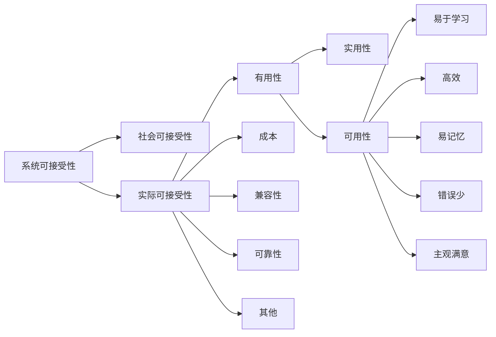

回到当计算机厂商不再仅仅把用户视为一种麻烦的时候，他们选择的措辞是“用户友好( user friendly)”的系统。不过，从几个方面来看，这个词实际上并不恰当。首先，这有些不必要的谦恭，**用户实际上并不需要机器对他们友好，他们所需的无非是在他们试图完成工作的时候机器不要碍手碍脚**。其次，这个词隐含有这样的意思，即用户的需求可以按照从系统单方面看来是否友好这样一个角度来进行描述。**而在现实生活中，不同的用户会有不同的需求，对某个用户友好的系统，对另一个用户则可能是乏味的。**

由于“用户友好”这个词所存在的这些问题，近年来用户界面专业人员倾向于使用其他措辞。这个领域本身通常被人们称为计算机-人交互(computer-human interaction，CH)、人-计算机交互( human- computer interaction，HCI，**某些喜欢“把人放在首位”的人倾向于这种说法，即使只是象征性地**)、以用户为中心的设计( user-centered design UCD)、人机器界面(manmachine interface，MMI)、人-机器界面( human- machine interface，HM)、操作员-机器界面( operator-machine interface，OMI)、用户界面设计( user interfacedesign，UID)、人类因素学( human factors，HF)、人类工效学等等。

我倾向于采用“可用性”这个词来表示本书介绍的方法所针对的问题正如下面一节所讨论的，**在传统的“用户友好”的范围内还需要考虑更广泛的问题。**

## 可用性定义

### 可学习性 learnability

系统应当容易学习，从而用户可以在短时间内开始用系统来做某些事情。

容易学习指的是新手用户在学习曲线的开头部分的体验。不仅要度量用户需要花多长时间掌握整个系统，孩应当度量需要花多长时间可以达到能够做些有用的事情的熟练程度。

### 效率 efficiency

系统的使用应当高效，因此用户学会使用系统之后，可能具有高的生产力水平。

效率指的是熟练用户在达到学习曲线上平坦阶段是的稳定绩效水平。

度量有经验用户的使用效率，显然需要有经验的用户。度量使用效率的典型方法是，**确定关于技能水平的某种定义，寻找一些具有这种技能水平的有代表性的用户样本，然后度量这些用户执行某些典型测试任务所用的时间。**

### 可记忆性 memorability

系统应当容易记忆，从而那些非频繁使用系统的用户，在中间有段时间没有石油之后能够使用系统，而不用一切从头学起。

非频繁使用用户是那些间断使用系统的人，他们不像熟练用户那样比较频繁地使用系统。

对界面可记忆性的测试，很少像其他可用性属性那样全面。但从原理上说，有两种主要的度量方法：

1. 对于在特定长的一段时间内没有使用系统的用户，进行标准用户测试，度量这些用户执行某些特定任务所需的时间
2. 对用户进行**记忆测试**，在他们结束一个使用系统的过程后，让其解释各种命令的作用，或说出完成某种功能的命令，最后得到的用户界面可记忆性得分，就是用户给出的正确答案。

对非频繁使用用户进行绩效测试，最能说明我们想度量可记忆性的原因。

### 出错 errors

系统应当具有低的出错率，在出错后也能够迅速恢复，而且必须能够防止灾难性错误的发生。

### 满意度 satisfaction

系统应当使用起来令人愉快，从而让用户在使用时主观上感到满意，喜欢使用系统。

为了保证度量的一致性，通常是在用户测试后进行总结时，让用户填写一份简短的问卷，来进行主管满意度的度量。

即使用户的确使用过系统，他们对于系统使用难度的主观评价，**也会更接近对系统中最难的地方的评价，而不是平均难度**。最艰难的经历对用户来说是最难忘的。<u>如果目标是改进系统的整体性能，那么不能只依赖用户的评价。</u>

无论采用的是什么评价尺度，都应当进行试点测试，以便保证用户会对问题做出正确的解释。

当使用评价尺度时，在对结果进行评估之前，**需要用一个锚点或基准来对尺度进行校准**。如果有关若干不同系统或同一系统的若干版本的主观满意度评价的话，可以相对于其他系统来考虑这次得到的评价，从而可以确定哪个系统使用起来最令人感到愉快。如果只对一个系统进行度量，那么在对评价做出解释时就应当谨慎，因为用户在回答问题时经常是比较客气的。

可用性测试的重点是**要针对特定用户和特定任务来度量可用性**。在进行可用性度量时，首先要定义一组具有代表性的测试任务，只有相对于这组任务，才能度量不同的可用性属性。

为了在一组可用性度量的基础上确定系统的整体可用性水平，通常的做法是取每个可用性属性度量的平均值，看它们是否比先前确定的某个最低标准要好。

