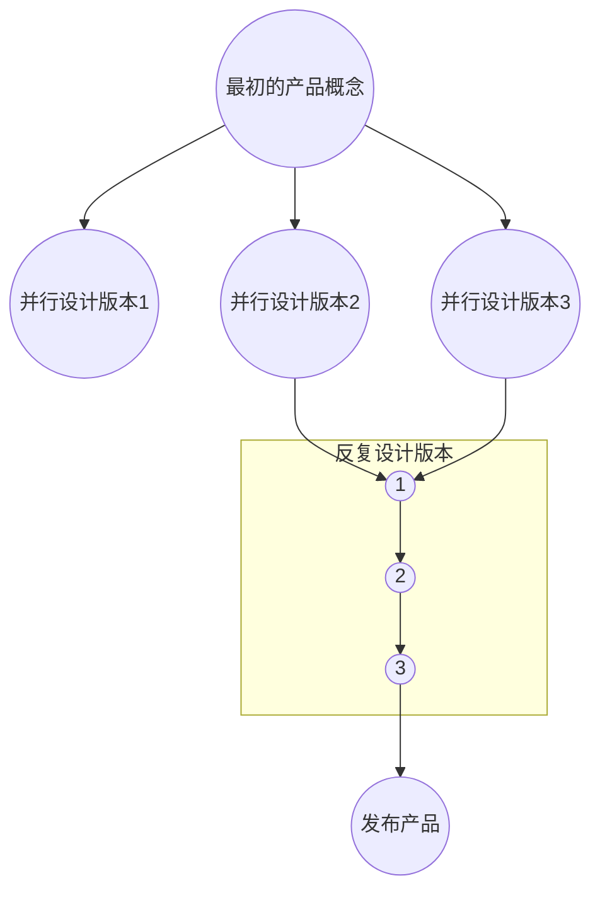

## 可用性工程生命周期模型中的阶段

**这个生命周期强调的是，不应当不问青红皂白地直接进入设计阶段。**要想使可用性活动左右产品的设计，最省力的办法就是在设计开始之前开展尽可能多的可用性工作，这样就不必为满足可用性方面的要求而更改设计。

而且，在系统设计开始之前说开展的可用性活动，可能会避免开发那些不必要的功能。

### 了解用户

“用户”这个概念应当是指其工作一某种方式受到产品影响的所有人，包括系统最终产品或输出的用户，即使他们根本没有直接看到屏幕。

**直接接触用户**是唯一建议的解决方案。开发人员反复争论用户会是什么样的，或者用户可能想要什么，在这上面浪费的时间是惊人的。**与其关在屋子里讨论这些问题，还不如（实际上更省时间）直接从用户哪里获得真正的事实。**

#### 个体用户特征

通过了解用户的工作经历、教育程度、年龄、计算机使用经验等情况，可以在某种程度上预测他们在学习上会遇到的困难，从而对用户界面的复杂程度做出恰当的限制。**我们的确还需要了解用户的阅读和语言技能水平**。例如，很小的孩子没有阅读能力，所以适合给他们提供非文字的界面。我们还需要了解用户能够有多少时间用于学习系统的使用，以及是否有机会参加培训课程:如果希望用户在受到很有限的培训之后就可以使用，就应当使用户界面大大简化。

还有用户的工作环境和社会环境。

**在任何情况下，最好都不应当完全依赖于书面记载的信息，因为新的见解几乎总是来自于对实际工作环境中实际用户的观察和交谈。**

#### 任务分析

任务分析是系统设计**必须的**的早期输入。应当研究用户的**最终目标，还要研究他们目前是怎样执行任务的，他们的信息需求，以及他们怎样处理异常或经济情况。**

应当识别用户的任务模型，因为可以利用它得到关于如何设计用户界面隐喻的启发。而且，<u>通过观察那些特别有效的用户以及他们的策略和工作环境</u>，可以对于新系统应当提供的支持得到某些启示。这种“**领先的用户**”往往是创新设计的源泉。最后，还应当找出当前情况下存在的问题，即用户未能实现目标、花费过多的时间或感到不舒服的那些地方。这些弱点为改进新产品提供了机会。

任务分析的输出通常包括**一系列用户想用系统实现的事情（目标），实现这些目标所需的所有信息（前提条件），允许执行的所有步骤及其相互依赖关系，所需产生的各种输出和报告**，用来判定这些结果的质量和可接受性的标准，以及用户在执行或准备执行任务时与其他人交流信息的通信需求。

**当为了搜集有关任务的信息而对用户进行访谈时，应当总是让用户提供关于其工作产品的具体事例，而不只是在抽象层次上讨论问题。**而且，作为对访谈方法的补充，应当对一些用户实际工作的情况进行观察，因为在访谈中，用户常常把他们的行为合理化，或者遗忘重要的细节或例外情况。

任务分析经常可以按照层次结构进行分解，组织机构的每个较大的任务和目标可以被分解为较小的子任务，然后再对他们做进一步分解。<u>通常，每当用户说“然后我做这件事情”时，进行访谈的人员可以问两个问题：</u>

1. 你**为什么**做这件事情？（把这件事情与更大的目标联系起来）
2. 你**怎样**做这件事情？（把这件事情进一步分解子任务，以便进一步的研究）

其他可以问的问题有：

- 做这件事情时出过差错吗？
- 你是怎样发现并纠正这些差错的？

**应当让用户描述其正常工作过程中的例外情况。**还应当让用户谈一谈留下深刻印象的成功或失败的事例，存在的问题，他们最喜欢或最不喜欢什么东西，希望有什么改变，对改进有什么建议，以及目前有什么东西让他们感到烦恼。

#### 功能性分析

不应当仅仅分析用户当前执行任务的方式，还应当分析任务的底层功能上的原因：**真正想要做的到底是什么，哪些是可以或应当改变的表面过程。**

### 竞争性分析

现有产品或同类竞争性产品，常常是可以得到我们自己产品的最好原型。

### 确立目标

一般来说，在一个特定项目中，并非可用性的所有方面都具有同样的权重，所以，**必须根据对用户和任务的分析来明确他们的优先级。**

在开始设计新的用户界面之前，应当对那些**对于本项目比较重要的可用性度量指标**进行讨论，明确用户界面在这些可用性指标上的目标。

对于每一个感兴趣的可用性属性，在确立可用性目标的过程中可以定义若干种不同的绩效水平。**至少应当定义对于产品发布来说可接受的最低水平，更详细的目标定义还可以包含计划达到的绩效水平和目前的绩效水平。**

#### 经济影响分析

在确立可用性目标的同时，还应当对系统可用性的经济影响进行分析。这样的分析需要估算将使用系统的用户人数，他们的全额工资或其他成本以及他们使用系统的大致时间量。用户时间的成本并不仅仅只是他们的薪酬，还应包括其他成本，诸如各种养老金和福利，政府征收的就业税费，以及办公室租金这样的日常开销。所有这些成本被称之为**用户的全额工资**或**全额成本**。

对于在开放市场上销售的软件来说，其用户方面的节省就不那么容易计算。因此经济影响分析应当包括两个部分：

1. 关于对开发组织影响的评估（有助于确定可用性预算的量级）
2. 关于对用户组织影响的评估（有助于对可用的可用性资源进行优先排序）

### 并行设计

并行设计的目的在于**在确定某个设计方案之前，先对几个不同的设计方案进行一番探索，然后再对所确定的设计方案做进一步的开发，开展更细致的可用性活动。**

**并行设计的重点是，<u>让设计人员独立进行设计，因为其目标是为了产生尽可能大的多样性。</u>**

并行设计的一种变形被称为**多样化并行设计 Diversified Parallel Design**，<u>它是基于让不同的设计人员侧重于不同的设计问题。</u>通过明确地规定每个设计人员的设计方向，多样化并行设计方法可以把每一种方案推向极致，从而得到在通用设计方案中很难出现的设计构思。

对于创新性的系统来说，往往<u>并不存在关于什么设计方法是最好的指导意见</u>，在这种情况下，特别需要采用并行设计方法。

### 参与型设计

尽管在开始设计之前，人们会遵循“了解用户”的忠告，但对用户的了解程度还不足以解决设计过程中出现的所有问题。在进入设计阶段后，设计人员不应当只凭猜测，而应当与一些用户代表保持沟通。

**应当注意，必须与将来真正使用系统的人，而不是他们的经理或工会代表进行沟通。**

应当通过设计人员和用户的定期会议，让用户参与设计过程。参与系统设计过程的用户，有时被称为**领域专家 Subject Matter Expert, SME**。

用户不是设计人员，因此期望他们完全靠自己提出设计构思是不现实的。不过，<u>他们非常善于对他们不喜欢或实际上并不可行的具体设计方案提出意见。</u>为了充分发挥用户参与的作用，**必须以用户能够理解的方式向用户展示这些建议的系统设计方案**。为此，应当采用具体而可见的设计方案，最好是原型的方式，而不是长篇大论的系统设计描述。

<u>需要认识到，参与型设计并非只是询问用户需要什么，因为用户经常并不清楚自己想要什么或需要什么，甚至不知道存在什么样的可能性。</u>

对于较大型的开发项目，**应当注意定期更新参与项目的用户代表。**因为存在这样一种风险，随着参与系统开发的过程，用户代表会逐渐变得不具有普通用户的代表性。一个参与过太多设计会议的用户代表，将会受到开发人员思维方式的浸染，将会了解所提出的系统结构，并可能会倾向于接受对那些有问题的设计部分所做的解释。

### 整体界面的协调

一致性是最重要的可用性特征之一。

为了实现整体界面的一致性，每个开发项目都必须有一个唯一的权威，来对界面的各个方面进行协调。通常这种协调可以通过某个人来实现，但对于规模很大的项目或整个企业范围的一致性，则更适合采取成立一个委员会的方式。

除了正规的协调活动之外，在开发部门内应当就建立什么样的用户界面形成共识。

此外，还可以通过技术措施来提高一致性。如共享程序代码或采用具有约束作用的开发环境。

### 指南应用和经验性评估

指南列出了开发项目应当遵循的、广为人知的用户界面设计原理。在任何特定项目中，应当使用若干不同层次的指南：

- 适用于所有用户界面的**通用指南 General Guideline**
- 针对所开发的系统类型的**种类专用指南 Category-Specific Guidelines**
- 针对特定产品的产品**专用指南 Product-Specific Guideline**

标准和指南之间的区别在于，**标准描述界面呈现给用户的样子，指南对于界面的可用性特征提出建议**。

### 原型

**原型技术的主要目的，就是节省时间和成本来开发那种可供真正用户进行测试的东西。**

#### 垂直原型  Vertical Prototyping

减少功能数的办法被称为**垂直原型**。因为这样产生的结果是一个狭窄的系统，它的确包含某些完整的功能，但只针对少数几个说选择的功能。因此，**垂直原型只能用来测试完整系统中有限的一部分，但可以用真实的用户任务在逼真的情况下进行有深度的测试**。

#### 水平原型 Horizontal Prototyping

降低功能水平的做法被称作**水平原型**。因为这样产生的结果只是一个表层，它具有完整系统的整个用户界面，但却没有底层的功能。水平原型是一个不能执行真实任务的界面仿真，可以用来测试整个用户界面，但不能执行任何真实任务。

水平原型的主要优点在于，**他们经常可以通过使用各种原型工具和屏幕设计工具来很快实现，而且可以用来评估吧界面各部分放在一起的整体效果**。

#### 剧情

**剧情**是最低限度的原型，因为他只描述了一个交互过程，没有给用户提供任何灵活性。因此**它兼有水平原型（用户无法于真实的数据进行交互）和垂直原型（用户无法在系统中自由移动）所具有的限制。**

剧情的定义--剧情是对以下事物的一种笼统描述：

- **用户**个体
- 对一组特定计算机功能的使用
- 获取特定的**结果**
- 在特定**情况**下
- 经过特定的**时间间隔**

剧情有2种用途：

1. 在用户界面设计过程中，可以<u>把剧情作为关于用户最终如何于未来的系统进行交互的描述手段</u>
2. 在用户界面设计的早期评估中，可以在不用建造可运行原型的情况下，通过剧情来获得用户反馈

一般来说，在设计的早期阶段，剧情描述是不错的工具，因为可以在用户界面充分设计之前生成和编辑它们。描述想象中的未来系统使用情况的剧情，对于早期的参与型设计活动也是有帮助的，因为用户发现，比起抽象和面向功能的系统规范来说，面向任务的剧情更容易理解和接受。

如果剧情能够在纯粹叙述的基础上包含更多细节，它还可以用来进行用户测试。

细致的剧情有时会以“日常生活”录像片的形式出现。这些录像片表现了“用户”在日常的活动中于某个模拟系统交互的情景。这些录像片随后可以播放给用户看，例如，在焦点小组活动中用来启发讨论。

### 界面评估

关于界面评估，最基本的建议就是**做起来再说，尤其是要做用户测试**。

Whitefield等人对评估方法提出了一种基于两种因素的分类方法：

1. **真正的用户**是否参与
2. 界面是否已经实现

#### 严重性评估

不论采用什么评估方法，说得到的主要结果都是这样一个清单，**其内容为界面存在的可用性问题，以及关于改进功能以支持用户任务的建议**。

通常，要想解决所有问题不太显示，因此需要进行优先排序。这种优先排序最好能搞以有关问题对**用户绩效影响程度的实验数据（例如，有多少人会遇到这个问题，每个人会因此而耗费多少时间）**为依据，但有时候只能靠直觉。

通常，严重性评价是通过把界面上说发现的可用性问题清单发给一组可用性专家，让他们给每个问题的严重性打分来获得。

然而，纯粹根据可用性专家的主观判断做出的严重性评价是不太可靠的。人们对可用性的判断的确有较大差异。建议绝对不要依赖于任何一个可用性专家所做出的严重性评价，而应当综合若干独立评价者的意见。

严重性评价常用的两种方法是，或者采用**单一尺度**，或者采用**若干正交尺度的组合**。

用于可用性问题严重性评价的单一评价尺度可能是：

- 0：根本不是个可用性问题
- 1：只是一个表面的可用性问题--除非项目有额外时间，否则不必进行矫正
- 2：轻微的可用性问题--纠正这个问题的优先级较低
- 3：重要可用性问题--需要重视该问题的纠正，应当给以高优先级
- 4：可用性灾难--在产品发布之前必须予以纠正

严重性还可以根据可用性问题最重要的两个因素来评价：

1. **预期有多少用户会遇到这个问题**
2. **这些用户受该问题影响的程度**
   1. 临时性的可用性问题：用户通过学习可以克服
   2. 永久性可用性问题：每次使用都会遇到困难

如果得不到用户测试数据，也可以由可用性专家对每个问题的频度和影响程度做出经验性的估计，**但这种估计可能最好以少量的用户观察工作为基础。**

### 反复设计

**用户交互过程的日志文件**是很有帮助的，它可以揭示用户在什么地方停顿下来或浪费了时间，以及经常出现的错误是什么。

在有些情况下，我们需要完全根据有关可用性指南的知识，来建立不同的设计方案，而且在做出决定之前，可能需要对若干不同的可能方案进行测试。<u>这个时候，对不同设计选项的熟悉程度、从观察用户中得到的见解、创造性以及运气都是需要的。</u>

为解决特定可用性问题而进行的设计变更有时是会失败的。变更后的设计方案甚至可能会引入新的可用性问题。这说明了**为什么要把反复设计与评估结合起来**。实际上，每次重新设计往往侧重于改进某个可用性属性（如减少用户出错次数），但结果却发现，某些设计变更出人意料地影响了其他的可用性属性。

#### 捕捉设计道理

可以把各种用户界面设计决定背后的道理加以明确的记载，以便于今后参考。在反复设计和开发产品未来版本的时候，对设计道理的回顾是十分重要的。因为经常需要对界面进行修改，所以最好能够了解原始设计方案的基本道理，从而不会为了微不足道的目标而损害重要的可用性原理。设计道理还有助于技术资料编写人员编写文档，有助于翻译人员开发外语版本。而且，设计道理还可以帮助维护产品后续版本用户界面的一致性。

### 对已安装系统的跟踪研究

在产品发布以后，可用性工作的主要目标就是搜集可用性数据，以用于下一个版本和今后新产品的开发。

方法包括：

1. 数据埋点和后台数据
2. 访谈、问卷和观察研究
3. 分析用户投诉、修改请求
4. 系统对用户的工作产品和工作本身的质量和成本产生的影响等等经济数据

### 元方法

- 对于使用方法需要做什么写一个**清晰的计划**。例如，关于实验性用户测试的计划需要包括这样一些信息，如对多少用户进行测试，对那种用户进行测试（以及如何招聘），让这些用户执行什么测试任务（这应当给予任务分析和用户观察），以及测试活动的时间安排。
- 请某个与你不在同一开发团队，并且能够从全新的角度来进行评论的人对这个计划进行**独立评审**，这个人<u>最好具有可用性工程的经验</u>。
- 用整个方法预算资源的10%～15%做一次实验性应用。然后用剩下的85%～90%的预算对计划进行完善，克服那些在实验性应用中无法回避的困难。
- 在项目中应当尽可能早地建立一个总的可用性计划，列出整个生命周期中要开展的可用性活动。并不是所有项目都有足够的资源来应用所有的可用性方法，说应用的具体方法取决于项目的特点。

### 可用性活动的优先顺序

通常，在一个特定的项目中，往往不可能应用这里说推荐的所有可用性方法。可以使用[**简化可用性工程**](book2/chapter1?id=简化可用性工程)。

#### 对可用性影响程度最高的6种可用性方法

1. 反复设计
2. 对用户当前任务的任务分析
3. 用真实用户进行实验性测试
4. 参与型设计
5. 在设计开始前访问顾客现场
6. 在系统安装后进行现场研究，以了解系统的实际使用情况

### 有所准备

为紧急项目做的预防措施：

1. 寻找一个好的**用户界面原型工具**，熟练掌握其使用。
2. 掌握正确的**可用性检查和经验性评估技术**（见[第五章](http://book2/chapter5)），熟悉有关的界面标准和指南。采用这些方法只用几个小时就可以改进界面设计，但可能需要两周时间才能掌握某些方法。
3. 了解与你的组织有关的**典型用户类型、任务、应用程序和计算机平台**。对以前从用户测试、现场访问和运行系统的研究中说得到的具体经验加以总结和归纳，将有助于对新的界面做出更有见地的判断。
4. **为在需要时招聘测试用户而建立相应的流程**。但需要进行用户测试时，说遇到的一个主要困难就是，在事先没有准备的情况下，要找到合适的用户需要花费一定的时间。
5. 在那些还没有专职可用性专业人员的每个项目团队中，**物色和培训一名可用性的拥护者**。这样的可用性拥护者应当对可用性有足够的了解，以便可以应对其项目中对可用性的日常要求，这种活动包括对设计构思的经验性评估和简单快速的用户测试。由于可用性拥护者并不是全职的可用性专业人员，所以他们于专职的可用性专业人员应当建立联系。这些可用性专业人员可以让他们随时了解用户界面领域的最新发展，承担更专业化的工作，如建立可用性实验室，或者招聘和安排测试用户。
6. 阅读更多关于可用性的书和文章，参加会议。还可以尝试使用许多具有不同类型界面的系统，以获得关于不同交互风格的经验

