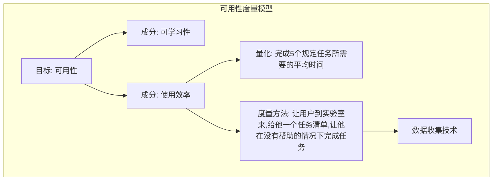

## 可用性测试的困难

在可用性测试中需要注意两个主要问题：

1. **可靠性**：当重复进行测试时，是否还会得到与原来一样的结果
2. **有效性**：所测试的结果是否能真实反映出想要测试的可用性问题

### 可靠性

95%的置信度往往用于研究工作，在实际开发中，**把目标定在80%的置信水平就足够了。**

### 有效性

典型的有效性问题包括选择不适当的用户，或者给出了不当的用户测试任务，或者没有考虑时间约束和社会因素的影响。

## 测试目标和测试计划

在进行任何测试之前，都应该首先搞清楚测试的目的，因为它对要进行的测试有重要的影响。主要差异在于，测试是想对用户界面进行**形成性评估 formative evaluation**还是**总结性评估 summative evaluation**。

- **形成性评估**：是反复设计过程的一部分，目的是**为了改进设计**，因此它的主要目标是了解界面细节方面的优劣，以及如何改进设计
- **总结性评估**：目的是**评定界面的整体质量**，例如可以用它在两个备选方案中进行选择，或者作为竞争性分析的一种手段，来了解竞争对手的产品设计好在哪里。典型的总结性评估方法就是**度量型测试**。

### 测试计划

应该在测试开始之前写好测试计划，并且在计划中要说明下列问题：

- 测试的目标：想达到什么目的？
- 测试在什么地方和什么时候进行？
- 每一次测试预期用多少时间？
- 测试需要什么样的计算机设备？
- 测试之前要准备什么软件？
- 开始测试时系统要处于什么状态？
- 系统或者网络负载和响应时间应该是多少？如果可能的话，系统不应该异乎寻常地慢，也不能因为系统或网络上没有其他用户就快得出奇。这时候有必要人为地把系统的速度降下来以模拟实际的响应时间。
- 谁担任测试人员？
- 谁是测试用户，怎么找到这些用户？
- 需要多少测试用户？
- 让用户完成哪些测试任务？
- 有什么标准来确定用户已经正确地完成了每一项测试任务？
- 测试用户可以使用什么辅助手段（手册、在线帮助等等）？
- 测试人员在测试期间可以给测试用户提供何种程度的帮助？
- 有收集什么数据，以及在数据收集之后怎么对其进行分析？
- 判断界面成功的标准是什么？通常把先前定义的可用性目标中的[“计划”水平](book2/chapter4?id=严重性评估)作为标准，但也可以像“**没有发现严重程度高于3的新的可用性问题**”这样宽松标准。

### 测试预算

标准的用户测试成本预算有以下几部分：

- 可用性专家设计、实施和分析测试的工作：如果聘请了咨询专家，还要直接像他们付费
- 管理助手安排测试用户时间表和录入数据等工作
- 软件开发人员为加入数据收集功能或满足其他测试要求所做的代码修改工作
- 测试用户的时间：如果招募了外面的人员来测试，就要直接支付费用
- 在测试和分析期间使用的计算机
- 可用性实验室或者其他用于测试的房间
- 录像带和其他消耗品：直接购买

付给各种工作人员的费用应该根据他们的全额薪水而不是他们的名义工资来估算。全额工资就是公司雇用一个人的总体费用，包括福利、休假报酬、就业税费以及企业的一般开销。

测试预算应该分为**固定费用**和**可变费用**。

- **固定费用**：计划和组织测试所需的花费，不考虑测试用户的多少
- **可变费用**：付给每一位测试用户的那些额外费用

*根据已经公布的研究数据，还可以得出，在中等规模项目中发现可用性问题的花费通常为15,000美元。*

  

    Niesen 和 Landauer(1993)给出以下公式，它可以对发现可用性问题做出很好的估算： 
$发现的可用性问题(i) = N(1-(1-ℷ)^i)$  
	i：测试用户的数量 
	N：界面上可用性问题的总数 
	ℷ：任一个测试用户找到任一个问题的概率 
  

N和ℷ的值在各个项目中的变化相当大，应该用根据每个项目已有数据所做的曲线来估计。**应当在项目中留意搜集这些数据，这样就能估计出这些参数的“常规”值，以用于为将来的测试做计划。

### 试点测试

不应当在事先没有对测试过程进行几次实验的情况下就进行可用性测试。最初的几次试点测试可以找一些实验人员比较容易找到的人来测试，即使这些人并不代表实际用户也没有什么关系，因为甚至让同时来做一次测试也会发现测试设计上存在的错误。即便如此，也还是应当由与测试用户一样的人员来进行至少一次试点测试。

在试点测试过程中，人们一般都会发现某些让用户难以理解的测试任务说明，或者引起他们误解的地方。<u>同样，任何用于主观满意度调查的问卷，或者其他的测试后交流问卷也常常需要根据试点测试的结果进行修改。</u>

试点测试还能用来完善测试过程，以及清楚地对拟测量的各种事物进行定义。例如，常常难以确切判定什么情况算是用户的错误，或者什么时候可以准确地告诉用户他已经完成了给定任务，试点测试还能帮助找出测试计划中存在矛盾或者缺陷的地方。

## 招募测试用户

有关寻找测试用户的**主要原则**，就是**所选测试用户越能代表预期使用系统的用户越好**。

### 新手用户还是熟练用户

用户类型的一种主要区分方法就是把他们划分为[新手用户和熟练用户](book2/chapter2 ?id=用户分类及用户个体差异)。**几乎所有的用户界面都需要用新手用户进行测试。**

### 用户间还是用户内测试

可用性测试常常用于比较两个或多个系统的可用性。有两种基本的方法来选择测试用户：

1. **用户间测试 between-subject testing**：每个测试用户只参与一个测试过程
   1. 问题：用户间测试的结果可能会有一定的偏向
   2. 解决方法：随机分配
2. **用户内测试 within-subject testing**：所有测试用户来使用所有被测试的系统
   1. 问题：测试用户在学过使用第一系统以后，无法再作为一个新手使用第二系统
   2. 解决方法：先分组使用，再交换组

## 选择实验人员

一般来说，最好选择曾经使用过所选测试方法的有经验的实验人员。

除了具备测试方法方面的知识之外，实验人员还必须具备大量有关应用程序及其用户界面方面的知识。

让实验人员具备丰富系统知识的一种方法是**让系统设计人员自己来担当评估人员**。同时这样的方法的一个问题是--很可能会由于他们给予用户太多的帮助而使测试缺乏客观性。为了避免这种情况，开发人员可以作为可用性测试队伍中的一员，但让可用性专业人员去和用户进行交流。

## 用人来进行测试的伦理问题

实验人员应尽量让用户在测试过程中和测试后感到舒适。特别是，实验人员不能取笑用户，也不能用任何方式表示用户在找到如何操作系统的过程很慢。在向用户介绍测试时，实验人员应该清楚地表示测试的对象时系统而非用户。需要强调的是，绝对不能把测试用户称为“实验对象”、“豚鼠”或其他类似的称谓。

应该告诉用户，不会公开用户的任何个人绩效信息，特别是不会向他们的经理透露有关他们的表现。

### 用户测试中有关伦理方面的考虑

- **测试之前**
  - 在用户来到之前准备好所有东西
  - 强调测试的对象是系统而非用户
  - 告知用户软件是新的，没有被测试过，可能会存在一些问题
  - 让用户知道他们可以随时停止测试
  - 解释所有使用的录音设备、键盘敲击记录程序或其他监控设施的用途
  - 告诉用户测试结果将会完全保密
  - 在开始测试之前回答用户提出的所有问题
- **测试过程中**
  - 让用户尽早体验到成功
  - 一次给用户一个测试任务
  - 在测试房间内保持轻松气氛，提供咖啡或者中间休息时间
  - 避免干扰：关上房门并贴出告示。关掉电话。
  - 不要以任何方式表现出用户正在犯错误或者用户操作太慢
  - 测试观察人员数量要保持最少
  - 不允许用户的上司来观看测试
  - 如果测试令人不愉快，在必要时可以让实验人员停止测试
- **测试之后**
  - 向用户说明他们帮助发现了要改进的地方
  - 千万不能以可以区分出具体用户的方式来报告测试结果
  - 只有在用户同意的情况下，才能在可用性小组之外公开录像带

## 测试任务

选择测试任务的基本原则是**所选择的测试任务要尽可能地代表系统的最终使用**。另外，测试任务应该大致覆盖用户界面上最重要的部分。

1. 应当把测试任务设计得比较小，这样就能在有限的测试时间内完成，但任务也不能小到微不足道的程度。
2. 测试任务应该详细精确地说明用户执行后产生什么后果，因为使用计算机来达到某个目标的过程与只是随便用用系统是很不一样的。
3. 测试任务不要轻挑、滑稽或者冒犯，**所有的测试任务都应该是面向业务处理的**，并且尽可能逼真。
4. 为了增加用户对任务的理解和真正使用软件的感觉，任务可以与整体剧情相关联。

## 测试的各个阶段

可用性测试通常分成4个阶段：

- 准备
- 介绍
  - 测试的目的是对软件进行评价，而不是对用户个人进行测试
  - 除非实验人员（测试人员）实际上就是系统设计人员，否则实验人员应该对用户（被测试人员）提到他与被评价系统没有关系，因此测试用户可以自由表达意见，而不必担心伤害到实验人员的感情。
  - 测试结果将用于改进用户界面，所以最终发布的系统有可能与测试时看到的不一样。
  - 提醒用户对所测试的系统要保密，不要与别人讨论有关内容。即使系统不是保密，也最好要求用户保持沉默，不要与后面可能参加测试的同事讨论。
  - 说明参与测试是自愿的，用户可以随时停止测试
  - 让用户放心，对测试的结果会保密，并且不会以可以区分出单个测试用户的方式向任何人展示
  - 对于使用的任何录像设备都要向用户进行解释。不管是什么情况，录像时都不应该摄入用户的面部，只能有屏幕、键盘和用户的背影，明确说明这一点以减轻用户对录像的忧虑
  - 向用户说明欢迎他们提问，因为想知道他们在界面上有什么地方不清楚，但是实验人员在测试时一般不能回答用户的提问，因为测试的目的就是看用户在没有帮助的情况下是否使用系统
  - 关于实验的任何特殊要求要提前说明，例如边做实验边大声说出感受，或者在保证出错最少的同事尽快操作等
  - 在实验开始之前请用户提出需要澄清的任何问题
- 测试
  - 测试期间，实验人员通常不要与用户进行交流，也不要有任何个人观点或关于用户操作好还是不好的表示。
- 事后交流
  - 在测试之后，要询问用户，并要求用户填写一份主观满意度问卷。为了避免实验人员的评论说带来的偏向，用户应当在有关系统的讨论之前填写问卷。在交谈中，请用户对系统的使用情况进行评论并提出改进建议。这些建议并不一定都会对具体的设计改动起作用，人们也常常会发现不同的用户会给出相互矛盾的建议，但这些用户建议都可以做为重新设计时构思的丰富来源。
  - 在询问时，实验人员也可以请用户对测试过程中发生的实验人员难以理解的事件进行进一步的解释。
  - 在测试用户离开以后，实验人员要尽快检查所有测试结果，并用测试用户的编号进行标识，需要标识的还有计算机记录的所有文件、所有问题和其他表格，以及实验人员自己所做的笔记。
  - 撰写完整报告

## 绩效度量的方法

**首先要弄清楚研究的目标。**

目标常常分为几个部分（[参见第2章](book2/chapter2)），需要在目标的各个不同部分之间平衡，决定彼此的相对重要性。

**在确定目标的各个部分后，需要精确地对其进行量化。**但要时刻记住：**测试任务不是所有可能的任务，反复设计不应把目标确定在仅仅针对说要执行的测试任务中，而不考虑其他方面来优化界面以改进系统的使用效率。**

要明确定义任务什么时候开始和结束。

通常可量化的可用性度量指标包括：

- 用户完成规定任务所用的**时间**
- 在限定时间内完成的**任务数量**（或者完成大任务的比例）
- **正确**的交互**操作**与所发生错误之间的**比率**
- 从**错误**中恢复所用的**时间**
- 用户出错的**数量**
- 随后导致的错误**操作数量**
- 用户**用到的命令**或其他功能的**数量**（或者是说发出命令的绝对数量，或者是所用不同命令与功能的数量）
- 用户**从未用到的命令**或其他功能的**数量**
- 在测试后交流中，用户能**记住**的**系统功能**的**数量**
- **使用手册和/或帮助系统的频度**，以及**使用时间**
- **使用手册和/或帮助系统**有多少次**解决**了用户的问题
- 用户在测试期间对系统**肯定和批评的比率**
- 用户表达**明显的挫折（或明显的欢喜）**的次数
- 表示喜欢用该系统而不喜欢用某个特定竞争产品的用户的**比例**
- 用户不得不**试图解决某个无法解决的问题**的**次数**
- 采用**高效策略**的用户与使用**低效策略**的用户之间的比例（在有多种方法完成任务的情况下）
- 用户不与系统进行交互的**“呆滞”时间**。可以在系统中度量出两种呆滞时间：用户等待系统响应说造成的延迟，系统等待用户思考说造成的延迟。者两种呆滞时间显然可以用不同的方法来研究。
- 用户注意力**从真实任务被吸引到其他地方**的**次数**

## 边做边说法 Thinking Aloud

边做边说法可能是单个**最有价值的**可用性工程方法。通过测试用户对自己想法的描述，我们就能搞了解他们对计算机系统的看法，还能很容易地确定用户对系统主要有哪些误解。

这种方法的主要缺点是：**它并不适用于大多数绩效度量。**优点在于能从少量的用户那里收集定性数据。

不要过度依赖用户提出的解决方案，不要只因为某个用户的意见就去改变界面。

**记录用户实际在看什么地方的数据，比有关用户自己声称的改进建议要可信得多。**边说边做的优势在于，它在用户操作时就显示出用户在做什么和为什么这样做，而不必以后再来推断分析。

### 协同交互方法

边做边说法的一种变形叫做**协同交互 constructive interaction**，就是让两个测试用户同时使用一个系统，这种方法优势也叫做**协同发现式学习**。

协同交互方法的主要优点在于，**测试形式比只用单一用户进行的标准边做边说测试显得更为自然一些，因为人们习惯于在共同解决问题时把自己的想法说出来。**缺点是用户可能有不同的学习和使用计算机的策略。

**协同交互方法尤其适于对儿童使用的用户界面的可用性测试，**因为让孩子们遵循标准的边做边说法可能会有困难。

在很容易找到大量用户而且使用这些用户的费用比较低廉的情况下，最适于采用协同交互方法，因为这种方法说需要的测试用户数量是当用户边做边说测试的两倍。

### 回顾式测试 retrospective testing

如果在测试期间录了像，可以让用户温习录像内容来收集额外的信息，这种方法有时叫**回顾式测试**。在看录像带时用户不会那么紧张，因此会说出更多的意见。

回顾式测试在**难以找到代表性的测试用户**时<u>尤其有价值</u>，因为它能从每一个测试用户那里获得更多的信息。它明显的不足是，每个测试至少要用双倍的时间，因此这个方法不适于用户报酬很高，或因用户从事关键工作而不能占用太多时间的情形。

### 辅导方法 Coaching Method

在辅导方法中，需要引导用户在正确的方向上使用系统。在开展辅导方法研究时，测试用户可以问任何与系统相关的问题，辅导人员将尽可能来回答这些问题。

辅导方法通常关注的是新手用户，目的是发现这类用户的信息需求，以便提供更好的培训和文档资料，同时还能帮助重新设计界面来避免这些问题。

辅导方法的情况与边做边说方法要自然一点，可以用在说面向的用户群较小、很特殊或报酬很高的情况。

辅导方法还能用于想用熟练用户进行测试但却没有找到任何熟练用户的情况。辅导可以让新手用户的操作水平得到迅速提高，一旦他们达到了说要求的技能水平就可以进行关于用户绩效的传统测试。

