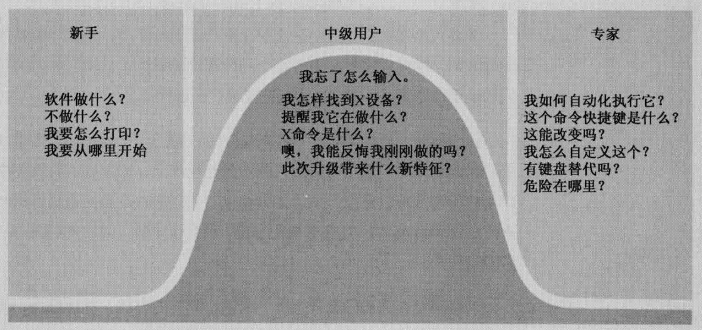

#第10章 为中级用户优化设计 

##永久的中级用户

大多数用户即非新手又非专家，属于中级用户。

**人们愿意为值得的事情付出努力。至于值不值得，用户说了算，同这一功能执行起来技术难度有多高没有关系，完全取决于用户的目标。**

##扭转界面

**付出与回报要相称**

> 用户只有获得充分的回报，才会付出相应的努力。

如果在应用中添加复杂的功能，要想让用户忍受复杂的操作，结果必须有**足够**的吸引力。

**组织界面的扭转**

按照3个原则对界面中的部件和显示器进行整理。

- 使用频率
- 转换程度（指某一功能或命令引发正在处理的界面或者文档、信息突然发生变化的程度，最好隐藏在界面深处。）
- 风险承担程度（指不可更改的功能 或者更改后会产生危险后果的功能）

设计人员还需要提供方便用户使用的快捷方式，配合中级用户的提升，也是专家用户的必备功能。

##为三层用户设计

- 迅速轻松地将新手培养成中级用户
- 不要在中级用户成长为专家用户的过程中设置障碍
- 最重要的是，保证永久的中级用户在技术范围的中段探索时有**愉快**的体验

### 新手想要什么

> 将用户想象成非常聪明但很忙碌的人。

一个新手必须迅速掌握程序的概念和范围，不然他可能就会彻底放弃；而新手一旦成为中级用户，程序提供的帮助会妨碍用户，所以无论提供什么样的额外帮助，都**不应该在界面中固定下来**。

新手不需要参考消息，他们需要概括性的信息，比如一次全局的界面导游。

**好的界面设计，不管何种平台都应该能通过导航和功能使用户迅速熟悉产品，并获得舒适的产品体验。**

### **专家想要什么**

对经常使用的工具栏，要求能够快速访问，专家甚至需要所有功能的快捷方式。

应在专业产品上针对专家用户进行设计。

### **永久的中级用户需要什么**

永久中级用户需要快速进入最经常使用的工具。工具提示是适合中级用户最好的习惯用法。

永久中级用户知道如何使用参考材料，只要不是必须一次解决所有问题，他们就有深入学习和研究的动机。这意味着**在线帮助 **是永久中级用户的极佳工具，他们通过索引使用帮助 ，因此索引必须设计得十分全面。

永久中级用户知道高级功能在哪，即使他们用不到，也不知道如何使用。**因为软件具有这些高级特性的事实让中级用户感到放心，让他们确信投资购买这个程序是正确的选择。**

必须将你大部分的才智、时间和资源为大部分用户，即永久的中级用户而设计，为其提供最好的交互。

