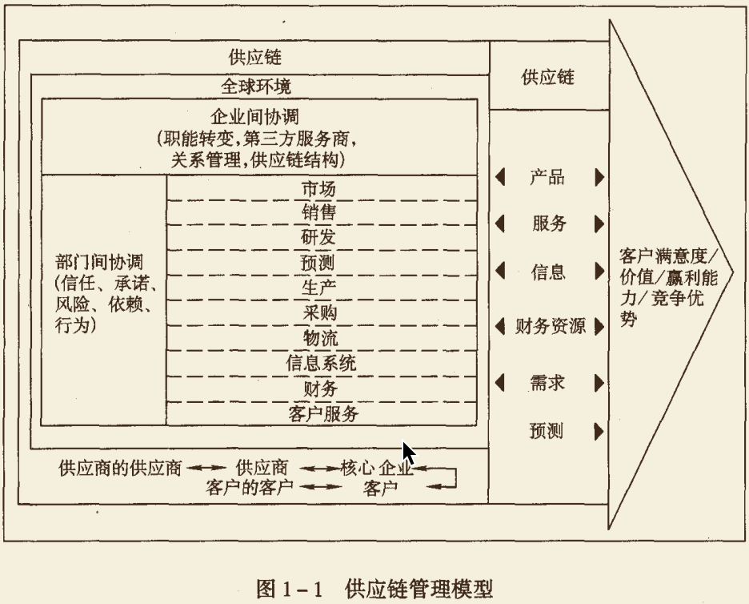
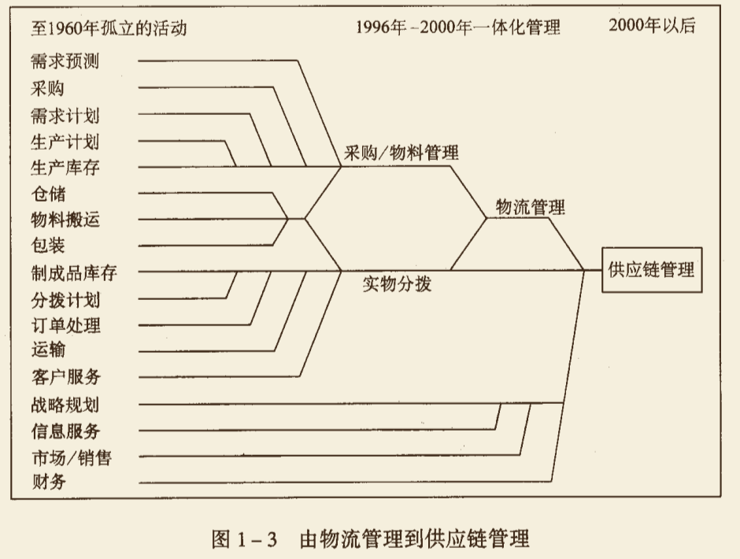
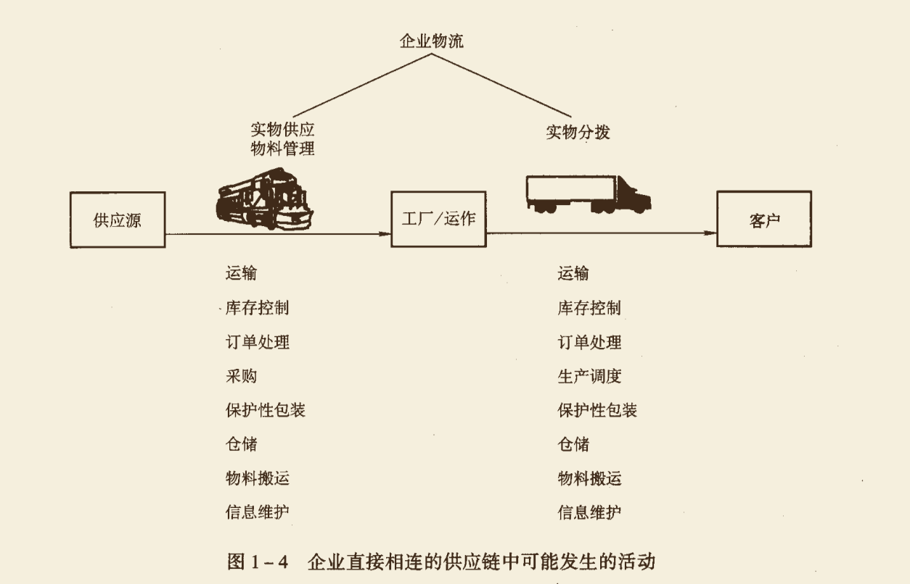
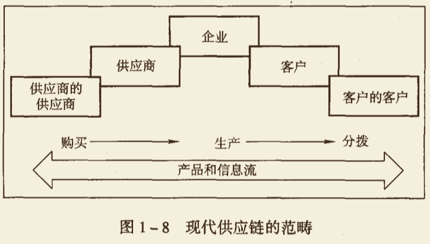
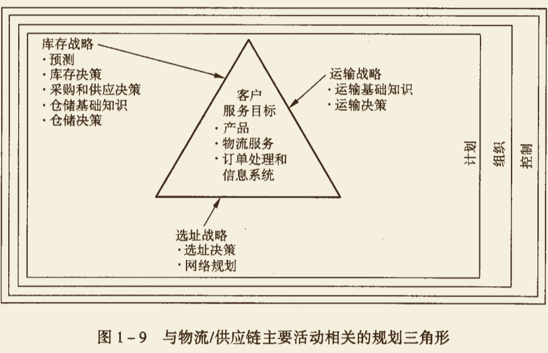

# 企业物流/供应链管理

### 企业物流的定义

**物流(logistics)**：物流是供应链活动的一部分，是为满足顾客需要对商品、服务及相关信息从产地到消费地高效、低成本流动和储存而进行的规划、实施、控制过程。

物流管理不仅关注实物流，还关注服务流，包括所有影响在客户期望的时间、地点提供商品或服务的所有活动，是供应链流程的一个**组成部分**，而非供应链管理的全部。

**供应链管理(Supply Chain Management)**：供应链管理 是传统企业各部门之间，特定企业不同部门之间，供应链上各企业之间的系统的、具有战略意义的协调活动，其目的是改善个别企业，以及整个供应链各环节长期的经营绩效，实现供应链上个别企业和供应链所有成员的竞争优势和赢利能力。

### 供应链 The Supply Chain

**逆向物流渠道(Reverse Logistics Channel)**：产品送达消费者后，过期、损坏或出现故障，需要返回供应地维修或处理的过程。

### 物流活动

一个典型的物流系统组成要素包括：

- 客户服务 Customer Service
- 需求预测 Demand Forecasting
- 分拨系统管理 Distribution Communication
- 库存控制 Inventory Control
- 物料搬运 Material Handling
- 订单处理 Order Processing
- 零配件和服务支持 Parts and Service Support
- 工厂和仓库选址 Plant and Warehouse Site Selection
- 区位分析 Location Analysis
- 采购 Purchasing
- 包装 Packaging
- 退货处理 Return Goods Handling
- 废弃物处理 Salvage and Scrap Disposal
- 运输管理 Traffic and Transportation
- 存储管理 Warehousing and Storage

**关键性物流活动**：

1. **客户服务**

   与市场营销部门的合作：

   - 确定客户对物流客户服务的需求
   - 确定客户对服务的反应
   - 设定客户服务水平

2. **运输**

   - 运输方式和运输服务的选择
   - 合并运输
   - 运输路线
   - 车辆调度
   - 设备选择
   - 理赔程序
   - 运价审计

3. **库存管理**

   - 原材料和产品成品的存储政策
   - 短期销售预测
   - 存储点的产品组合
   - 存储点的个数、规模和选址
   - JIT(Just In Time 准时生产)管理，拉动式管理或推动式管理战略

4. **信息流动和订单处理**

   - 销售订单-库存之间的联系
   - 订单信息的传输方法
   - 订购规则

**支持性物流活动**：

1. **存储**

   - 仓容决策
   - 仓库布局和站台设计
   - 仓库的结构
   - 存货的摆放

2. **物料搬运**

   - 设备选择
   - 设备更新政策
   - 订单-拣步骤
   - 货物的存取

3. **采购**

   - 供货商选择
   - 采购时间安排
   - 采购数量

4. **保护性包装**

   为以下活动设计：

   - 搬运
   - 储存
   - 防止灭失或损坏

5. **与生产/运作部门合作**

   - 明确总量
   - 确定生产的顺序和时间

6. **信息维护**

   - 信息收集，储存和处理
   - 数据分析
   - 控制过程

运输和库存是成本消耗最大的物流活动。他们各占物流总成本的1/3到2/3。

**运输增加产品和服务的空间价值，库存增加时间价值。**

### 物流/供应链管理的重要性

物流是创造价值的活动，表现在**时间和空间**两个方面。

> 只有当顾客在他希望进行消费的时间和地点拥有产品和服务时，产品和服务才有价值。

良好的物流管理将供应链中的每一项活动都看成增值过程。如果增加的价值很少，物流活动存在的必要性就值得怀疑。如果顾客愿意为产品和服务支付的价格超过供给价，增值就实现了。

**世界一流企业物流绩效**：

- 对出运的货物，出错比率在千分之一以下
- 物流成本远低于销售额的5%
- 每年成品库存的周转次数为20次或以上
- 总的订单周期为5个工作日
- 运输成本为销售收入的1%或以下

### 物流/供应链管理显著增加客户价值

企业创造产品或服务有4种价值：

1. **形态价值**：通过将投入转化为产出（从原材料加工成制成品）产生的价值
2. **时间价值**
3. **空间价值**
4. **占有价值**

### 非制造业中的物流/供应链管理

- **服务业**
  - 关键在于将无形的服务转化为有形的产品
- **军事**
  - 早在企业对协调管理供应链流程产生兴趣之前，军队已经很好地组织起物流活动了。
- **环境**
  - 对环境垃圾的回收及再利用，物流管理者都是主要参与人。

### 企业中的物流/供应链管理

传统企业是围绕营销和生产职能组织起来的，一般，营销意味着销售产品，生产意味着制作产品。许多企业在强调这两个职能的同时，又将例如运输、采购、财务和技术等其他职能活动视为支持性部门。但它们**没有认识到那些必然发生在生产、采购与需求的时间和地点之间的活动的重要性**，这是很危险的。这些活动就是物流活动，他们既影响营销又影响生产的效率和效果。

- **营销**主要负责市场调查、促销、销售队伍管理和产品组合，创造产品的"占有"价值
- **生产/运作**关注产品或服务的生产，创造产品的形态价值，主要职责包括质量控制、生产计划和调度、工位设计、产能计划、维修保养作业要求和标准
- **物流**关注的是赋予产品或服务时间和空间价值的活动

**物流管理要把自己视为整个供应链的协调者，而不是本地物流活动的管理人，否则会丧失降低成本，提高客户服务的大好机会。**

### 企业物流/供应链管理的目标

1. **物流系统设计对收入的影响**
2. **设计的运作成本和资金要求**

理论上，物流管理者应该知道客户服务质量的改进将会带来多少额外收入。但一般管理者很难确切知道这些收入是多少，这个情况下，物流目标变为使成本最小化，限制条件是要满足所期望的服务水平，而不是利润或投资回报最大化。

成本通常有两类：

1. 运营成本：周期性重复发生或直接随活动水平的变化而变化的成本(工资、公共仓库费用、管理费用、其他间接费用等)
2. 资本成本：一次性开支，不随正常物流活动水平的变化而变化(自有车队的投资、企业仓库的建设成本、物料搬运设备的购买成本)

**物流资产回报率(Return On Logistics Assets)**：

**ROLA=(对企业收益的贡献-物流运作成本)/物流资产**

*对企业收益的贡献：物流系统设计所产生的销售额*

*物流运作成本：为提供物流客户服务，增加销售所产生的支出*

*物流资产：物流系统内的资本投资*

### 物流/供应链管理的研究方法

