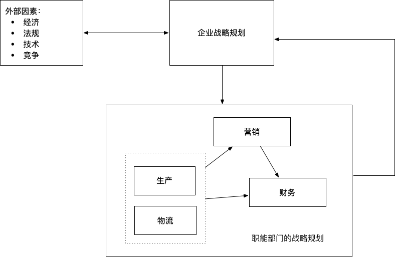
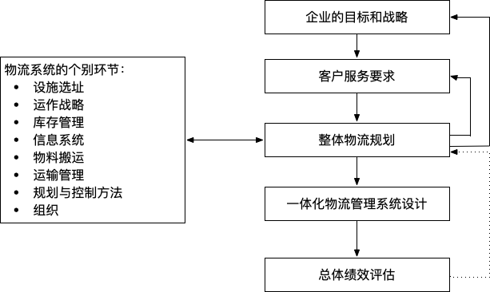

# 物流战略和规划

### 企业战略

制定企业战略首先要对企业目标作清晰描述。无论企业目标是追求利润、生存、社会效益、投资回报、市场份额或是企业发展，都应该对目标有很好的理解。

一个良好的战略有四个组成部分：

- 客户
- 供应商
- 竞争对手
- 企业自身

要估量各组成部分的需要、强项、弱项、发展方向和远景，再提出具体战略。

企业战略带动各职能部门战略的制定，**只有当生产、营销、财务和物流部门制定的计划满足企业战略需要时，企业战略才会实现。**

### 物流/供应链管理战略

物流战略的三个目标：

1. 降低成本
2. 减少资本
3. 改进服务

### 物流/供应链规划

- **规划层次**

  - 战略层次(长期，时间跨度通常超过一年)
  - 策略层次(中期，一般短于一年)
  - 运作层次(短期，每小时或每天)

- **主要规划领域**

  - 客户服务目标：首要任务
  - 设施选址战略：寻求成本最低的需求分配方案或利润最高的需求分配方案是选址战略的核心
  - 库存决策战略
  - 运输战略

  

- **规划的时机**
  - 需求
    - 每年几个百分点的异常增长，往往足以说明需要对网络进行重新规划
  - 客户服务
    - 如果服务水平本身很低，变化幅度小，不一定需要重新规划物流战略，反之则需要
  - 产品特征
    - 当产品特征发生大的变化时，重新规划物流系统可能是有益的
  - 物流成本
    - 当物流成本占总成本比重增加到不可忽视时，需要重新规划物流系统
  - 定价策略
    - 商品采购或销售的定价政策发生变化时，会影响物流战略。定价策略的改变一般会导致物流战略的重构
- **制定战略时的指导原则**
  - **总成本概念(Total Cost Concept)**
    - 物流系统本身的范畴和物流系统设计的核心都是关于**效益悖反(Trade-off)**的分析。效益悖反指各项物流成本的变化模式常常表现出互相冲突的特征。解决方法是：**平衡各项活动以使其达到整体最优**
    - 物流管理的基本问题就是**成本冲突的管理问题**
  - **多样化分拨(Differentiated Distribution)**
    - 不要对所有产品提供同样水平的客户服务，这是物流规划的基本原则
    - 对由仓库供货的产品，应按存储地点进行分组
  - **混合战略(Mixed Strategy)**
    - 和多样化分拨战略类似：混合分拨战略的成本会比纯粹的或单一战略的成本更低
  - **推迟(Postponement)**
    - 分拨过程中运输的时间和最终产品的加工时间应推迟到收到客户订单之后，避免了企业根据预测在需求没有实际产生的时候运输产品
  - **生产技术和生产流程的特点**
    - 可以将初步生产和推迟作业分离
    - 定制不太复杂
    - 模块化产品设计
    - 从多个地点采购
  - **产品特征**
    - 模块的通用程度较高
    - 产品有具体形态
    - 有具体参数
    - 产品单位价值高
    - 定制后产品的体积和/或重量增加
  - **市场特征**
    - 产品生命周期短
    - 销售量波动大
    - 提前期短而可靠
    - 价格竞争
    - 多个市场，多个客户
    - 合并
    - 标准化

### 选择适当的渠道战略

**需求的可预测性和产品的利润率是选择供给渠道的首要决定因素。**

**需求不可预测的产品常常利润率更高。**

**除非产品的价值很低，否则保有足够的库存来满足不确定的需求是不经济的，最好的办法是在需求产生时快速作出反应，不是利用库存供货，而是由生产过程或由供应商直接供货。**

### 评估战略绩效

常用的3个指标：

- **现金流**：供应链所产生的现金流动
- **成本的节约**：与战略实施相关的成本变化，这些节约会转化为企业某段时间的利润
- **投资回报率**：新战略带来的年成本节约和新战略所需投资额之间的比率