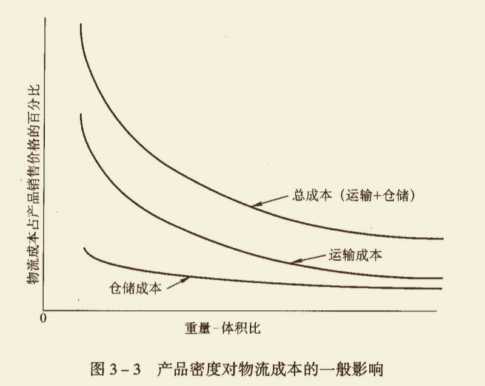
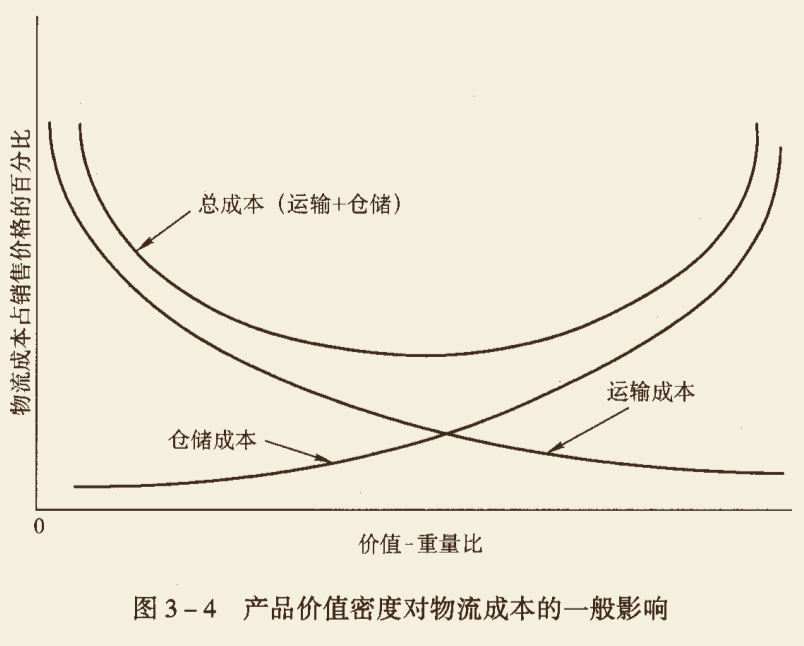
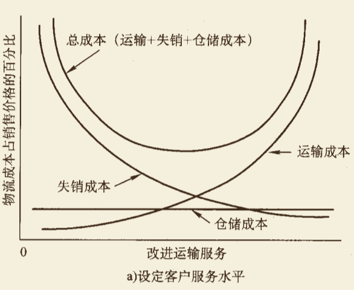
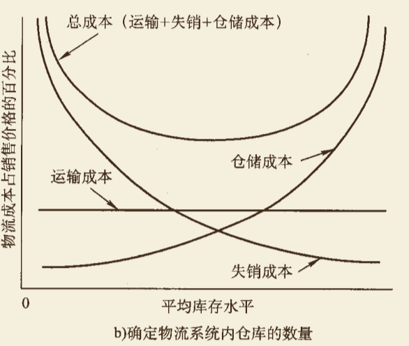
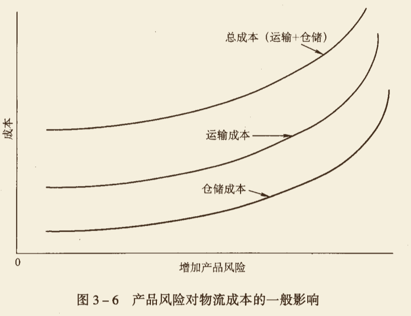

# 物流/供应链产品

产品是任何经营活动或经营过程的产出或结果。

产品的实体部分和无形部分共同构成企业提供的所谓总产品。

- 实体部分：重量、体积、形状和外观、性能、耐用性等特征
- 无形部分：产品的售后服务、企业信誉、为提供准确及时的信息(如在途跟踪)而与客户进行的交流、满足客户个性化要求的灵活性，回收产品以更正错误等服务

**任何企业提供的总产品都是产品的实体形态与产品服务的混合体。**

- **产品分类**

  - **消费品(Consumer Products)**
    - 便利品(Convenience Products)：消费者会购买频繁、直接，很少进行比较选择的产品或服务，这些产品一般需要有广泛的分销渠道，众多的网点，分销成本通常很高，量大价低
    - 选购品(Shopping Products)：消费者愿意寻找并进行比较的商品，存储点大幅减少，供应商分拨成本低，分销范围不需要很广泛
    - 特殊产品(Specialty Products)：购买者愿意花大量精力，愿意等相当长时间去购买的产品。一般使用集中式分拨管理，客户服务水平也不如其他两种类型高。实物分拨成本是各类最低的。许多企业试图为自己的产品在消费者中间树立品牌偏好。
  - **工业品(Industrial Products)**
    - 工业品是用于生产其他产品或服务的新产品。一般由供应商寻找买主
    - 工业品的买主可能对不同类别产品的不同服务水平不感兴趣

- **产品生命周期(The Product Life Cycle)**

  - 产品的生命周期：

    - 导入期(Introduction)
      - 产品未被广泛接受，销量不大，库存限制在相对少的地点，产品现货供应比率有限
    - 增长期(Growth)
      - 可能非常短暂，销售量迅速增长，实物分拨的计划工作尤其困难，这个阶段分拨管理常常在管理人员的判断和控制下进行
    - 成熟期(Matruity)
      - 销售增长缓慢或稳定在最高水平，产品销量不再剧烈变化，可以纳入现有类似产品的分拨模式中，会用到很多存储点，现货供应比率也控制在较好的水平上
    - 衰退期(Decline)
      - 存储点减少，库存下降，存放点更集中

    **物流管理人员应该时刻了解产品所处的生命周期的不同阶段，调整分拨模式以实现该阶段分拨效率最大化。**

- **80-20曲线(the 80-20 Curve)**

  - **企业80%的销售额由20%的产品系列创造。**

    

- **产品特征**

  影响物流战略最重要的产品特征是**产品本身的属性**，如重量、体积、价值、易腐性、易燃性和可替代性。

  - **重量-体积比(Weight-Bulk Radio)**

    - 和运输和存储成本直接相关。比值高，产品密度增加，存储和运输成本占销售价格的比重都会降低。

      

      

  - **价值-重量比(Value-Weight Radio)**

    - 价值-重量比低的产品，存储成本很低，但运输成本占销售价格的百分比较高

    - 价值-重量比高的产品，存储成本高，运输成本低

      

      

  - **可替代性(Substitutability)**

    - 大部分情况下，物流管理人员无法控制产品的可替代性，但必须为可替代性不同的产品制定分拨计划

    - 可替代性高通常意味着客户选择竞争性品牌的可能性大，导致供应商失销

    - 通常通过运输服务的选择(改进运输服务，提高货物运送的速度和可靠性，减少由此导致的货物灭失和损坏)、存储服务的选择来解决销售损失问题

      

      

      

  - **风险特征(Risk Characteristics)**

    - 指产品的易腐性、易燃性、贬值、爆炸的可能性、易于被盗等特征

      

      

- **产品包装**

  - 主要关注的是改变产品密度和保护性包装
  - **控制产品密度是产品成功的关键**

- **产品定价**

  - **地域性定价方法**

    1. FOB定价法

       