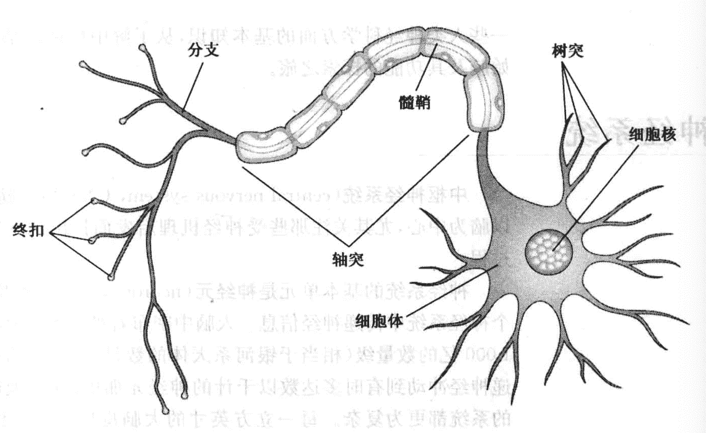
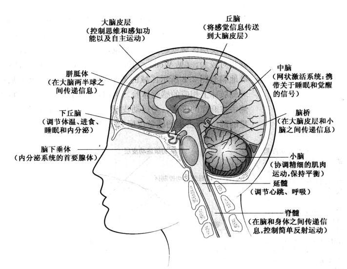
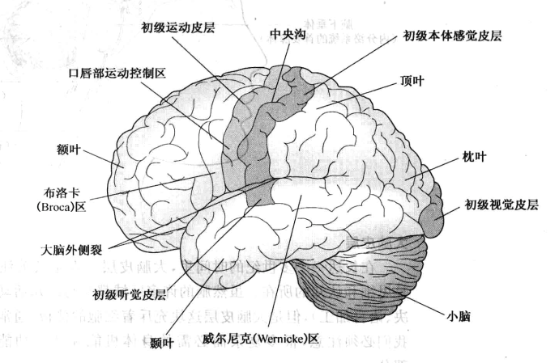
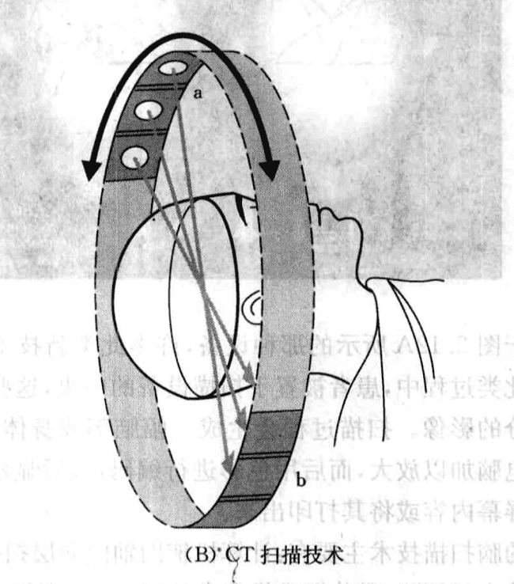
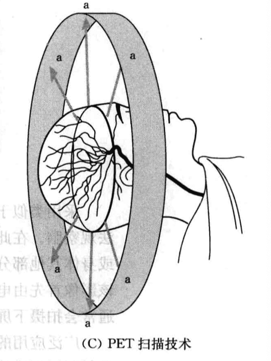

# 认知神经科学

#### 心身关系问题

人类同时存在于两个世界中：

1. 物理世界，其中的事物存在于特定的时空之中，这些事物具备物理特征，遵循物理法则
2. 心理世界，由记忆、思想、观念、想象等构成。

#### 神经系统

中枢神经系统由脊髓和脑组成。

神经系统的基本单元是**神经元**。

**神经元**主要组成部分：

1. 树突：在头部，从其他神经元收集神经冲动

2. 细胞体：主体，摄入营养，排出代谢物

3. 轴突：管状传递通道，外部包裹一层脂肪物质，称为髓鞘，起绝缘作用

4. 突触前端：又称为终扣，与其他神经元连接，负责传递信息

成年时期的人类，所有突触发育完全，所有适宜的细胞髓鞘化，每个细胞体和树突通常能够和约1000个其他神经元建立联系。

神经冲动在轴突中传导的速度与**轴突的大小**有关。最细的轴突传导速度为0.5m/s，最粗大的轴突传导速度为120m/s,神经元发放冲动的活动可以通过**脑电图**记录。

#### 脑的解剖结构

大脑皮层约1.5~5mm厚，人类的思维、感觉、语言加工和其他认知功能发生在大脑皮层中。

脑以**对侧**的方式处理信息。

每个大脑半球的表面被划分成四个主要区域：

* 额叶
* 颞叶
* 顶叶
* 枕叶

**感觉-运动脑区**：占据整个表面积的25%，其余部分属于**联络区域**，涉及认知、记忆、语言加工等。

**关于脑结构和运作过程的一般结论及推论**：

* 很多心理功能似乎定位于脑内的特定区域或区域集群，但进一步加工处理可能发生于不同的地方

* 很多高级心理功能（思维、学习、记忆等）似乎涉及大脑皮层的若干不同区域。对此类信息的神经加工过程是冗余的，即此类信息遍布于整个大脑并在**不同位置以并行方式**进行处理。

* 对脑的损伤并不总是导致认知功能的衰减。损伤可能发生于那些与认知功能仅仅存在微弱关联，或者执行冗余功能的脑区；认知功能也可能由于那些完好的联结可以接管原来的功能，或通过某种方式加以重整以完成原来的任务

#### 神经生理学探测技术

- **CT扫描**：X射线扫描，形成三维影像，提供脑部结构静态影像。

- **PET扫描**：扫描脑部消耗的葡萄糖。和CT不同的是他采用探测器测量血液中的放射性粒子。脑部活跃的部分需要更多的血流，因而有更多的放射性示踪素汇集，示踪素会发射射线，转化为可视图谱。

- **MRI和fMRI**:磁共振成像扫描技术（MRI），提供脑结构的静态影像。功能性磁共振成像（fMRI）,可以检测脑部活跃区域血流量的增加，从而既展现结构又展现功能。

- **MEG**：脑磁描记法，一种从头部外围通过探测脑活动所产生的微弱磁场的仪器，来测量脑部活动。MEG对神经细胞活动的解析度最为精确。

- **TMS**：穿颅磁刺激，可估计脑电活动的改变对知觉和思维的影响。