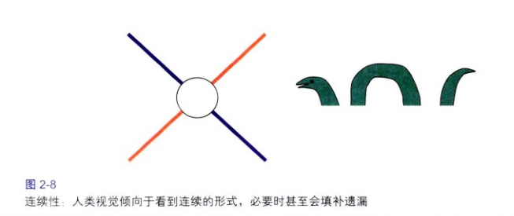
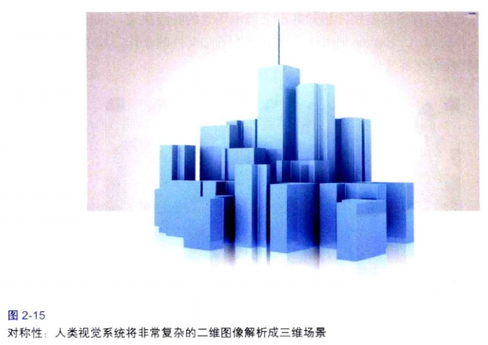
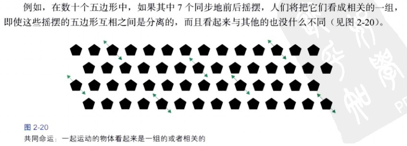

# 为观察结构优化我们的视觉

我们的视觉系统自动对视觉输入构建结构，并且在神经系统层面上感知形状、图形和物体，这个理论叫视觉感知的**格式塔原理**。
我们像其他动物一样，依据整体的对象来感知周围的环境。

##格式塔原理：接近性
物体之间的相对距离会影响我们感知它们是否以及如何组织在一起。互相靠近（相对于其他物体）的物体看起来属于一组。

##格式塔原理：相似性
如果其他因素相同，那么相似的物体看起来归属于一组。

##格式塔原理：连续性
我们的视觉倾向于感知连续的形式而不是离散的碎片，必要时甚至会填补遗漏。

##格式塔原理：封闭性
我们的视觉系统自动尝试将敞开的图形关闭起来，从而将其感知为完整的物体而不是分散的碎片。

##格式塔原理：对称性
我们倾向于分解复杂的场景来降低复杂度。

##格式塔原理：主体/背景
大脑将视觉区域分为主体和背景。主体包括一个场景中占据我们主要注意力的所有元素，其余的则是背景。

我们对主体与背景的差别的感知并不全部由场景的特点决定，也依赖于观者的注意力的焦点。

背景可以传递信息（用户当前所在位置），或者暗示一个主题、品牌或者内容所表达的情绪。

##格式塔原理：共同命运
共同命运原理指出一起**运动**的物体被感知为属于一组或者是彼此相关的。

**在设计时，使用每一个格式塔原理来考量各个设计元素之间的关系是否符合设计的初衷。**

