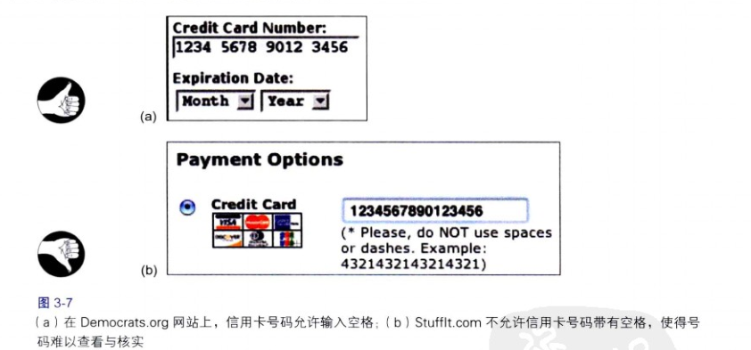

# 我们寻找和使用视觉结构

信息呈现方式越是结构化和精炼，人们就越能更快和更容易地扫描和理解。

##结构提高了用户浏览长数字的能力

##视觉层次让人专注于相关的信息
可视化信息显示的最重要目标之一是提供一个视觉层次 ，即信息的布置安排能够：
- 将信息分段，把大块整段的信息分割为各个小段；
- 显著标记每个信息段和子段，以便清晰地确认各自的内容；
- 以一个层次结构来展示各段及其子段，使得上层的段能够比下层更重点被展示。

*当用户查看信息时，视觉层次能够让人从与其目标不相关的内容中立刻区分出与其目标更相关的内容，并将注意力放在他们所关心的信息上。*