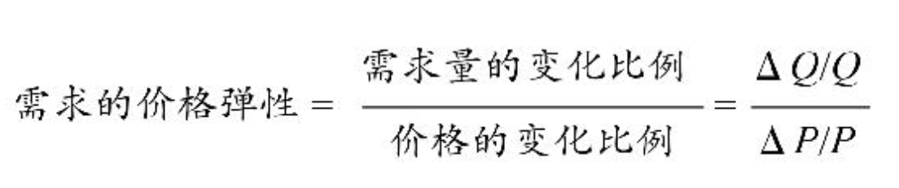
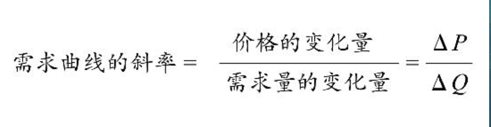

# 需求 好东西运到远方去

**个人估值**：一个人对一件商品的个人估值，是他为了得到这件商品所愿意支付的其他商品的最高数量。是绝对主观的。**个人估值不是以个人的愿望为基础，而是以他所愿意放弃的其他商品的数量来计算的。**

**客观价值论**：世界上所有的物品，都有客观的、内在的、不以人的意志为转移的价值，而价格只是围绕这个本质的、客观的价值上下波动的一个现象。

**主观价值论**：指所有的物品，本身并没有什么内在的价值，只有人对它的判断，人觉得它有价值，它就有价值。

****

**边际**：边际是“新增”带来的“新增”。

边际成本：每新增一个单位产品所需要付出的新增成本

边际收入：每多卖一个产品能够带来的新增收入

边际产量：每新增一份投入所带来的新增产量

边际效用：每消耗一个单位的商品所能带来的新增享受

**边际效用递减定律**：在单位时间内，随着人们消耗的某种商品的数量不断增加，消耗这种商品所能带来的新增享受迟早都会下降。

**边际效用和边际成本的平衡，能够使总收益最大化。**

**把资源分摊到不同的用途上，并确保资源在这些不同用途上获得的边际效用都趋于相等**；如果出现不等，那就应该不断把更多的资源挪用到边际效用较高的用途上，直到资源在这种用途上带来的边际效用下降到与其他用途的边际效用相等为止。

**应该利用自己有限的时间、有限的精力，在自己所能涉及的所有领域、所有活动、所有选项当中，根据边际平衡的规律来分配时间、金钱、精力和其他资源，从而使总效用达到最大。**

****

**需求第一定律**：当其他情况不变时，只要价格提高，商品的需求量就会减少；价格除到一定程度，需求量就会增加。

**需求曲线永远向下倾斜**

**当价格上升到一定程度，我们就会从需求者变成供给者。**

**剩余**：一个人对一件商品的个人估值，跟他为了得到这件商品所付出的代价之间的差距。只要有交易，买卖双方都能够享受到剩余。

****

**需求第二定律**：需求对价格的弹性，和价格变化之后流逝的时间长度成正比。即随着时间的失衡，需求对价格的弹性会增加。

弹性大于1，表示只要价格发生一定幅度的变化，需求量就会有更大幅度的变化。反之，表示需求量幅度变化更小。

弹性大于1，指奢侈品；弹性小于1，指必需品。

**一件商品是奢侈品还是必需品，完全取决于价格。 **

**垂直的需求曲线不存在**

**人会寻找替代方案**，时间越长，找到的替代方案越多。

**随着时间的推移，需求弹性会越来越高。**当出现新的情况、新的冲击时，人们寻找替代方案的范围一开始可能没这么大，但随着时间的推移，选择替代方案的空间会越来越大，能够找到的对策就越来越多。

税负是交易双方共同承担的，各付多少取决于需求者和供应者双方的相对弹性，**谁的弹性低，谁对这份交易需求更迫切，谁就付多一点。**

供需双方相对弹性的大小，跟法律与政府的规定本身无关。谁越需要这份工作，谁的谈判能力就越低，就会承担更大比例的负担。

****

**需求第三定律**：精选品和普通品之间的价格本来有较大差距，但加上附加费后，差距缩小。附加费越大，精选品就越便宜。

**附加成本大，精选品才值得**

**附加成本上升并不是好事。**会导致精选品的数量减少。

