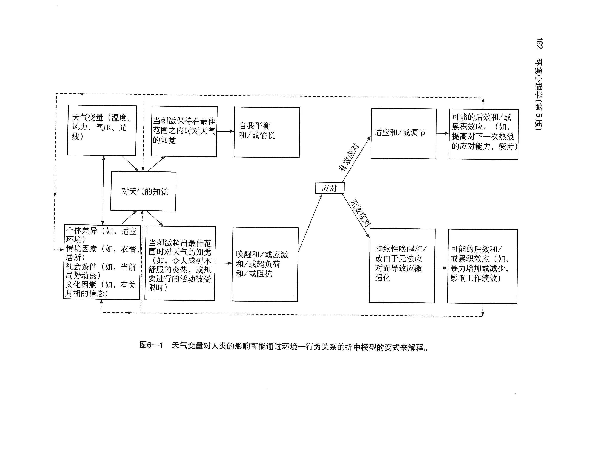

# 天气、气候和行为

### 为什么环境心理学家关心天气和气候？

环境心理学家关心的是：在不同的物理环境中，人的行为会有什么不同。

- **天气weather**：指相对迅速的变化或即时的情况
- **气候climate**：指一段时期内平均的或主要的天气状况

### 地理和气候决定论

气候影响说有三个观点：

- **决定论**：气候必然引起一类行为
- **或然论**：气候限制了人们能进行哪些活动又不能进行哪些活动
- **概然论**：认为气候并不绝对地决定特定行为，但会影响这些行为发生的可能性

### 高温和行为

还是从四个方面谈原因：

- 唤醒理论
- 身体素质
- 环境负荷理论
- 行为约束理论
- 控制理论

### 低温与行为

